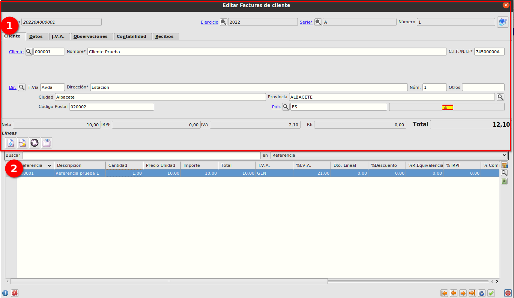
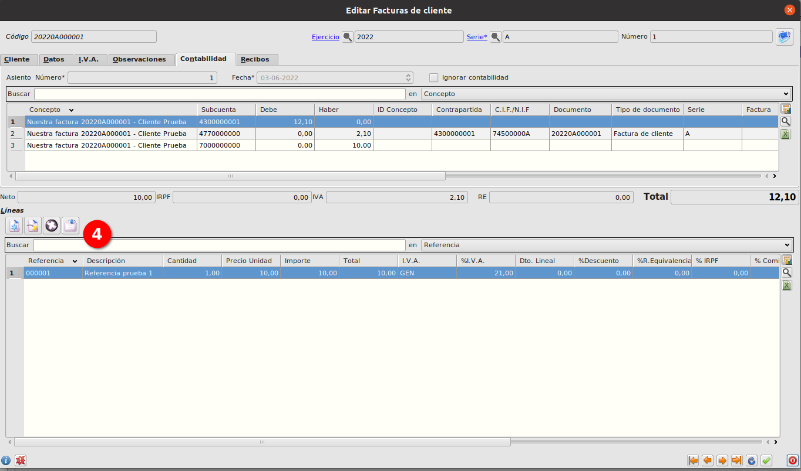

# Creación de factura
### Objetivo
    Generar una factura a un cliente
### Proceso
1. Seleccionamos el *Cliente*, se cargarán los valores predeterminados del cliente.
2. Creamos la/s líneas

3. Guardamos y se generará automáticamente los recibos correspondientes (3) y el asiento contable (4)

   

### Más

  * [Volver al Índice](./facturascli.md)
