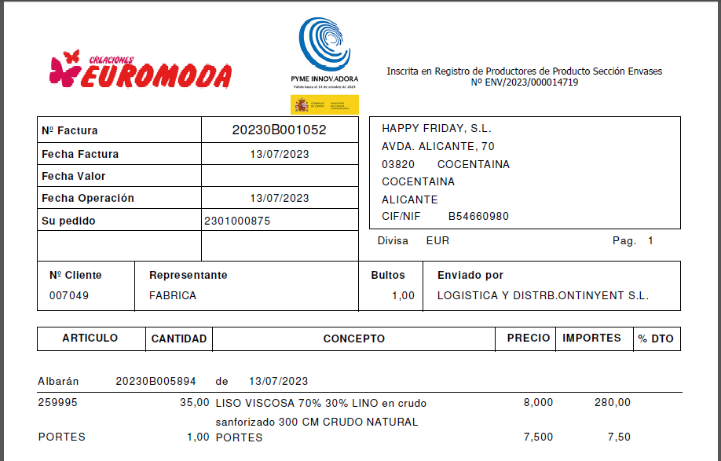

# #EUR #H3782 #P0085 - Número de Registro de Productores de Producto Sección Envases

Los objetivos de este proyecto son:
+  Adaptar los informes relativos a albaranes de venta y facturas de venta de Nacional al Real Decreto 1055/2022, de 27 de diciembre, de envases y residuos de envases.

## Estructura
Modificaremos los siguientes informes:
+ Informes de Albaranes de venta (Nacional, con o sin membrete)
+ Informes de Facturas de venta (Nacional con o sin membrete)

Para incluir el texto:

_Inscrita en Registro de Productores de Producto Sección Envases Nº ENV/2023/000014719_

La posición del texto será centrada verticalmente a la altura del logo de pyme innovadora y centrado horizontalmente con  el recuadro de los datos del cliente, texto arriba, nº debajo centrado (ver imagen)

Comprobaciones. Lanzar informes desde:
+ Facturación - Facturación - Facturas de cliente (con y sin membrete)
+ Facturación - Facturación - Albaranes de cliente (con y sin membrete)
+ Facturación - Informes - Albaranes de venta (detalle) (botones nacional con o sin membrete)
+ Facturación - Informes - Facturas de venta(detalle) (botones nacional con o sin membrete)

__Importante__:
El texto solo debe verse en documentos cuya fecha sea igual o superior al 03/05/2023 (ya que anteriores no quedan sujetos a la norma)

## Notas de desarrollo
Campo calculado para controlar la fecha del documento
Dos campos para controlar que se corte justo por _Nº ENV..._