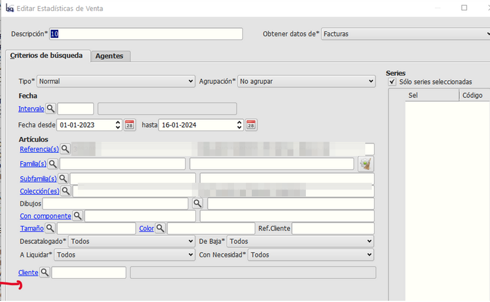
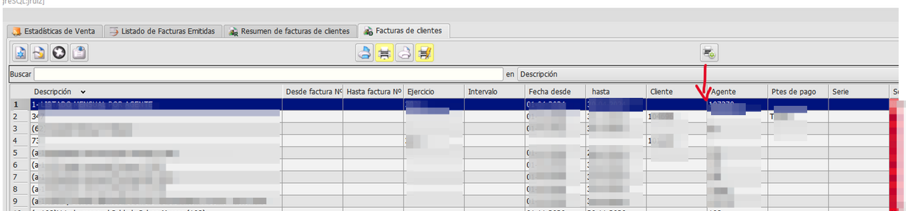

# #EUR #H4053 #SPRINT 2024 #P0086 - Unidad de Negocio

Los objetivos de este proyecto son:
+ Adaptar pantallas y algunos informes del circuito de ventas al nuevo campo añadido con la #H4051 Ficha cliente: Añadir nuevo campo Unidad de negocio, instalada recientemente.

## Propuesta realizada a petición de:
Jose

## Fase 1: Clientes y clientes con dirección (grid y filtros), filtro de informes de Estadísticas de Venta (y exportación a excel), filtro presupuestos, pedidos, albaranes del circuito de  ventas

## Estructura

### Pantalla de Clientes

+ En el maestro de clientes (grid) reposicionaremos el campo *Unidad de negocio* justo antes del datos *Grupo clientes*

+ En el formulario que se muestra al pulsar sobre el embudo, añadiremos el filtro *Unidad de negocio* relacionado con tabla *Unidades de negocio*

### Pantalla de Clientes con direccion

+ En el maestro de clientes (grid) reposicionar el campo *Unidad de negocio* justo antes del datos *Grupo clientes*
+ En el formulario que se muestra al pulsar sobre el embudo, añadir el filtro *Unidad de negocio* relacionado con tabla *Unidades de negocio*

### Filtro de informes de Estadísticas de Venta
Añadiremos a la pestaña de *Criterios de búsqueda* los siguientes controles:
+ Unidad de Negocio: Relacionado con tabla *Unidades de negocio*, lo añadiremos justo debajo del campo de *Cliente*

+ En el maestro de Estadísticas de venta debe posiconarse justo delante del *Tamaño*

### Filtro en pedidos de venta
Añadiremos a la ventana de *Criterios de búsqueda* los siguientes controles:
+ Unidad de Negocio: Relacionado con tabla *Unidades de negocio*

Reorganizaremos la pantalla de filtro para dejarla de la siguiente forma:

### Filtro en presupuestos de venta
Añadiremos los mismos botones de filtro  que están en el maestro de *Pedidos de venta* al maestro de *Presupuestos de ventas*
+ Los filtros que aplican a pedidos pero no aplican a presupuestos los inhabilitaremos.

### Filtro en albaranes de venta
Modificaremos el la ventana de filtro que se abre desde el embudo  del maestro de *Albaranes de venta* para que tengan los mismo controles que el de *Pedidos de venta*.
+ El filtro de *Míos* que ya tiene la ventana de filtros de *Albaranes de venta* debe de seguir funcionando igual.
+ Los filtros que aplican a pedidos pero no aplican a presupuestos los inhabilitaremos.

## Dinámica

### Filtrar maestro de clientes / maestro de clientes con dirección por unidad de negocio

+ Vamos al *Área de facturación / Principal / Clientes o Clientes con dirección*
+ Abrimos la pantalla de filtros pulsando sobre el embudo
+ Informamos el filtro de Unidad de negocio y aceptamos
    +   El maestro de clientes / clientes con dirección quedará filtrado por aquellos clientes que estén marcados con la Unidad de negocio que se haya informado + los filtros que se hayan podido informar

### Imprimir estadísticas de venta
+ Vamos al *Área de facturación / Informes / Estadísticas de venta*
+ Creamos/modificamos un registro informando el campo *Unidad de negocio* y los demás filtros que queramos.
+ Pulsamos en el botón de imprimir
    + El informe mostrado estará filtrado por aquellos clientes que estén marcados con la Unidad de negocio que se haya informado + los filtros que se hayan podido informar

### Exportar a Excel estadísticas de venta
+ Vamos al *Área de facturación / Informes / Estadísticas de venta*
+ Creamos/modificamos un registro informando el campo *Unidad de negocio* y los demás filtros que queramos.
+ Pulsamos en el botón de Exportar a Excel
    + Aparece la pregunta ¿Quieres imprimir los filtros tambiñen?
        + Si se contesta que sí se imprimirá el filtro de *Unidad de negocio* en la excel.
    + La hoja de cálculo estará filtrada por aquellos clientes que estén marcados con la Unidad de negocio que se haya informado + los filtros que se hayan podido informar

### Filtrar pedidos de ventas
+ Vamos al *Área de facturación / Facturación / Pedidos de venta*
+ Abrimos la pantalla de filtros pulsando sobre el embudo
+ Informamos el filtro de Unidad de negocio y aceptamos
    + El maestro de pedidos de ventas quedará filtrado por aquellos pedidos cuyos clientes estén marcados con la Unidad de negocio que se haya informado + los filtros que se hayan podido informar

### Filtrar presupuestos de ventas
+ Vamos al *Área de facturación / Facturación / Presupuestos de venta*
+ Abrimos la pantalla de filtros pulsando sobre el embudo
    + El campo *Servido* está inhabilitado porque no aplica.   
+ Informamos el filtro de Unidad de negocio y aceptamos
    + El maestro de presupuestos de ventas quedará filtrado por aquellos presupuestos cuyos clientes estén marcados con la Unidad de negocio que se haya informado + los filtros que se hayan podido informar

### Filtrar albaranes de ventas
+ Vamos al *Área de facturación / Facturación / Albaranes de venta*
+ Abrimos la pantalla de filtros pulsando sobre el embudo
    + El campo *Servido* está inhabilitado porque no aplica.   
+ Informamos el filtro de Unidad de negocio y aceptamos
    + El maestro de albaranes de ventas quedará filtrado por aquellos albaranes cuyos clientes estén marcados con la Unidad de negocio que se haya informado + los filtros que se hayan podido informar

## Fase 2: Filtro de informes de facturas de venta (detalle y resumen), filtro de facturas del circuito de ventas

## Estructura

### Filtro en informes de Facturas de venta (detalle) y facturas de venta (resumen)
Añadiremos a la ventana debajo del campo cliente el siguiente control:
+ Unidad de Negocio. Relacionado con tabla *Unidades de negocio*

+ En el maestro de informes de facturas de venta, tanto detalle como resumen (grid), el campo *Unidad de Negocio* se mostrará justo después del campo *Cliente*

### Filtro en facturas de venta
Añadiremos los mismos botones de filtro  que están en el maestro de *Albaranes de venta* al maestro de *Facturas de ventas*
+ Los filtros que no aplican a facturas los inhabilitaremos.

## Dinámica

### Filtrar informes de Facturas de venta (detalle)

+ Vamos al *Área de facturación / Informes / Facturas de venta (detalle)*
+ Creamos/modificamos un registro informando el campo *Unidad de negocio* y los demás filtros que queramos.
+ Pulsamos cualquiere botón para imprimir el detalle de las facturas   
    + Sólamente se imprimirán las facturas cuyos clientes estén marcados con la Unidad de negocio que se haya informado + los filtros que se hayan podido informar

### Filtrar informes de Facturas de venta (resumen)

+ Vamos al *Área de facturación / Informes / Facturas de venta (resumen)*
+ Creamos/modificamos un registro informando el campo *Unidad de negocio* y los demás filtros que queramos.
+ Pulsamos cualquiere botón para imprimir el detalle de las facturas   
    + El informe resultante estará filtrado por aquellas facturas cuyos clientes estén marcados con la Unidad de negocio que se haya informado + los filtros que se hayan podido informar

### Filtrar facturas de ventas
+ Vamos al *Área de facturación / Facturación / Facturas de venta*
+ Abrimos la pantalla de filtros pulsando sobre el embudo
    + El campo *Servido* está inhabilitado porque no aplica.   
+ Informamos el filtro de Unidad de negocio y aceptamos
    + El maestro de facturas de ventas quedará filtrado por aquellas facturas cuyos clientes estén marcados con la Unidad de negocio que se haya informado + los filtros que se hayan podido informar

## Notas de desarrollo
No hay notas de desarrollo

## Tareas
+ H4053 Pantalla de clientes
+ H4053 Pantalla de clientes con dirección
+ H4053 Filtro de informes de Estadísticas de Venta
+ H4053 Filtro en pedidos de venta
+ H4053 Filtro en presupuestos de venta
+ H4053 Filtro en albaranes de venta
+ H4053 Filtro en informe de facturas (resumen)
+ H4053 Filtro en informe de facturas (detalle)
+ H4053 Filtro en facturas de venta

## Manual
El manual constará de...
No es necesario manual

## Asistencia a puesta en marcha
No es necesaria.

## Presupuesto
+ H4053 Análisis X€
+ H4053 Desarrollo e instalación X€
+ H4053 Documentación X€
