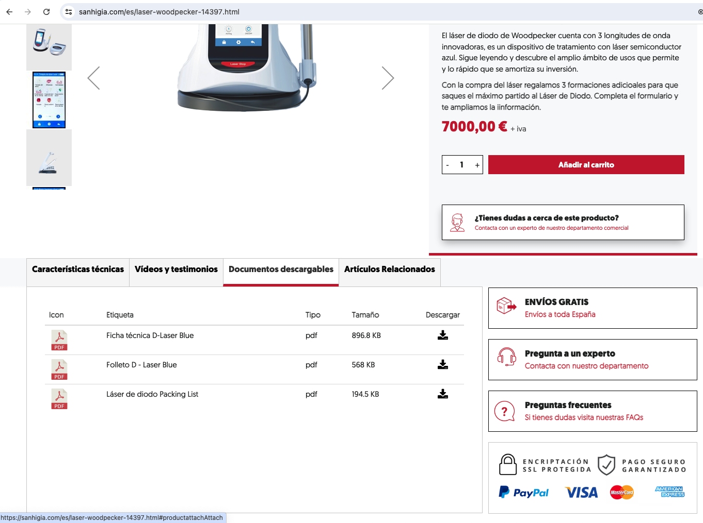

# ##SAN #H4119 Incluir datos de packing list en ficha de producto de tienda online. Incluir datos de packing list en ficha de producto de tienda online

Los objetivos de este proyecto son
+ Incluir una nueva pestaña de datos asociados al producto, que contenga un texto y título configurables, y que se pueda usar, entre otras cosas, para mostrar la información de packing list (elementos del paquete) del producto.

## Propuesta realizada a petición de:
Paloma

Paloma nos solicitó incluir una nueva pestaña en la ficha de producto para añadir la información relativa a Packing List (Elementos del paquete). El pdf con esta información puede adjuntarlo al producto y aparecerá en el listado de documentos descargables (Foto 1), pero además les gustaría tener una pestaña en la que mostrar esta información formateada directamente.

## Estructura

### Tienda online / Configuración de ficha de producto
Añadiremos un nuevo tipo de adjunto que permita incluir cualquier texto con formato (con un editor de texto) y se cambie el nombre de la pestaña en función del contenido que se quiera adjuntar.

### Tienda online / Ficha de producto
Para el diseño versión ordenador, al añadir una nueva pestaña es posible que los títulos de todas ellas excedan el ancho de la caja. Para evitarlo podríamos:
+ Modificar el diseño de los títulos de las pestañas para que se muestren en varias líneas
+ Modificar títulos para acortarlos (responsabilidad del usuario)

El diseño en versión móvil no tiene este problema ya que se van ordenando uno debajo del otro.

## Tareas
+ #SAN #H4119 Crear opción para el nuevo tipo de adjunto y su configuración
+ #SAN #H4119 Modificar el diseño de la versión de escritorio para evitar que las pestañas sobrepasen el ancho.

## Manual
No es necesario manual

## Asistencia a puesta en marcha
No es necesaria.
