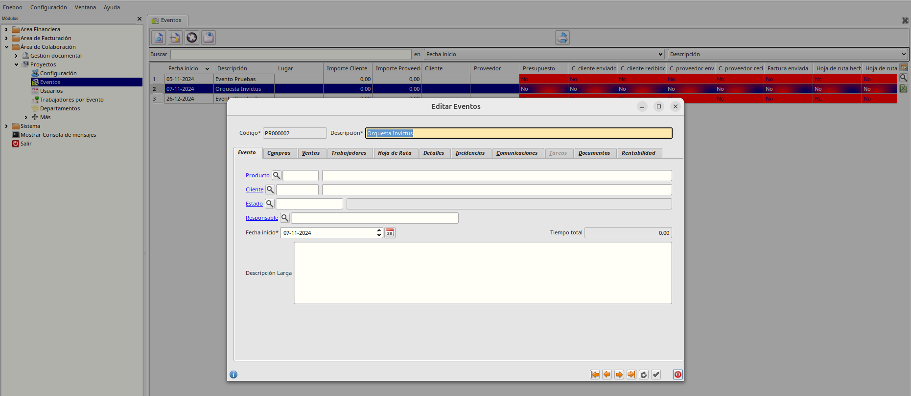
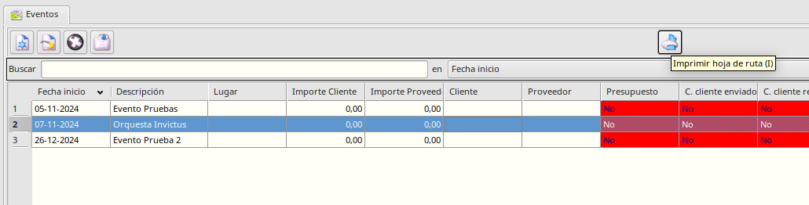
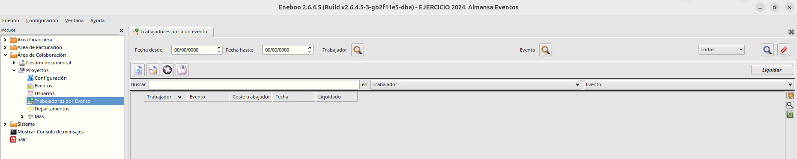
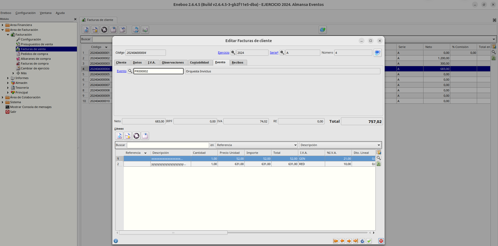
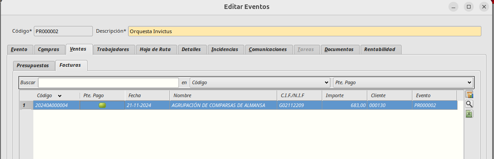
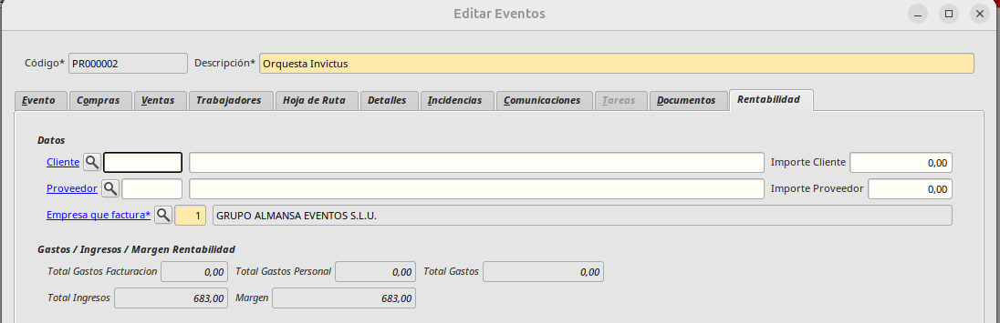
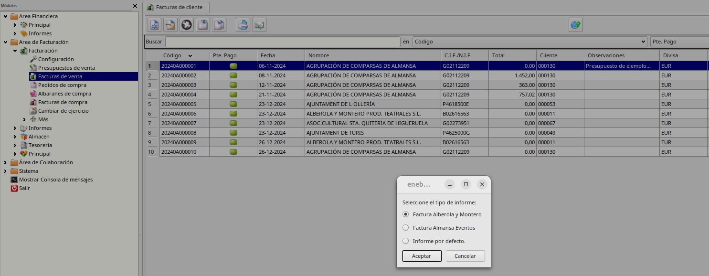

# ERP

### Crear - Visualizar Eventos

Para gestionar los eventos desde el erp accederemos a *Área de Colaboración -> Proyectos -> Eventos*

Desde este formulario es posible dar de alta nuevos eventos, mmodificarlos o consultar los eventos creados desde el calendario.
En las pestañas de *Compras* y *Ventas* veremos los documentos de facturación asociados al evento.
Desde la pestaña *Trabajadores* podremos gestionar los trabajadores que intervienen en el evento así como especificar su coste
En las pestañas *Hoja de Ruta* y *Detalles* podemos especificar algunos datos adicionales que se mostrarán en el informe de hoja de ruta. 
Desde la pestaña *Documentos* podemos incluir contratos o cualquier tipo de documentación asociada al evento.
En la pestaña *Rentabilidad* podemos ver los valores de:
    - *Ingresos*: Total facturado
    - *Gastos*: Suma de Gastos por facturación + Gastos personal donde:
        + *Gastos por facturación* es la suma de facturas de compra asociada al evento.
        + *Gastos de personal* es la suma del Coste de los trabajadores asociados al evento.
    - Margen: Resta de _Ingresos_ - _Gastos_

### Informe de Hoja de Ruta

Este informe  está disponible en *Colaboración -> Proyectos -> Eventos*. Una vez seleccionando el evento que queramos mostrar, pulsamos el botón superior *Imprimir hoja de ruta*. Y se mostrará el informe con los datos de ese evento.

### Trabajadores por evento

Además de poder asociar trabajadores a un evento desde el formulario de eventos, también podemos hacerlo accediendo a *Colaboración -> Proyectos -> Trabajadores por Evento*

En este formulario aparecerá un listado de todos los trabajadores que están asociados a algún evento. 
En la parte superior del formulario podremos establecer una serie de filtros para facilitar la búsqueda. Como pueden ser filtros por fecha, trabajador, evento y si ha sido o no liquidado. 
Además en la parte superior izquierda tenemos el botón *Liquidar* para marcar de forma rápida los trabajadores que han sido liquidados

### Facturación

Para generar documentos de facturación tanto de clientes como de provedores accederemos a *Área de Facturación -> Facturación*. Desde ese menú podremos gestionar todos los documentos, tanto presupuestos, como facturas de cliente y de proveedor.

Al crear cualquier documento, para que aparezca asociado a un evento debemos establecer dicho evento en la pestaña *Evento*.

Al establecer el evento correspondiente a una factura de cliente por ejemplo. Esa factura aparecerá en la pestaña *Ventas* del formulario de Eventos y sumará su importe al total de *Gastos por facturación* de la pestaña *Rentabilidad*

### Formatos de impresión

Los informes de presupuestos y facturas de cliente pueden mostrarse con dos formatos distintos. Al pulsar sobre el botón Imprimir de la parte superior de los formularios de presupuestos y facturas aparecerá un menú para seleccionar el formato de factura que se quiere mostrar.

