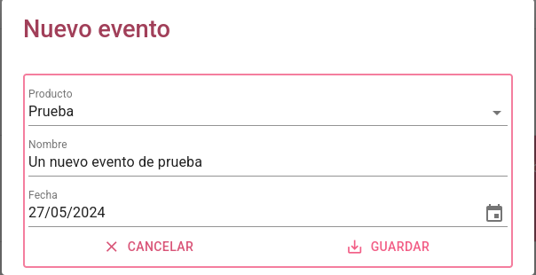

# Calendario eventos

Podemos ver el calendario de eventos en dos modos, mes(*por defecto*) o año. Para cambiar de modo clicaremos en el botón de la parte superior izquierda. Para cambiar de mes o año según el modo en el que estemos, utilizaremos la flechas *atrás* o *adelante* y también disponemos del botón *hoy* para navegar automáticamente a la fecha actual.

### Modo mes

### Modo año

## Filtrar eventos

Podemos usar el botón *mostrar filtro* para filtrar los eventos mostrados por producto.

## Crear un evento

Al clicar en el botón *Nuevo evento* se desplegará un formularió en el que introduciremos los datos del evento a crear.

* Producto(*solo veremos los artículos cuyo 'codfamilia' sea 'EVEN'*)
* Nombre
* Fecha

## Eventos del día

Al clicar en un día podremos ver desplegados los eventos programados para ese día.

## Generar enlace a calendario
Al clicar este botón se copiará al portapapeles un enlace con url con la que veremos el calendario con los eventos, en el modo usado y filtrado si fuera el caso. Este enlace sería como una foto fija, sin botones con lo que interactuar, con la funcionalidad al clicar en un día para ver los eventos programados.

[Volver al Índice](../index.md)