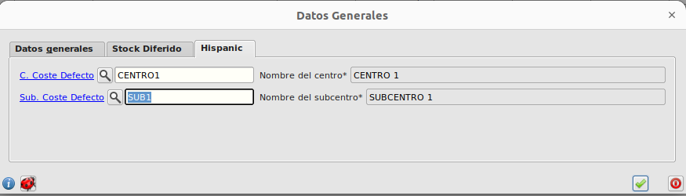
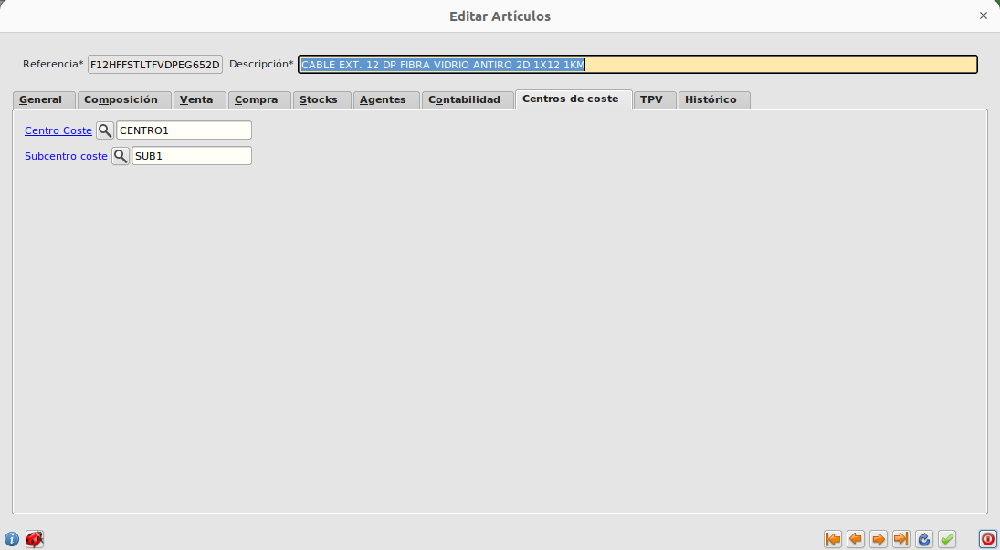
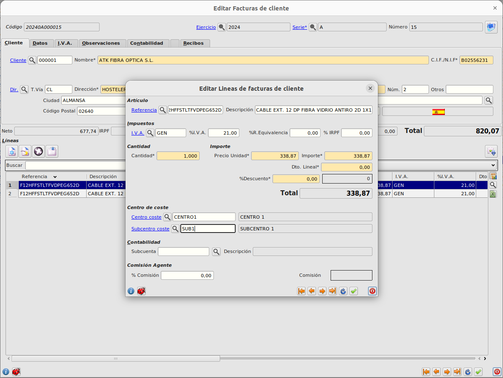

# Distribución de ingresos y gastos en centros de coste

Para la configuración de los centros de coste revisar la documentacion de la extensión en el siguiente enlace:

* [Distribución de ingresos y gastos en centros de coste](../../../extensiones/centros_coste/index.md)

## Configuración de centro y subcentro de coste por defecto

Podemos crear los centros de coste en Área de Facturación -> Almacén -> Configuración.

En la pestaña de Hispanic.

## Centro y subcentro de coste en ficha de Artículos

Dentro de la ficha de los artículos, en la pestaña **Centros de coste** indicaremos el centro y subcentro de coste.

Al dar de alta un nuevo artículo, se informaran automáticamente estos campos con los datos informados en la configuración de centro y subcentro por defecto del apartado anterior.

## Centro y subcentro de coste en líneas de documentos de compra y venta

Al indicar la referencia, los campos centro de coste y subcentro se informarán automáticamente con los datos de la ficha del artículo de la referencia indicada.

