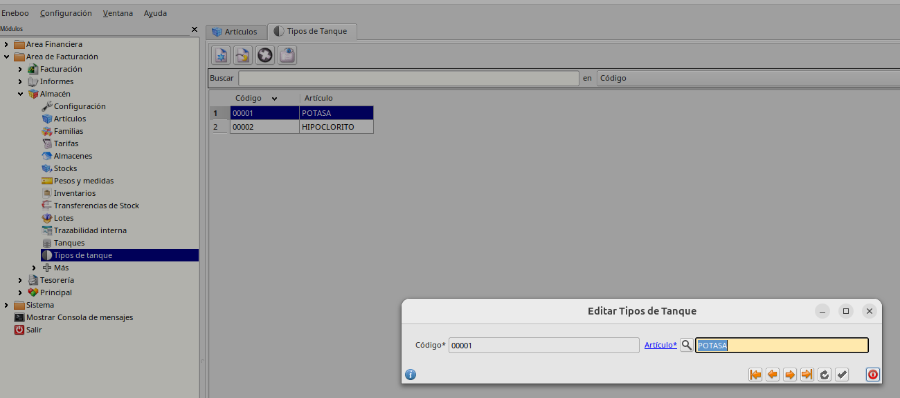
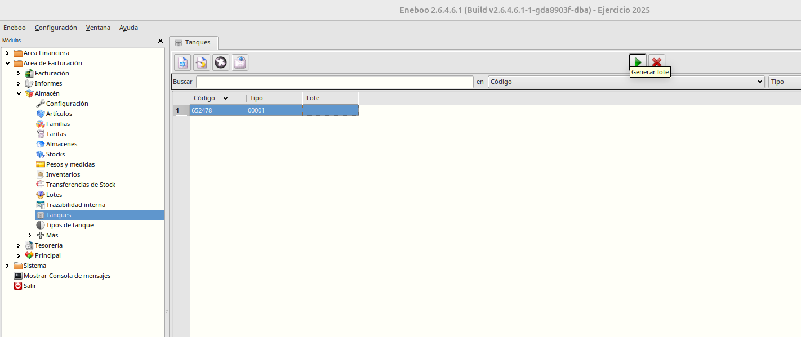
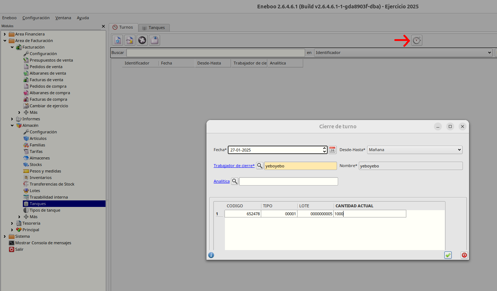
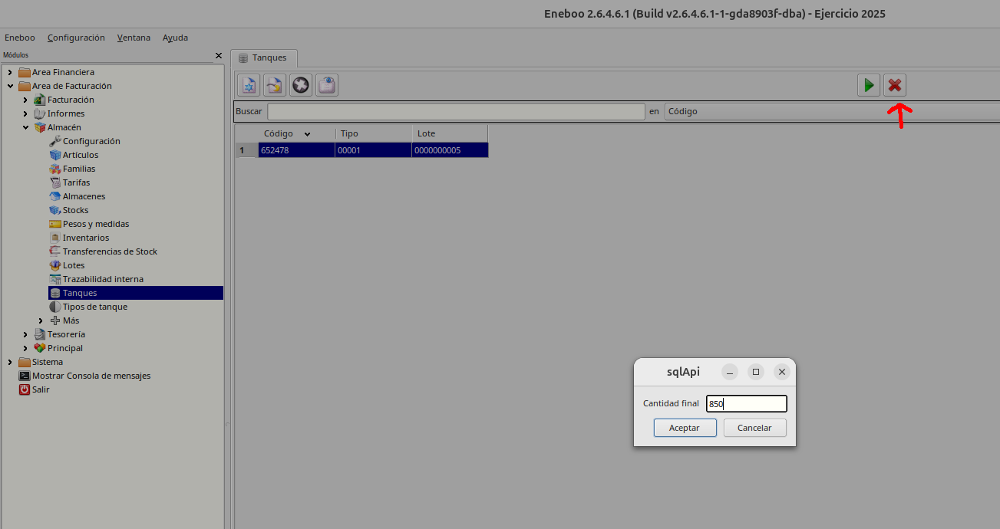
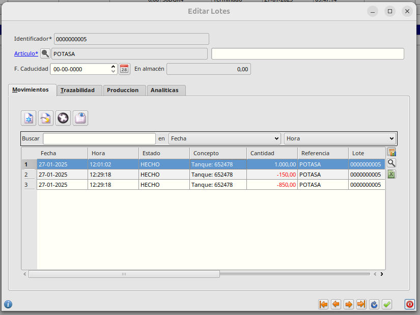
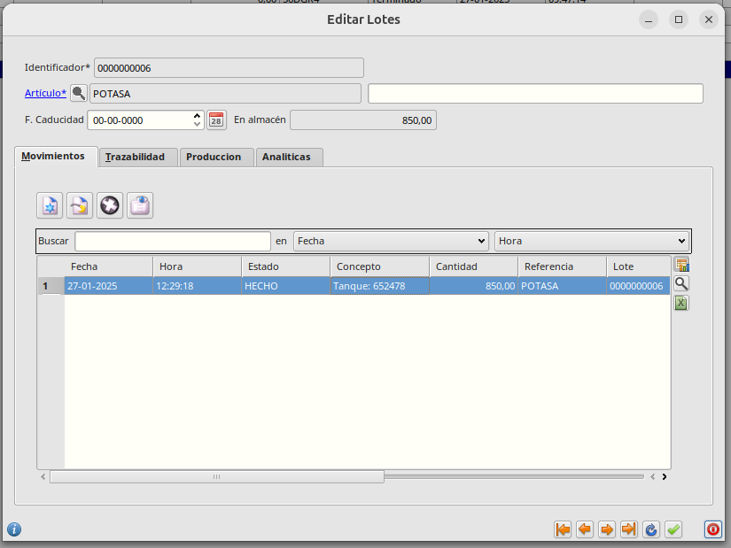
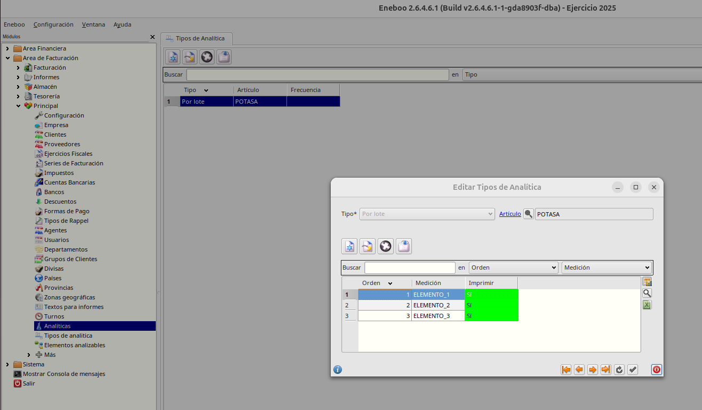
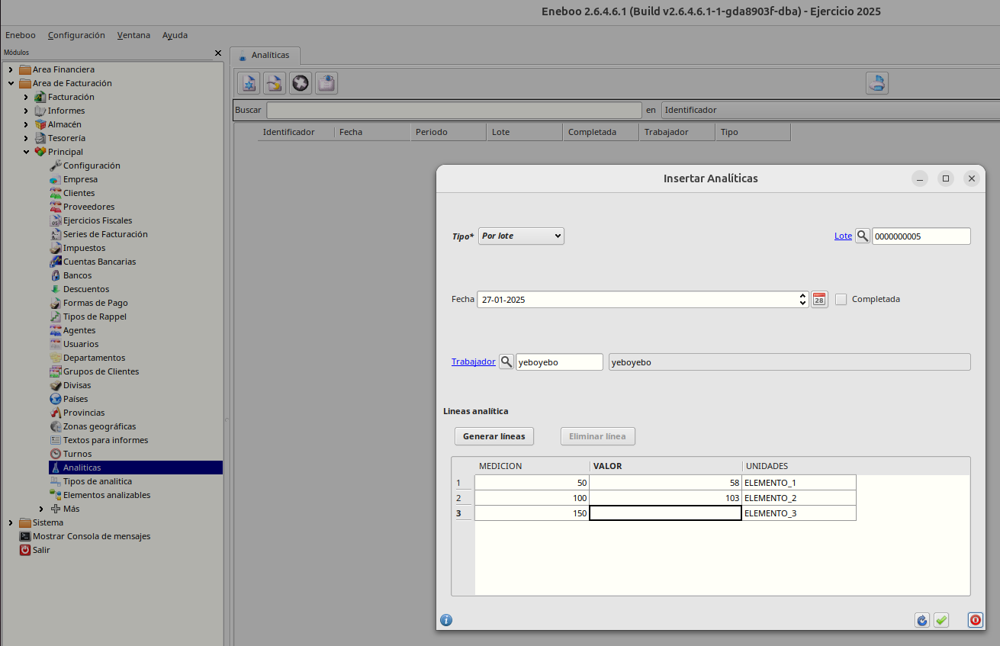

# Gestión de derivados electroquímicos

## Creación de tipos de tanque
Para crear los tipos de tanque nos vamos a Facturación -> Almacén -> Tipos de Tanque. Con el botón de insertar podremos crear nuevos tanques y asociarles el artículo que corresponda. Por Ejemplo. Creamos un nuevo tanque con código 00001 y artículo POTASA (que habremos creado previamente desde Facturación -> Almacén -> Artículos)

## Creación de un nuevo lote en un tanque libre
Vamos a producir un lote del producto _Potasa_, para ello:

* Vamos a Tanques en Facturación -> Almacén -> Tanques, y seleccionamos o creamos un tanque de tipo _Potasa_ y en estado _Libre_, es decir, sin lote asociado.
* Pulsamos el botón botón _Generar lote_ de la parte superiro del formulario.
    * Se genera un lote en estado _En curso_, con un nuevo código, asociado a la referencia relacionada con el tipo de tanque.
    

* Se comienza a trabajar en la producción en un turno de trabajo (no hay interacción con el sistema en este paso)

## Cierre de turno
* Cuando el turno termina, desde la opción de turnos en Facturación -> Principal -> Turnos.
    * El responsable del turno crea un nuevo _Cierre de turno_ pulsando el botón superiro del formulario
    * El responsable indica para cada tanque _Ocupado_, la cantidad producida en el turno.
        * Se crea el registro de turno
        * Se crea un movimiento de entrada de producto por cada canfidad indicada asociado al lote de cada tanque.
        * Se ofrece al usuario ir a completar la analítica del turno

* Se inicia un nuevo turno y se sigue trabajando.

## Terminación de lote
En cualquier momento se puede dar el lote actual del tanque por terminado y comenzar un nuevo lote. Para ello abrimos el formulario principal de tanques en Facturación -> Almacén -> Tanques, seleccionaremos el tanque _Ocupado_ (con lote asignado) y pulsaremos el botón _Terminar lote_.
* El sistema pregunta la cantidad real del lote, para subsanar efectos de temperatura sobre la cantidad teórica

Al terminar el lote:
   * Se crea un movimiento de regularización para establecer la cantidad real del lote
    * Se crea un nuevo lote que se asocia al tanque, y dos movimientos de traspaso del lote anterior al nuevo por la cantidad restante, si la hubiera. El lote original se queda con cantidad 0 y estado _Terminado_

## Tipos de Analítica

Para crear los distitnos tipos de analíticas nos va mos a Facturación -> Principal -> Tipos de Analítica.

Al crear un tipo de anáitica debemos especificar si será Por lotes o Periódica, el artículo analizable y los elementos a analizar

## Analíticas
Se podrá generar analíticas desde la correspondiente opción en Facturación -> Principal -> Analíticas. Las analíticas periódicas se generarán de forma manual. Solo en el caso de fin de turno el sistema propondrá al usuario informar la correspondiente analítica.

Los pasos para generar o revisar una analítica son:
* Vamos a analíticas y pulsamos _Crear analítica_
    * Se abre el diálogo de creación de analítica
* Indicamos _Fecha_, _Tipo_ y _Lote_ / _Periodicidad_.
* Pulsamos el botón _Crear Lineas_ para crear los elementos a analizar según el tipo de analítica establecido.
* Rellenamos todos o algunos de los valores de analítica
* Pulsamos _Aceptar_.
    * Se guarda la analítica
* Podemos añadir, modificar o borrar valores de la analítica
* Si la analítica esté terminada, pulsamos el check _Completada_

Podrá mostrarse un informe de la analítica con el botón imprimir del formulario princial.

## Albarnado de lote
* En facturación, se puede generar albaranes de producto para los lotes de los tanques en estado _Ocupado_, esto generará movimientos de salida asociados a dichos lotes.

Podrá imprimirse para cada albarán su carta de porte pulsando el botón imprimir del formulario principal y seleccionando la opción Carta de porte

