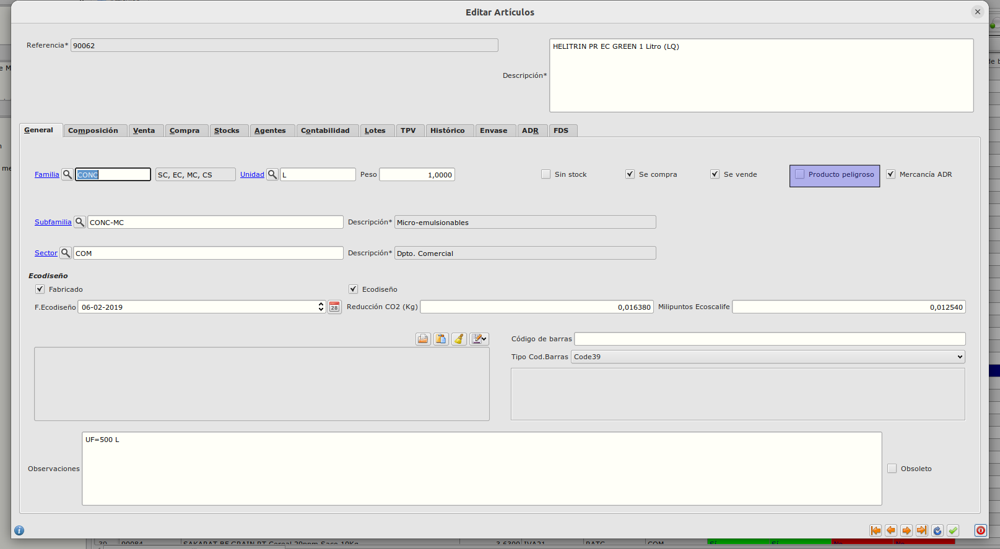
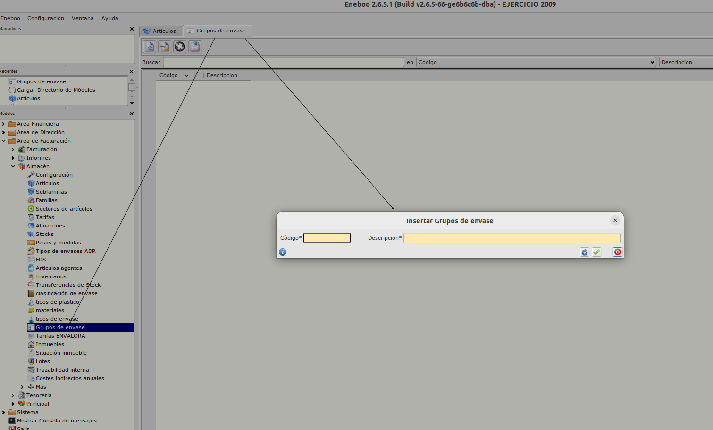
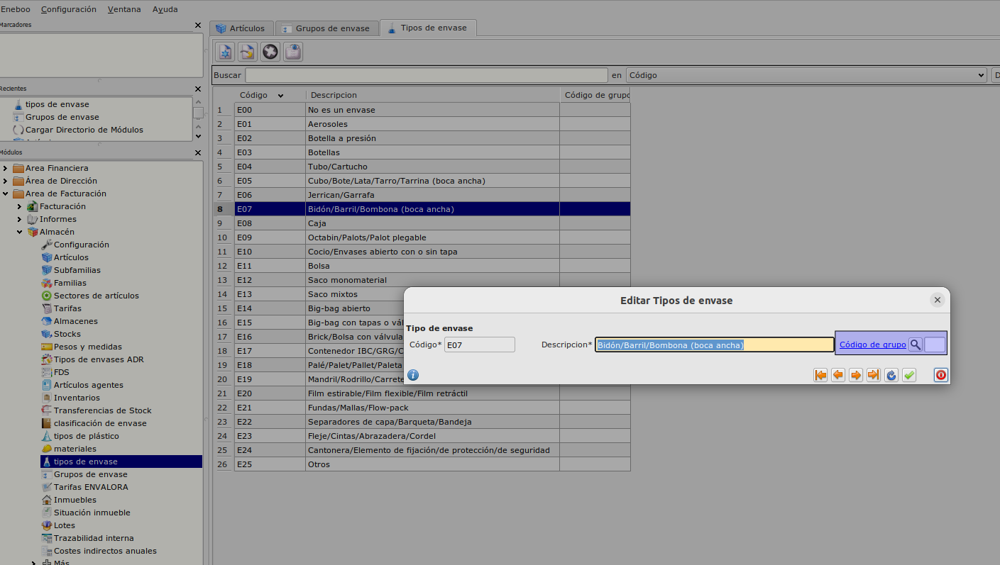
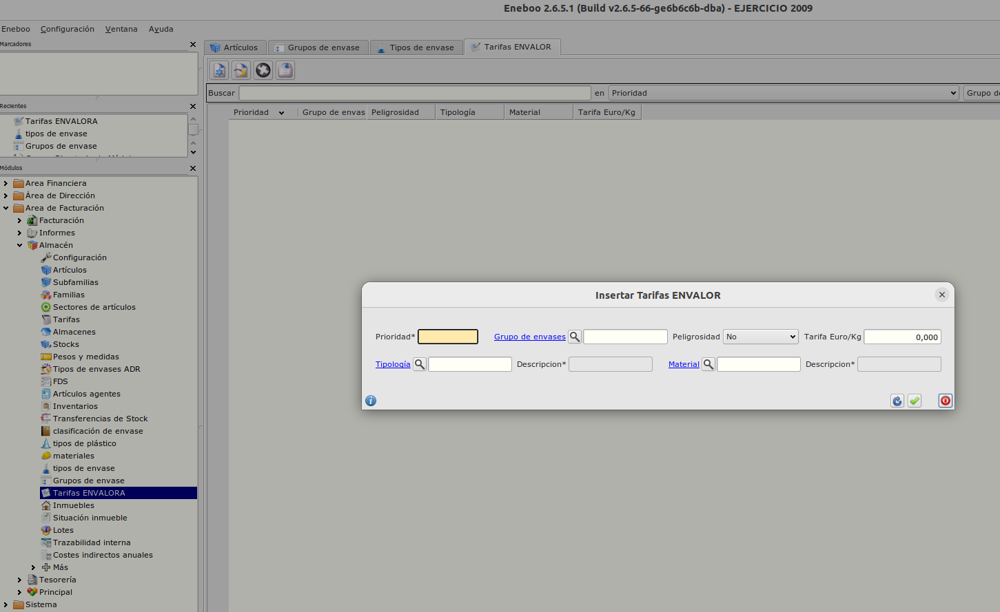
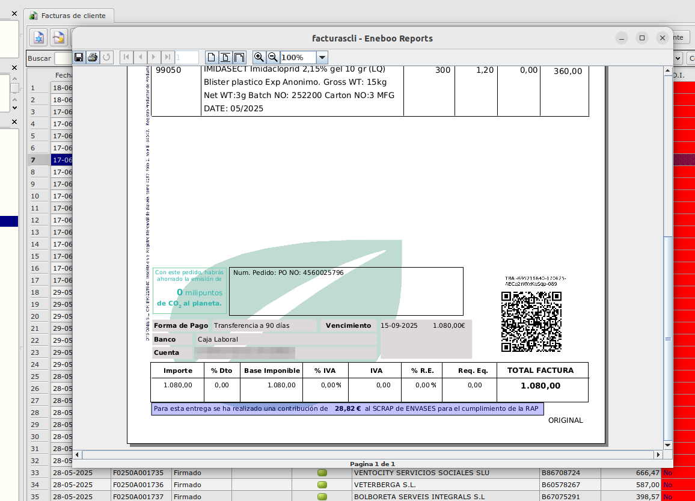
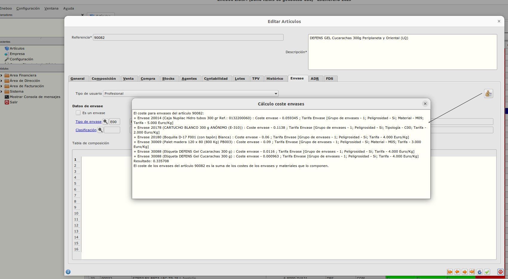

# Inclusión de datos relativos a gestión de residuos en informe de factura de venta

El objetivo de este proyecto es:
+ Cumplir la nueva legislación que obliga a detallar el coste de los embalajes en las facturas de venta


## Estructura

### Almacén / Artículos peligrosos
Añadiremos a la pantalla los siguientes controles:
+ Producto peligroso. Sí / No. Valor por defecto _No_.



### Almacén / Grupos de envase
Crearemos una nueva tabla _Grupos de envase_ con los siguientes campos:

+ Código
+ Descripción



### Almacén / Tipos de envase
Crearemos un nuevo campo en la tabla para asociar el tipo de envase con su grupo correspondiente:

+ Código de grupo.



### Almacén / Tarifas ENVALORA
Crearemos una nueva tabla de decisión de tarifas con los siguientes campos:

+ Id (no visible)
+ Prioridad
+ Grupo de envases.
+ Peligrosidad
+ Tipología. Relacionado con la tabla de Clasificación de envases (primario, secundario, etc.). Puede ser nulo.
+ Agrupación material. Relacionado con la tabla de materiales. Puede ser nulo.
+ Tarifa €/Kg. Moneda con 3 decimales.



## Facturación / Cálculo del coste de envases
Incluiremos un nuevo campo de cálculo de costes en las facturas que detallará el coste final y los datos usados para su cálculo.

La estructura de este campo será:
```json
{
    "coste": "[suma de costes de líneas]",
    "lineas": [
        {
            "referencia": "[refencia de la línea]",
            "cantidad": "[cantidad de la línea]",
            "coste": "[suma de costes de envases]",
            "calculo": "Normal",
            "envases": [
                {
                    "referencia": "[refencia del envase]",
                    "descripcion": "[descripcion del envase]",
                    "grupo": "[grupo y descripción]",
                    "peligroso": "[sí / no]",
                    "tipologia": "[primario, secundario, etc]",
                    "material": "[material del envase]",
                    "factor": "[factor envases por producto]",
                    "peso unitario Kg": "[peso unitario en Kg del envase]",
                    "peso": "[cantidad de la línea x factor x peso unitario]",
                    "tarifa": "[€/Kg]",
                    "total": "[peso x tarifa]"
                }
            ]

        }
    ]

}
```

+ Para cada producto de la factura se buscan recursivamente sus componentes que son de tipo envase.
    + Para cada material de este envase, se busca su tarifa en la tabla de decisión de tarifas de forma ordenada por prioridad hasta encontrar una tarifa que encaje con el envase. Para ello, se comprobarán todos los campos no nulos del registro de tarifa con los valores del envase.

Ejemplo:

Tabla decisión de tarifas

+ | Prioridad | Grupo | Peligroso | Tipologia | Material | Tarifa |
+ |         1 |     1 |         N |           | Madera   |     1€ |
+ |         1 |     1 |         S | Primario  | Carton   |     1€ |
+ |         2 |     1 |         S | Primario  |          |     2€ |
+ |         3 |     1 |         S |           | Madera   |     3€ |
+ |         4 |     1 |         S |           |          |     4€ |

Tarifas:
+ Envase grupo 1, peligroso, primario, cartón: 1€ (primera tarifa)
+ Envase grupo 1, peligroso, primario, madera: 2€ (segunda tarifa)
+ Envase grupo 1, peligroso, primario, plástico: 2€ (segunda tarifa)
+ Envase grupo 1, peligroso, secundario, madera: 3€ (tercera tarifa)
+ Envase grupo 1, peligroso, terciario, madera: 3€ (tercera tarifa)
+ Envase grupo 1, peligroso, secundario, cartón: 4€ (cuarta tarifa)

## Facturación. Filtro de Tipo Usuario en líneas de factura
Para las líneas de factura asociadas a un producto marcado como _Tipo de usuario_ distinto de _Profesional_ no se computará coste, indicando en la explicación de la línea lo siguiente:

```json
{
    "coste": "[suma de costes de líneas]",
    "lineas": [
        {
            "referencia": "[refencia de la línea]",
            "coste": 0,
            "calculo": "No realizado por ser el tipo de usuario no profesional",
            "envases": []
        }
    ]
}
```

## Facturación. Informe de factura
En el caso de que la factura tenga calculados los costes de envases y que el total de estos sea distinto de 0, la factura mostrará el siguiente texto en su pie:
```
Para esta entrega se ha realizado una contribución de X€ al SCRAP de ENVASES para el cumplimiento de la RAP
```
donde X es el campo coste de la estructura mencionada anteriormente




### Almacén / Calculadora en artículos
Incluiremos un campo _Calculadora_ en la pestaña de _Envases_ de artículos que calculará y mostrará al usuario el coste de envases y la estructura de cálculos usados para producirlo, similar a la calculadora de coste de producto actual.



