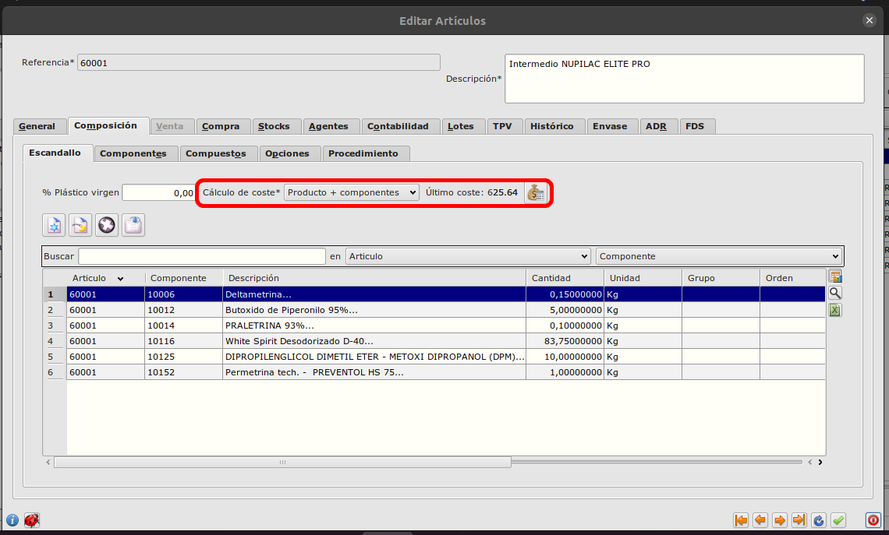

# Distintos cálculos de coste de artículo según componentes.

En el formulario de artículos hay un campo "Cálculo de coste" que indica el modo de cálculo del coste para este artículo, se encuentra situado en la pestaña de **Composición**.

Ruta: **Área de facturación -> Almacén -> Artículos**

## Producto
El coste será el coste de la última compra individual del producto.

## Por componentes 
El coste será igual a la suma de los costes de la última compra individual de cada uno de sus componentes.

## Producto + componentes 
El coste será igual al coste de la última compra individual del producto más la suma de todos los costes de la última compra individual de cada uno de sus componentes.

### Recalculo de costes
Al pulsar el botón para recalcular el último coste se abrirá un diálogo con la explicación de cómo se ha calculado en función del modo de cálculo seleccionado en el campo "Cálculo de coste"

