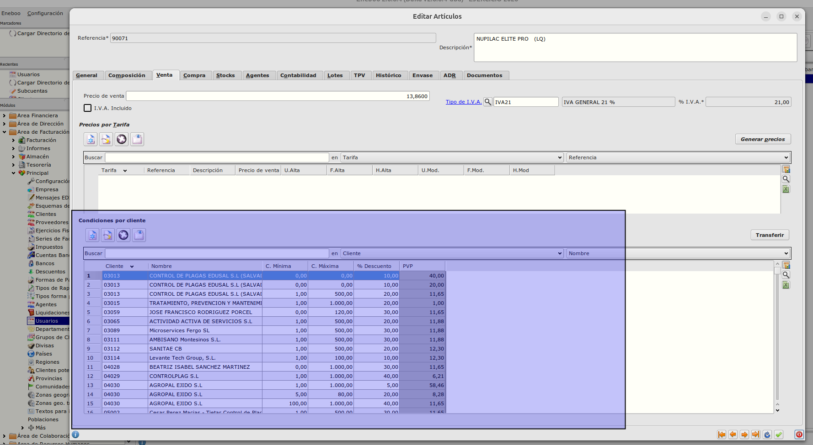
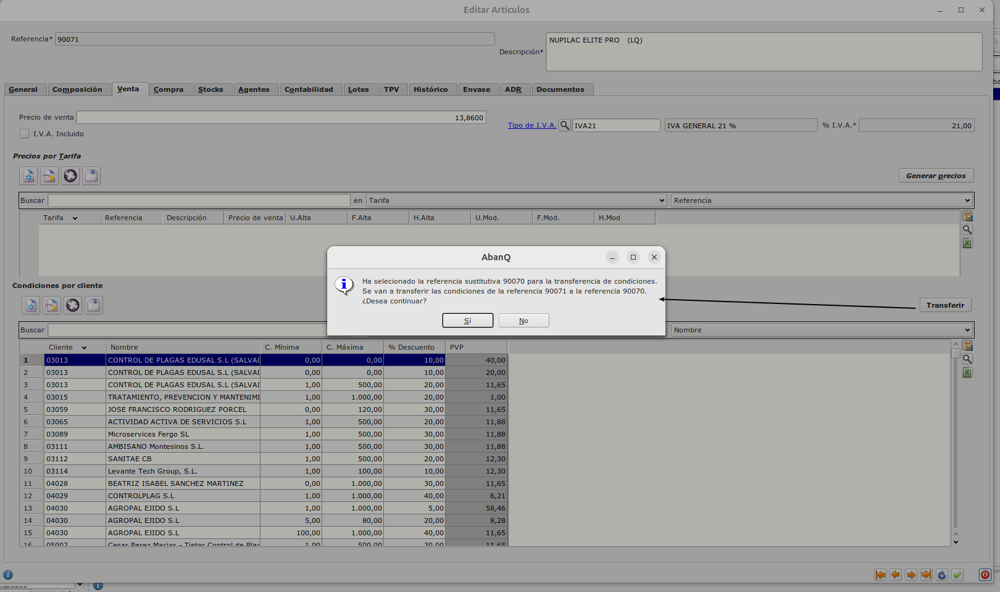
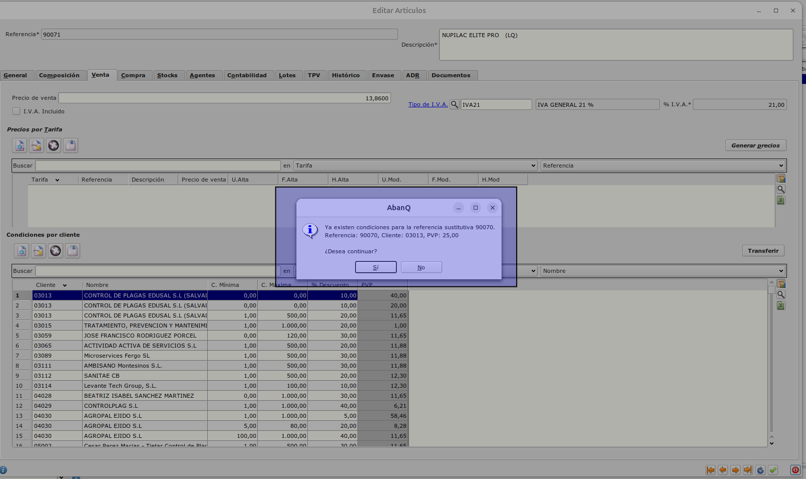

# Vista de precios por artículo y cliente desde artículos y botón de transferir

Los objetivos de este proyecto son:

+ Poder revisar los precios especiales de artículos por cliente desde artículos
+ Poder transferir las condiciones de precios de un artículo a otro sustitutivo cuando el original quede obsoleto.

## Estructura

### Almacén / Artículo / Venta
Incluiremos una tabla y su mantenimiento en la pestaña Venta de artículo llamada _Condiciones por cliente_

### Almacén / Artículo / Transferir condiciones
Crearemos un botón _Transferir_ en la cabecera de la tabla de condiciones que permitirá al usuario seleccionar el artículo al que transferir las condiciones y traspasará los datos de precio al nuevo artículo.

Condiciones:
    + Si el artículo destino tiene ya un registro de condiciones que coindicida (referencia de artículo + código de cliente) con alguno de los que se vayan a transferir el programa avisará y el usuario puede seguir o cancelar el proceso.

