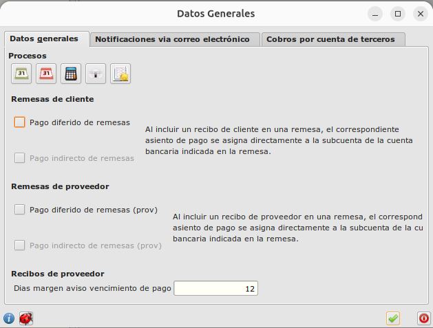
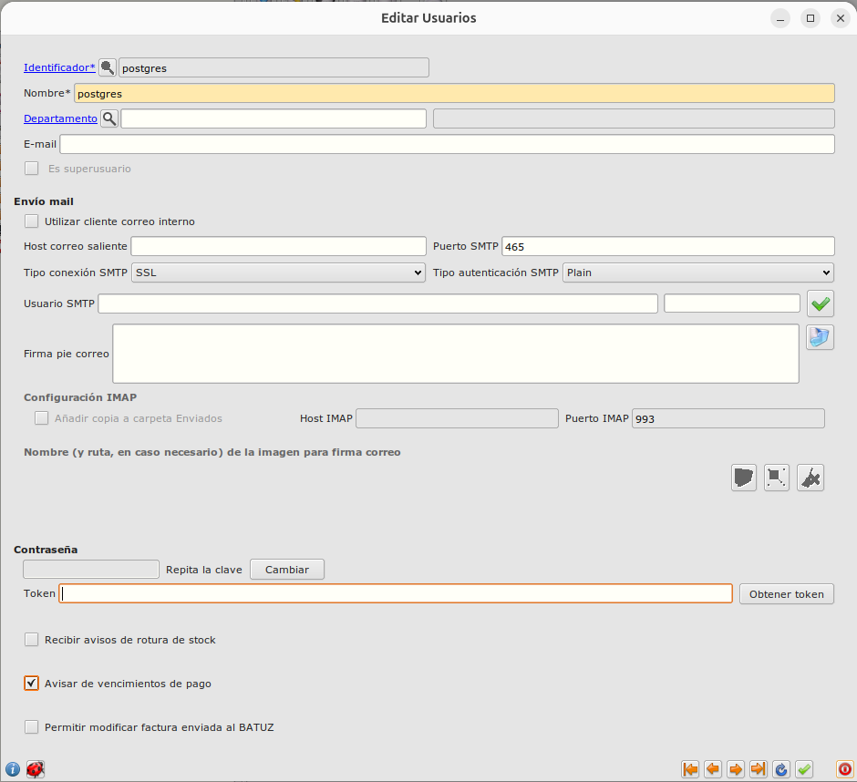
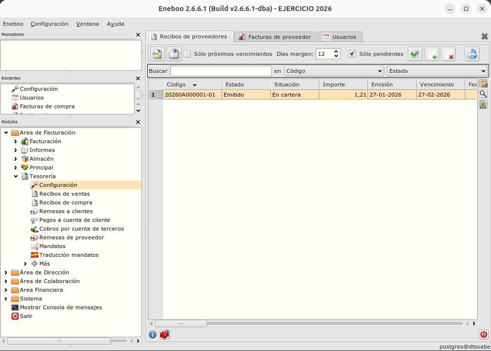
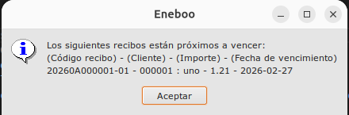

# Control de vencimientos de pagos a proveedores

El objetivo de este proyecto es gestionar pagos a proveedores antes de la fecha de vencimiento

## Configuración

Especificartemos los días de anticipo que queremos tener antes de que un vencimiento se haga efectivo.
Para ello , especificamos los días en la ventanda de **Configuración de Tesorería**

Si queremos recibir un mensaje de aviso nada más iniciar el programa , marcaremos el check **Avisar de vencimientos de pago** en nuestra ventana de usuario

## Funcionamiento

### Filtro master recibos de proveedores

El filtro se controla con:
 - El selector **días margen** ( por defecto , cantidad especificada en **Configuración de Tesorería**). 
 - Check para activar o desactivar filtro. Al marcar **Solo próximos vencimiento** se aplica tantos días especificados en el filtro de **Días margen** a la fecha de hoy ( hoy + dias_margen ), y se muestran solo los recibos que no estén en estado **pagado** desde hoy, hasta la fecha calculada.

### Aviso al arrancar el programa

Si hemos activado el check **Avisar de vencimientos de pago** en nuestra ficha de usuario, al arrancar y existir recibos de proveedor con fecha de vencimiento próxima, se mostrará un mensage como el siguiente:

