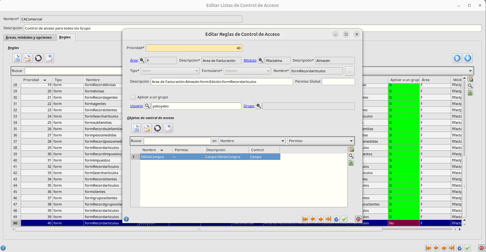

# Reglas de control de acceso

Para crear una nueva regla de control de acceso accedemos a **Sistema -> Control de acceso -> Listas de control de acceso** 

## Campo _Se Compra_ en artículos no editable

Editamos la lista de control de acceso existente y vamos a la pestaña _Reglas_. Insertamos una nueva regla y establecemos los siguientes datos:

- _Área_: F - Área de facturación
- _Módulo_: flfactalma - Almancén
- _Tipo_: form
- _Formulario_: Edición
- _Nombre_: formRecordarticulos

Después elegimos si queremos aplicar la regla a un grupo o a un usuario en concreto. Si queremos aplicar la regla a varios grupos o usuarios debemos crear la misma regla cambiando ese valor

En la tabla de _Objetos de control de acceso_ creamos un nuevo objeto con los siguientes valores:

- _Control_: Campo
- _Nombre_: fdbSeCompra/secompra
- _Permiso_: r-  (de esta forma permitirá ver el campo pero no editarlo)

Guardamos todos los formularios

## Instalación de nuevas reglas

Para hacer efectiva la nueva regla, la seleccionamos y pulsamos el botón _Instalar_ de la parte superior derecha. Cerramos eneboo y volvemos a entrar.