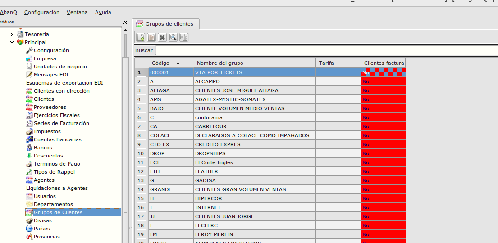
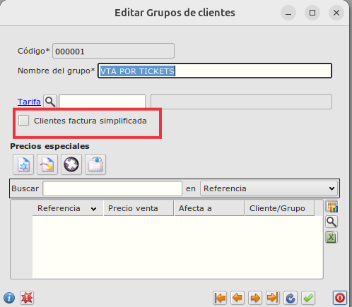

# Factura simplificada según el grupo de clientes
## Configuración de grupos de clientes
* En el formulario de *Grupos de clientes* que podemos abrir desde el **Área de Facturación --> Principal --> Grupos de clientes** podemos indicar si los clientes pertencientes a un grupo de clientes tendrán factura simplificada o no, marcando o desmarcando el check de *Clientes factura simplificada*

### Selección datos de cliente y dirección en facturas

* Al generar una factura de un cliente perteneciente a un grupo de clientes que **SI** tiene el check marcado de *Clientes factura simplificada*

    * El campo *Clave Tipo Factura* será **F2**
    * Si la factura proviene de un albarán:
        - El campo *Nombre* se copiará del Albarán.
        - El campo *C.I.F./N.I.F.* se copiará del Albarán.
        - Los campos *Dirección*, *Ciudad*, *Provincia*, *C.P.* y *País* se copiarán del albarán.
 
* Si el cliente pertenece a un grupo de clientes que **NO** tiene el check marcado de *Clientes factura simplificada*.

    * El campo *Clave Tipo Factura* se calculará según los criterios actuales.
    * Si la factura proviene de un albarán:
        - El campo *Nombre* se calculará según el código del cliente.
        - El campo *C.I.F./N.I.F.* se calculará según el código del cliente.
        - Los campos *Dirección*, *Ciudad*, *Provincia*, *C.P.* y *País* se calcularán según la dirección de facturación del cliente.
 