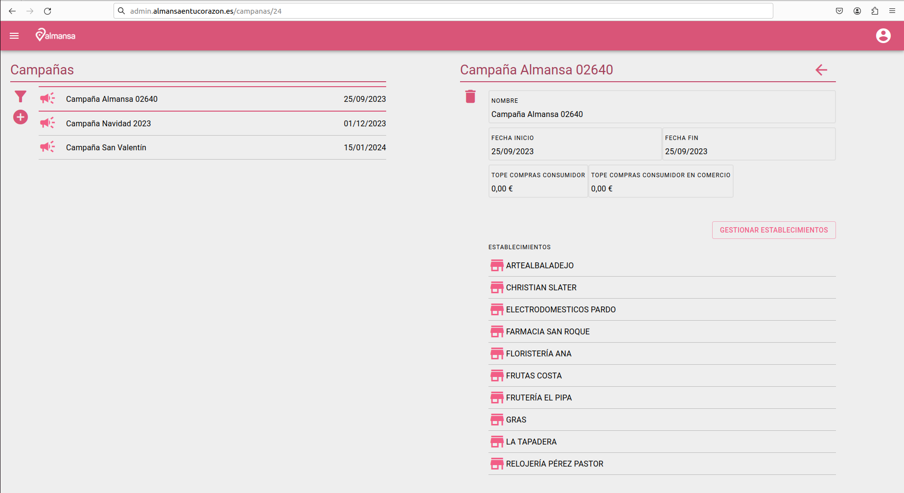
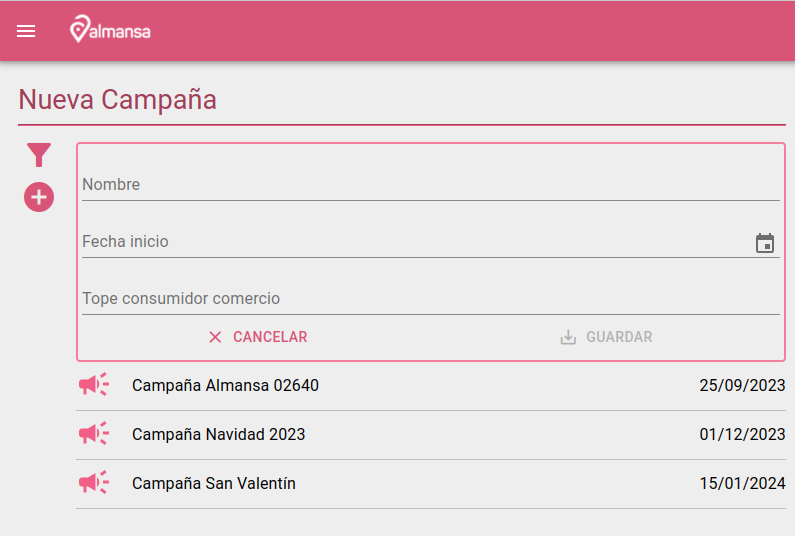
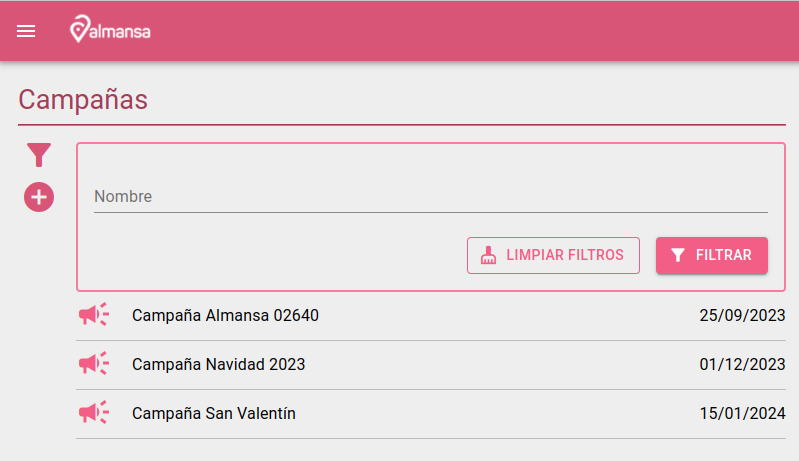
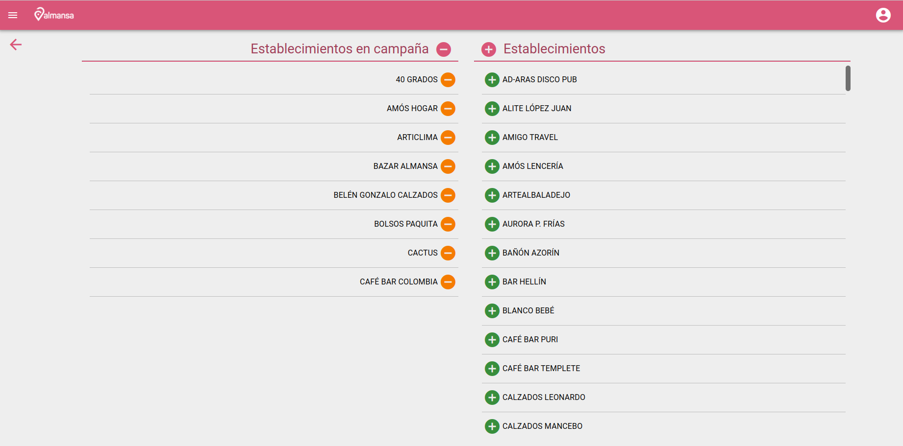

# Pantalla gestión de campañas

Pantalla con lista de campañas, los datos de las campañas son editables y posibilidad de eliminar una campaña de la lista.

## Nueva campaña

Pulsando el botón + abre formulario para dar de alta una nueva campaña

## Filtro campañas

Pulsando el botón  abre formulario para buscar campañas por nombre.

## Gestionar comercios de una campaña

Pulsando el botón Gestionar comercios navega a la pantalla de gestión de comercios suscritos a una campaña

El botón - naranja quita un comercio de la campaña, el azul quita todos los comercios dejando a la campaña sin comercios suscritos.

El botón + naranja suscribe un comercio a la campaña, el azul añade todos los comercios a la campaña.

[Volver al Índice](../index.md)