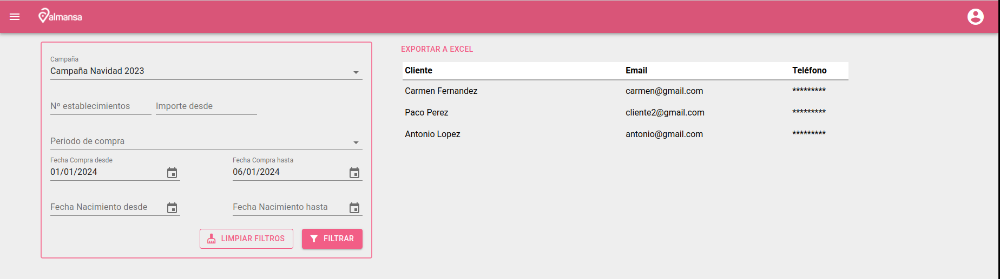
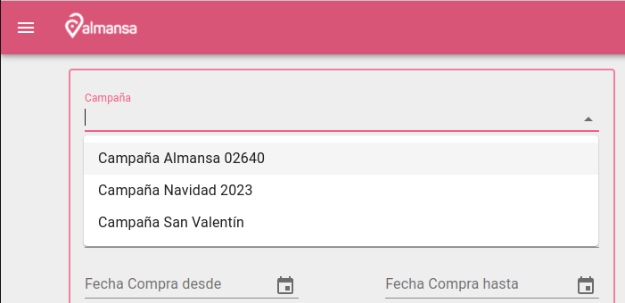
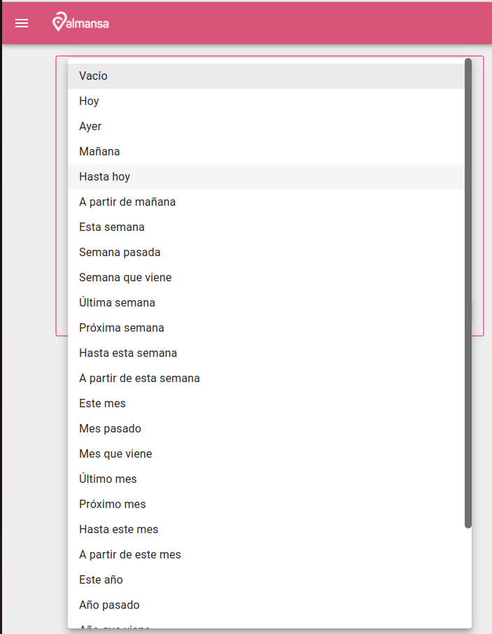

# Pantalla consultas datos clientes

Permite la consulta de clientes con diferentes condiciones:

- Campaña en la que se realizo compra
- Numero de comercios diferentes en los que ha comprado
- Importe minimo en compra
- Perido en el que se realizo la compra
- Fecha de nacimiento del cliente

##

Las campañas se pueden buscar por nombre

El perido de compra se puede seleccionar manualmente o de entre una lista

[Volver al Índice](../index.md)