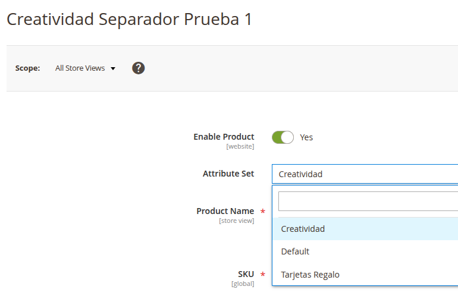
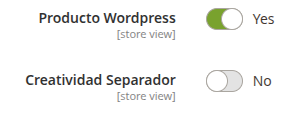
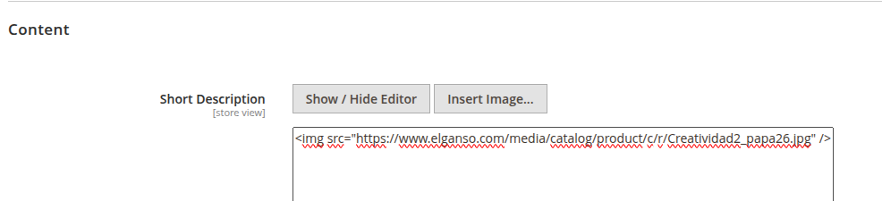
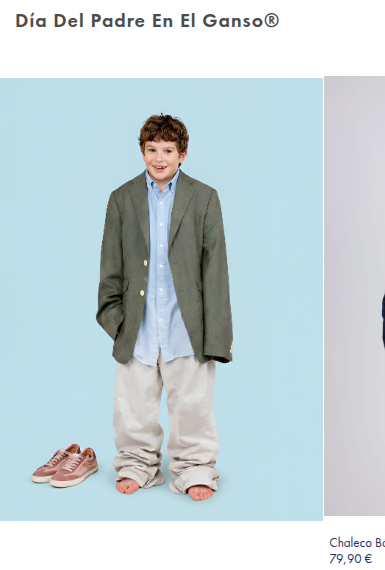
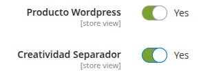
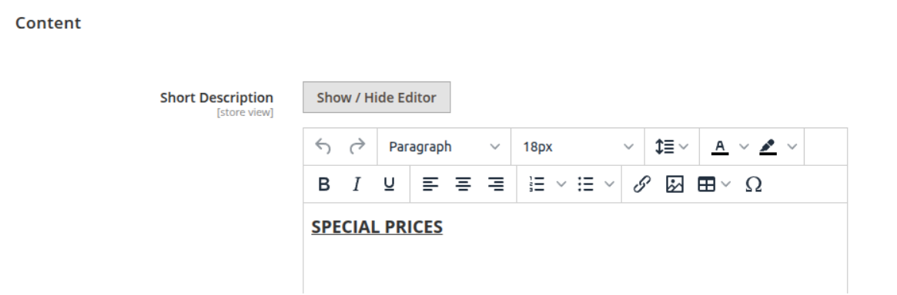
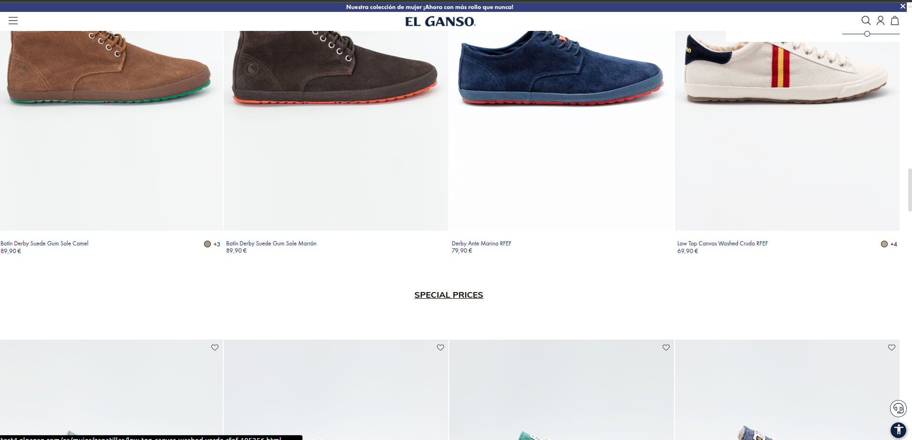
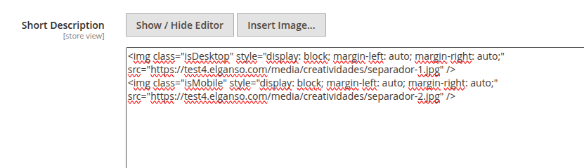
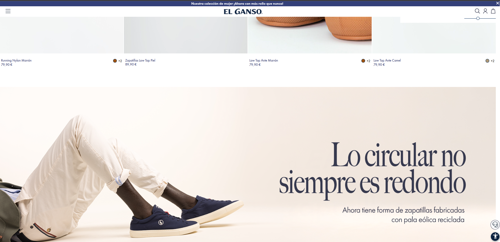

# CONFIGURACION CREATIVIDADES WEB

## 1. Configurar Atributo de Producto

Debemos marcar el producto como tipo cratividad configurando el atributo **ATTRIBUTE SET** como creatividad.



Al configurarlo como creatividad nos aparecen estos 2 nuevos atributos dentro de el producto.


El primer atributo **Producto Wordpress** debe estar marcado **SIEMPRE** para que nuestro producto sea una creatividad, si no lo marcamos se seguira tratando como un producto normal.

El segundo atributo **Creatividad Separador** es opcional y lo podemos marcar para utilizar nuestra creatividad como un separador para la catgoria **(ejemplo más adelante)**.

## 2. Tipos de Creatividad
### 2.1. Creatividad como producto
Esta es la creatividad más sencilla que imita a un producto. Para esta tenemos que hacer 2 cosas, marcar el producto como creatividad como hemos visto en el punto anterior.



Después de marcarlo, debemos configurar la imagen que queremos. En este caso nos vamos dentro de el producto a la sección **Content → Short Description**.



Este es el código de la imagen para pegarlo directamente en el admin, se debe cambiar el src con la url de la imagen que queremos.

```txt

```

Así nos debería de quedar nuestra creatividad.



### 2.2. Creatividad como separador

Esta creatividad la podemos utilizar para realizar separaciones dentro de la categoría o incluir titulos a mitad de esta. Debemos marcar los 2 checks que hemos visto en el punto 1.



Ahora tenemos 2 opciones de separador que veremos a continuación:

#### 2.2.1. Separador como titulo

Para este tipo, dentro de el producto a la sección **Content →Short Description** podemos configurar nuestro texto dandole los estilos personalizados que queramos con el editor que nos proporciona.



Si no vemos el editor debemos hacer click en el boton **Show/Hide Editor** para que se muestre.

Así nos debería de quedar nuestro separador en forma de título.



#### 2.2.2. Separador como imagen

Para este segundo tipo debemos ir a la misma sección **Content →Short Description** pero para este caso la utilizaremos sin editor de texto ya que vamos a incluir codigo html como en el tipo de creatividad de el punto 2.1.

En este caso vamos a configurar 2 imagenes ya que nuestro separador va a tener una imagen diferente en modo movil que la que pongamos en escritorio.



Hemos creado las clases **isDesktop (visible en escritorio)** y **is Mobile (visible en movil/app)**, con ellas diferenciamos que imagen mostramos en movil y cual en escritorio.

Podeis copiar el siguiente codigo y modificar la url de las imagenes:
```txt


```

Con esto configurado deberíamos de ver nuestro separador de imagen de la siguiente forma:


