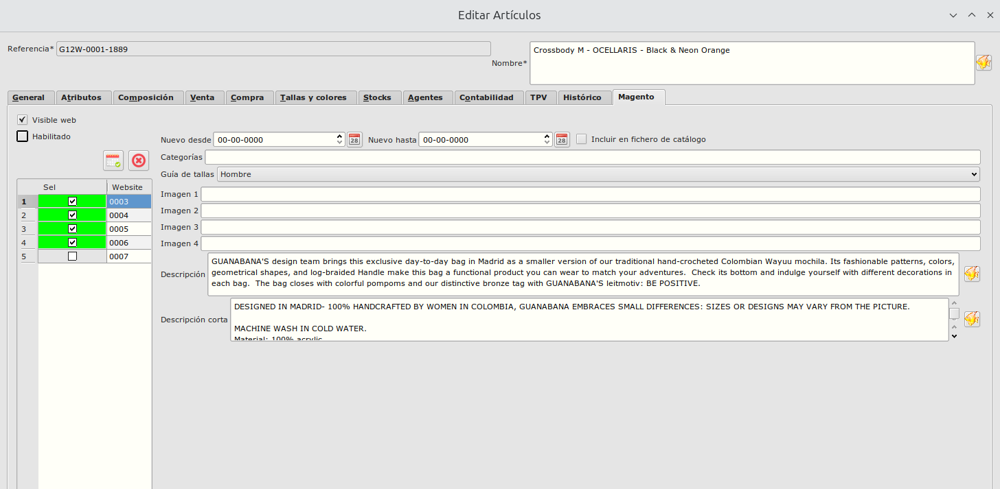
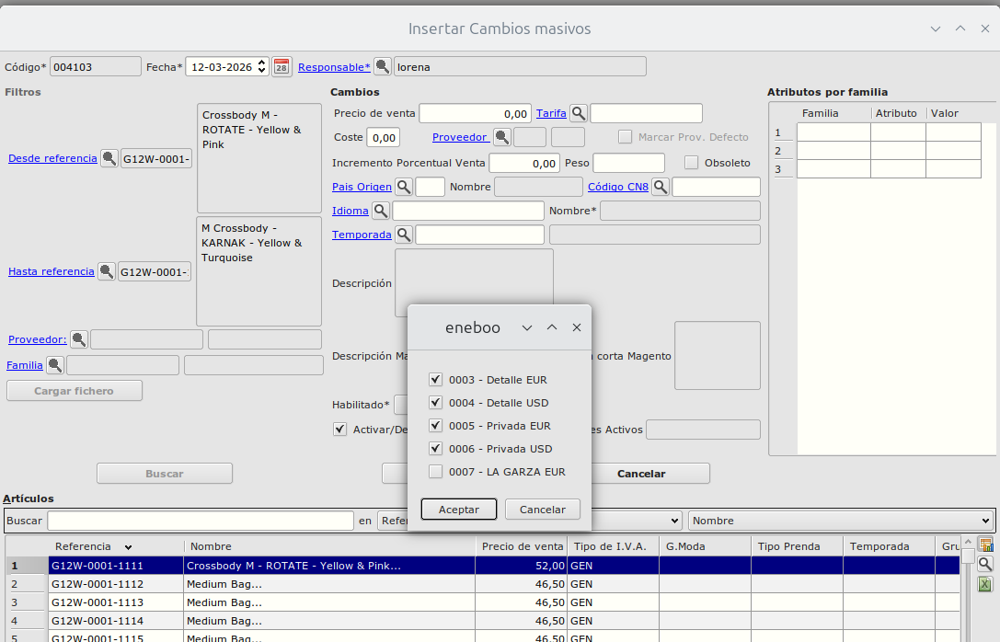
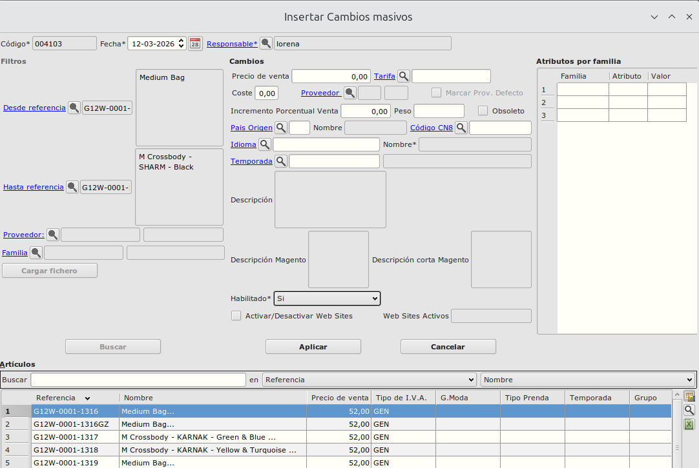

# Sincronización de artículos con la web

## Enviar productos al admin de magento

Antes de publicar un producto en la web podemos enviarlo al panel de administración de magento para configurarlo. Podemos hacerlo de dos formas

### Enviar un sólo producto

Para enviar un sólo producto nos vamos a Facturación->Almacén->Artcículos, seleccionamos el artćiulo a enviar, lo abrimos y nos vamos ala pestaña Magento.

En esa pestaña seleccionamos los Web Sites en los que queremos que aparezca y guardamos el artículo.
Esto generará un registro en la cola de sincronizaciones por cada website seleccionado.
Se enviará el producto al panel de administración de magento pero todavía no será visible en la web.

### Enviar varios productos a la vez

Para enviar un grupo de artículos podemos hacerlo desde cambios masivos. Para ello accecdemos a Facturación->Almacén-Cambios masivos. Insertamos un nuevo registro y buscamos los artículos a modificar. Podemos hacerlo estableciendo filtros por referencias, familia..., o cargando/copiando las referencias desde un fichero.
Pulsamos el botón buscar y en la tabla inferior aparecerá la lista de referencias para las que se aplicarán los cambios.

Para generar los registros de sincronización marcamos el check Activar/Desactivar Web Sites y seleccionamos los web sites a los que las queremos sinconizarlas.

Una vez sincronizado con el panel de administración de magento poddremos configurar los valores propios de magento, como imágenes o categorías en las que será visible. 

NOTA: No deben modificarse datos que se sincronicen desde el erp, como por ejemplo descripciones, para evitar que se pierdan al habilitarlo.

## Habilitar un producto para que sea visible en la web

Una vez tenemos los productos configuradas en el panel de administración de Magento y queremos que aparezcan visibles para los usuarios de la web debemos habilitarlos. Esto podemos hacerlo de dos forams:

### Habilitar un sólo producto

Para habilitar un sólo producto nos vamos a Facturación->Almacén->Artcículos, seleccionamos el artćiulo a enviar, lo abrimos y nos vamos ala pestaña Magento.

En esa pestaña marcamos el check Habilitado. Esto generará un registro en la cola de sincronizaciones por cada website en el que esté activo.
Una vez se sincronice ya será visble en la web

### Habilitar varios productos a la vez

Para enviar un grupo de artículos podemos hacerlo desde cambios masivos. Para ello accecdemos a Facturación->Almacén-Cambios masivos. Insertamos un nuevo registro y buscamos los artículos a modificar. 
Podemos hacerlo estableciendo filtros por referencias, familia..., o cargando/copiando las referencias desde un fichero.
Pulsamos el botón buscar y en la tabla inferior aparecerá la lista de referencias para las que se aplicarán los cambios.

Para habilitar esos productos y que sean visibles por los usuarios de la web en el valor de Habilitado seleccionamos la opción Si. Si pulsamos Aplicar, se genrarán los registros de sincronización correspondientes.

