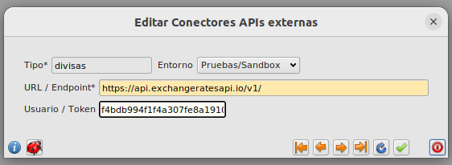
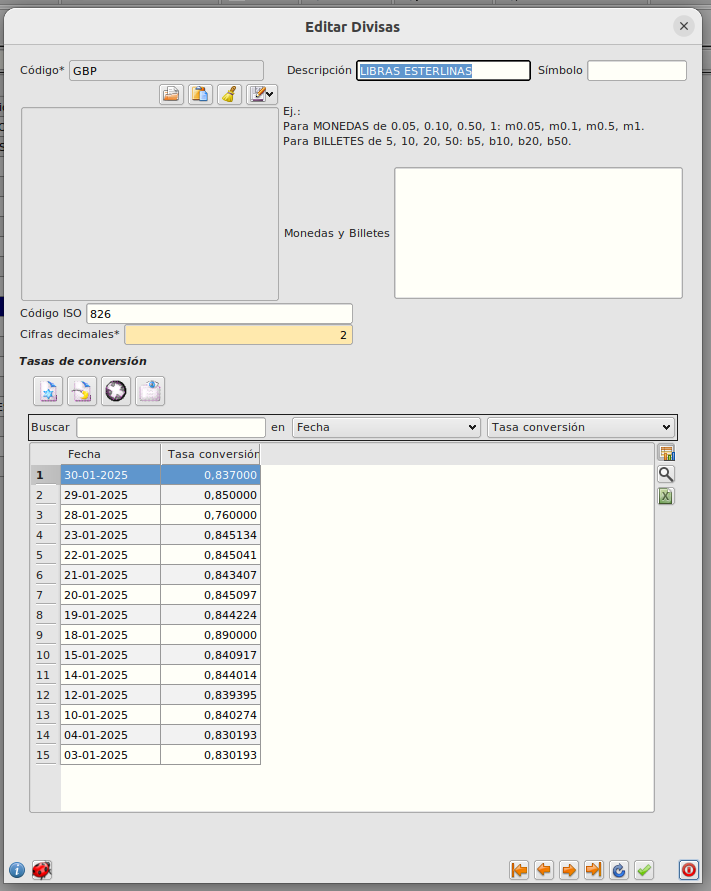
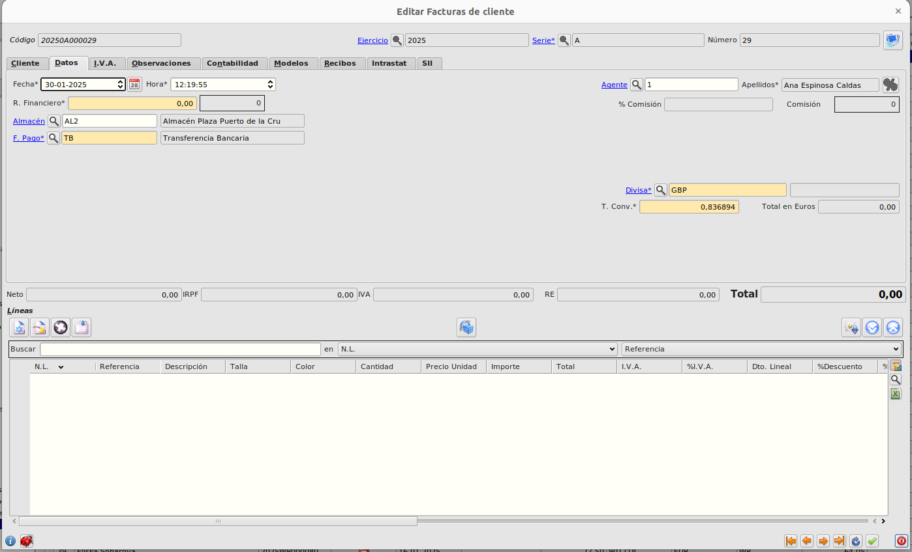

# Sincronizacion automática de divisas

## Crear una cuenta en la API
Ir a la web https://manage.exchangeratesapi.io/ y crear una cuenta gratuita.

Copiar el token **API Access Key**

## Crear conector con la API

En el ERP desde el formulario de conectores en *Facturación/Principal/Más/Tablas Generales/Conectores*, crearemos un entrada como la siguiente eligiendo el entorno y el token adecuado.

## Listado de tasas de conversión divisa

Cada divisa contará con un listado de tasas de conversión ordenado desde más reciente. Podemos introducir manualmente un registro o modificar uno existente.

Estos listados se actualizan automáticamente, para todas las divisas exisistentes en la actualidad con la API externa, cada vez que introducimos una fecha que no estuviera ya registrada al crear o modificar el campo *fecha* o el campo *divisa* desde la pestaña *Datos* de una factura o un albarán.

