# Envíos Agencia

## Crear nueva agencia de envío

* Podremos crear y configurar una agencia de envío desde **Área de Facturación -> Principal -> Tarifas de transporte**

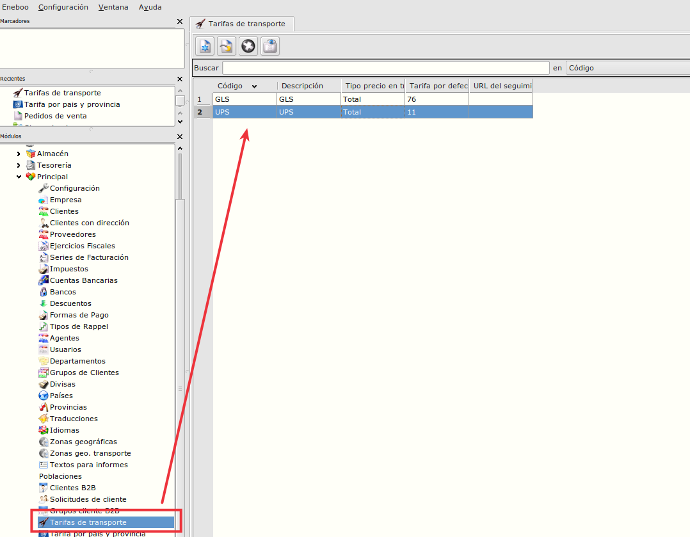

* Pulsaremos en nuevo registro e informaremos el código, descripción, las posibles tarifas que tenga contratadas el cliente y la tarifa por defecto.

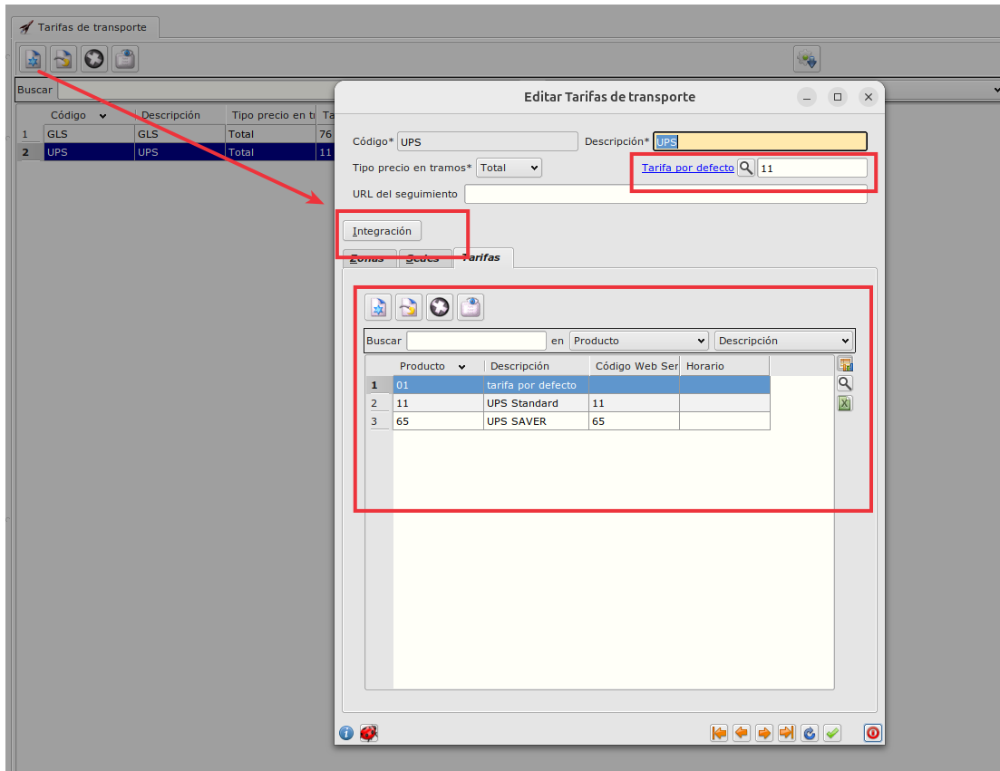

* Pulsaremos en el botón de integración para informar los datos de configuración del cliente proporcionados por la agencia

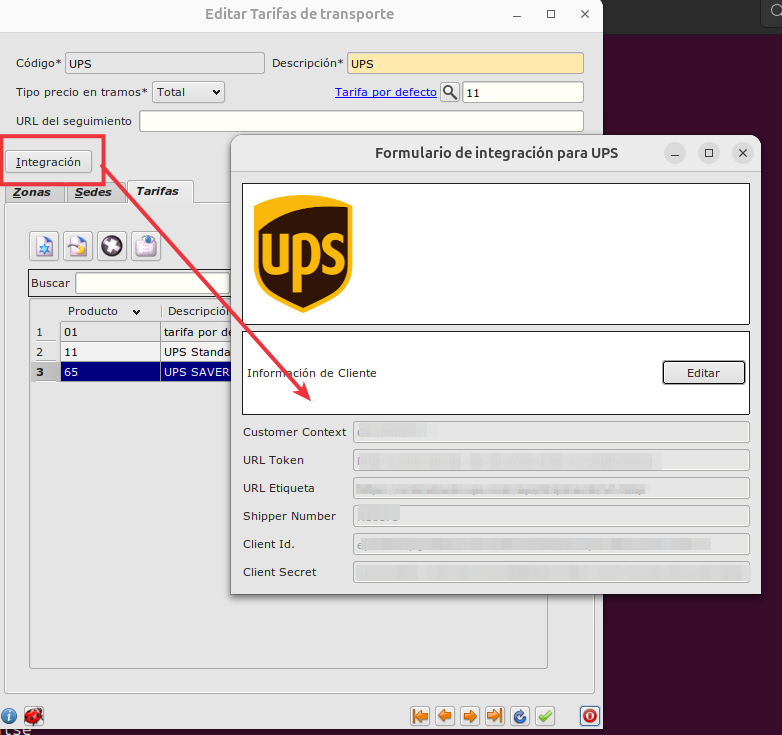

## Agencia de envío según país y provincia

* Podremos configurar que agencia de envío se asignará a cada albarán de venta según el país y provincia que tenga creando reglas desde el **Área de Facturación -> Principal -> Tarifas por país y provincia**

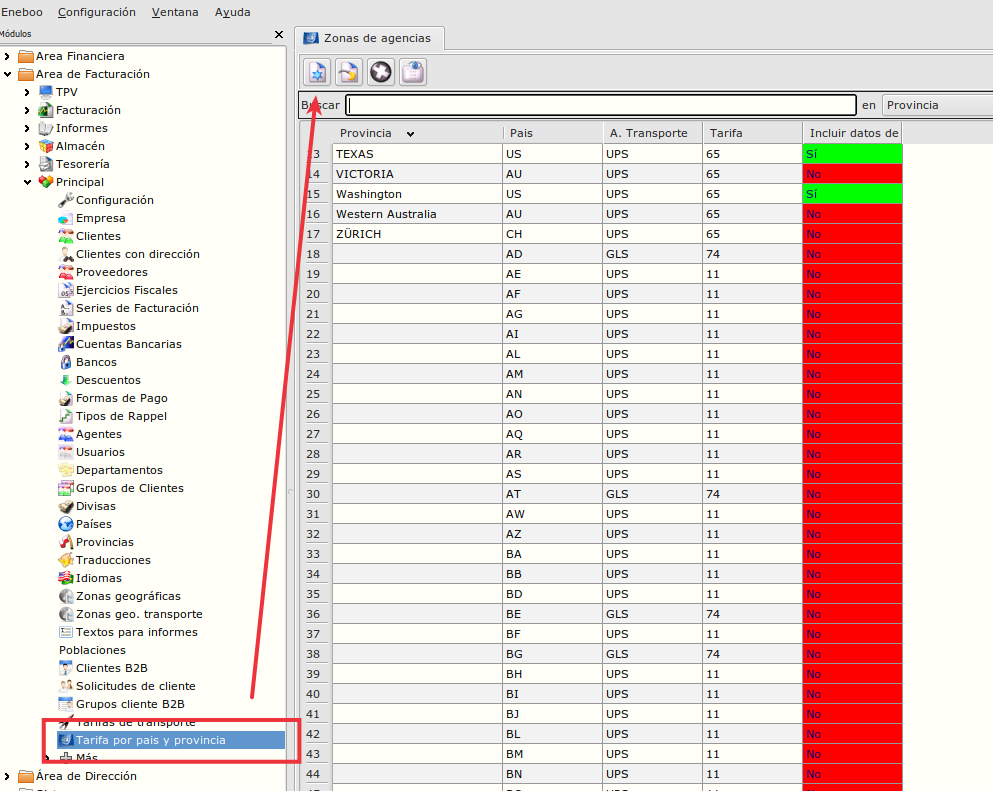

* Al crear una nueva regla, informaremos obligatoriamente la agencia de transporte y la tarifa, opcionalmente informaremos el país, la provincia y marcaremos el check o no de que necesita tener la factura creada para crearse el envío.

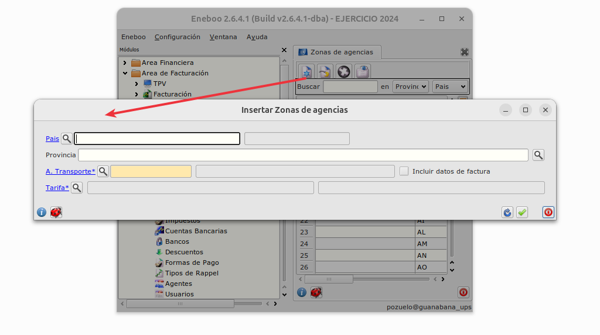

* La prioridad para obtener la tarifa es:

    1. País y provincia

    2. País

    3. Nada

* El funcionamiento de las reglas será el siguiente:

    - Se genera el albarán.

    - Automáticamente el sistema busca una regla (un registro en la tabla *Tarifas por páis y provincia*) donde tenga informado el mismo *país y provincia* que el albarán.

        - Ha encontrado un registro, se informará en el albarán la agencia y tarifa encontrada.

    - No ha encontrado un registro, el sistema busca una regla donde tenga informado el mismo *país* que el albarán y tenga la provincia vacía.

        - Ha encontrado un registro, se informará en el albarán la agencia y tarifa encontrada.

    - No ha encontrado un registro, el sistema busca una regla donde NO tenga informado *ni país ni provincia*.

        - Ha encontrado un registro, se informará en el albarán la agencia y tarifa encontrada.

    - Si no ha encontrado ningún registro NO se informará la agencia en el albarán.

## Datos obligatorios al generar envío.

* Al generar el envío el sistema exigirá que estén informados una serie de datos en el albarán.

    - Provincia --> Si el país es *US* o *CA*, la provincia tiene que estar informada en el albarán y además tener un código válido de provincia en el formulario de provincias

    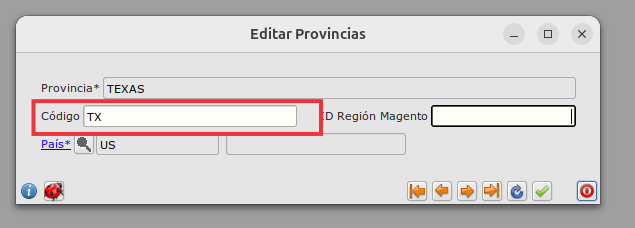

    - Factura --> Si la tarifa seleccionada por país y provincia tiene el check de *Incluir datos de factura*, al generar el envío el sistema exigirá que esté creada la factura y además que la factura tenga algunos datos obligatorios informados y algunas restricciones.

        - Provincia --> Tiene que estar informada la provincia en la factura y además tener un código válido de provincia en el formulario de provincias.

        

        - CódigoCN8 en artículos --> Las referencias de las facturas tienen que tener asociado un código CN8 en su ficha.

        - Peso --> Las referencias de las facturas tienen que tener asociado un peso en su ficha

        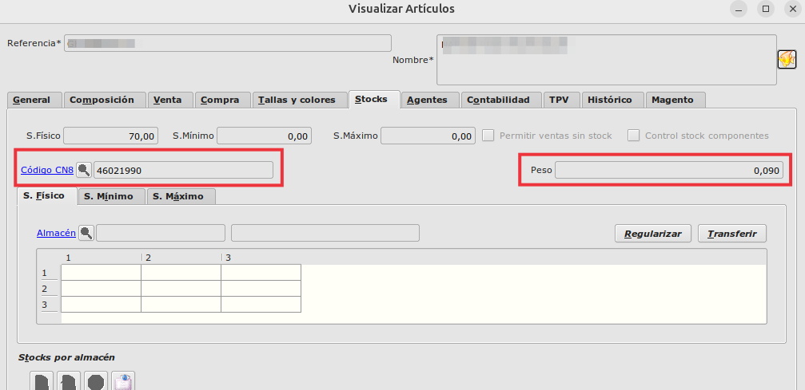

        - Observaciones --> Las observaciones de las facturas tiene las restricción de que tienen como máximo 550 caracteres.

## Como modificar datos obligatorios de albarán o factura que está bloqueado

* Puede ocurrir que al ir a generar un envío no tengamos informados algunos de los datos obligatiorios en el albarán o en la factura y al estar el albarán o la factura bloqueada ya no se puede modificar.

* En el caso de albaranes, pulsaremos sobre el botón de *Modificar Albarán* y nos mostrará las opciones que podemos modificar:

    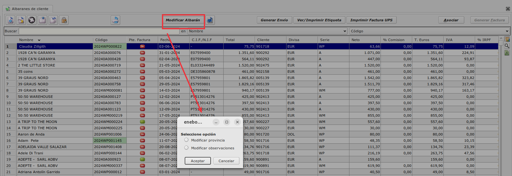

    - Si pulsamos en una de ellas nos mostrará un diálogo para informar o cambiar el dato.

    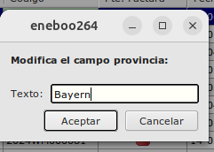

* De forma similar, en facturas pulsaremos sobre el botón de *Modificar Factura* y nos mostrará las opciones que podemos modificar:

    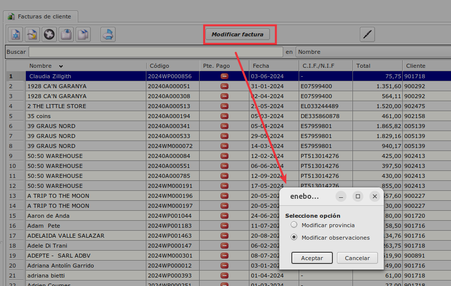

    

## Generar envío

* Para generar un envío pulsaremos en el botón de *Generar Envío* en el maestro de albaranes teniendo seleccionado el albarán al que queremos realizar el envío.

    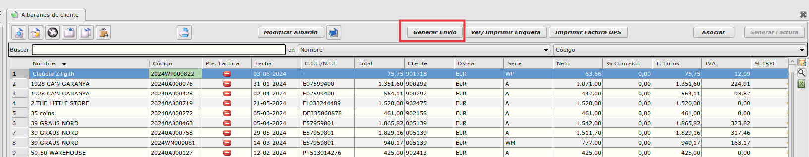

* Si hay una regla válida para el país y provincia, automáticamente se informará la agencia

    * Si no hay una regla válida, nos pedirá que seleccionemos manualmente la agencia de transporte. 

    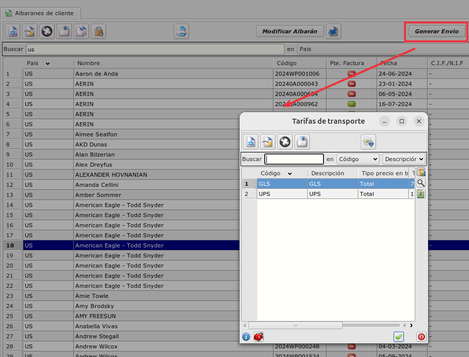

* Una vez informada la agencia, el sistema nos pedirá que marquemos cantidad de bultos y peso 

    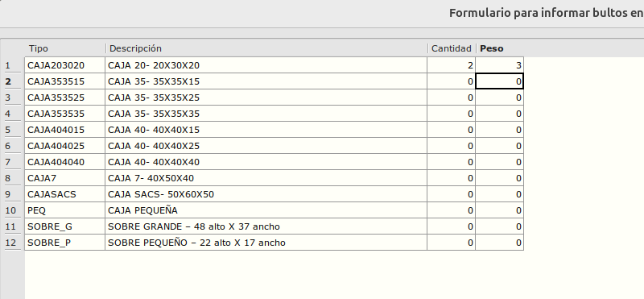

* Si todos los datos obligatorios están bien, nos aparecerá la ventana de la agencia dónde revisaremos los datos y cambiaremos aquellos que creamos necesario cambiar.

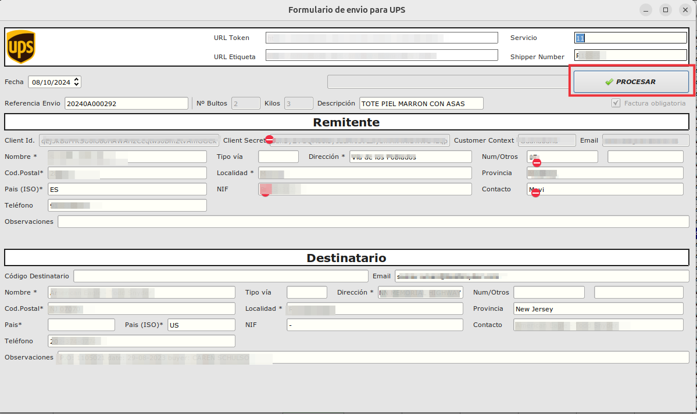

    * Si hay algún dato que no está informado nos aparecerá un mensaje para que lo arreglemos y no nos dejará continuar. Utiliaremos los botones de *Modificar Albarán* o *Modificar Factura* si es necesario por estar bloqueados los registros.

    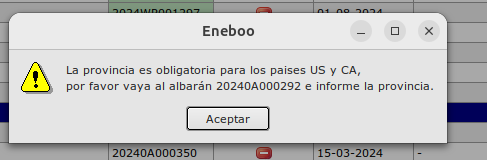

    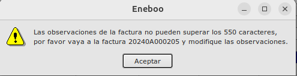

* Pulsaremos en procesar

    

* Si todo ha ido bien nos mostrará un mensaje indicándolo

    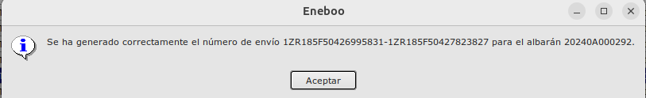

* Se mostrará la etiqueta por pantalla 

    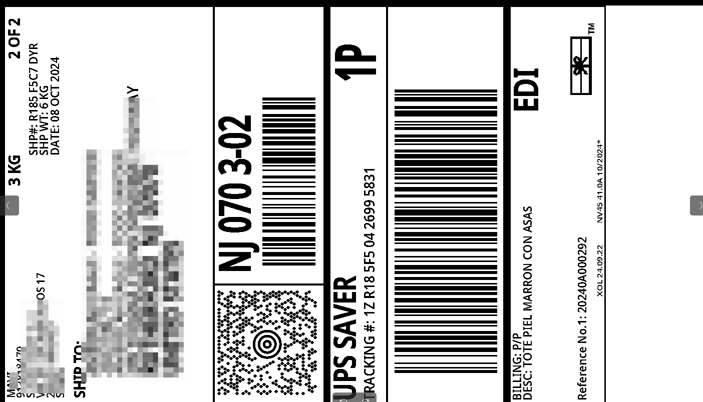

* El registro se marcará en verde indicando que el preceso ha ido correctamente.

    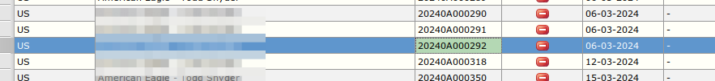

* Puede ocurrir que se haya generado el envío pero no se haya devuelto etiqueta **(solo para GLS)**, en este caso el registro se queda en amarillo y habrá que volver a pulsar el botón sin borrar nada en un rato para que vuela a realizar la petición de etiqueta.

    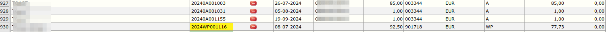

## Reimpresión de etiqueta

* Para reimprimir una etiqueta, pulsaremos en el botón de *Ver/Imprimir etiqueta* en el maestro de albaranes teniendo seleccionado el albarán al que queremos realizar la reimpresión de la etiqueta.

    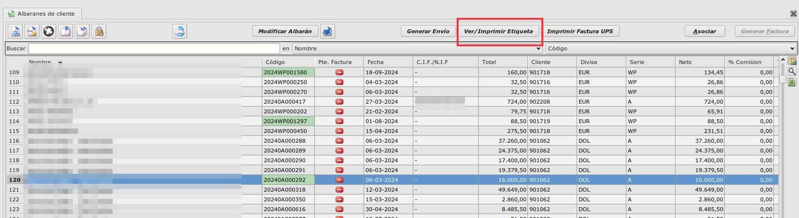

## Impresión de factura

* Para imprimir la factura generada por la agencia **(UPS)**, pulsaremos en el botón de *Imprimir factura UPS* en el maestro de albaranes teniendo seleccionado el albarán al que queremos realizar la impresión de la factura.

    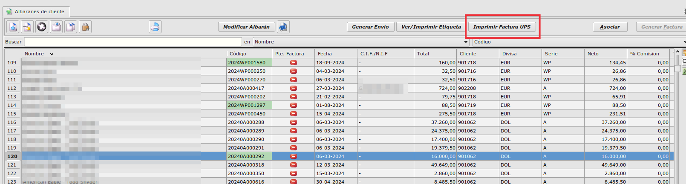

    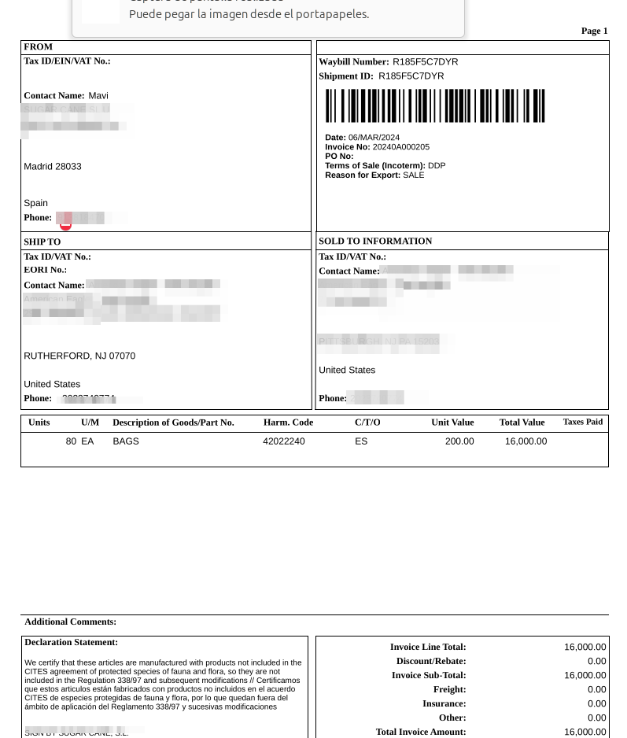

