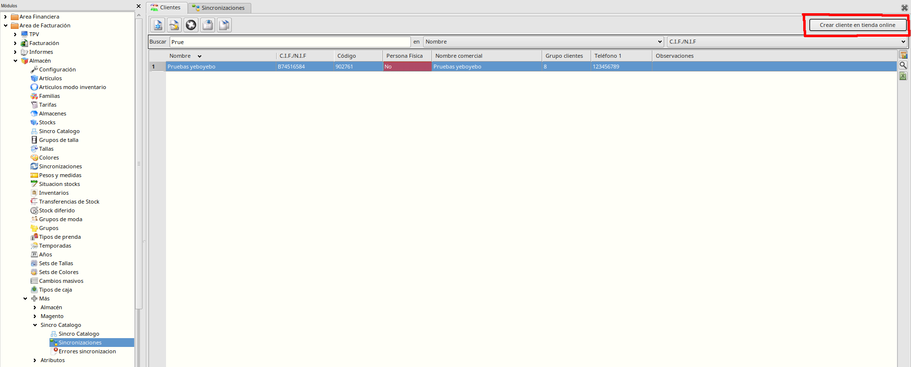
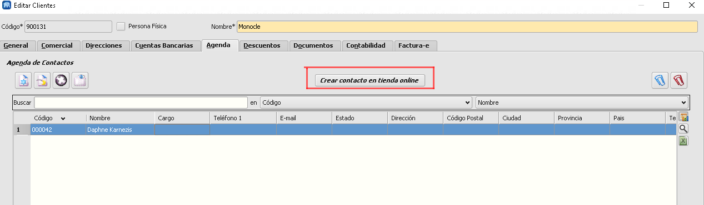
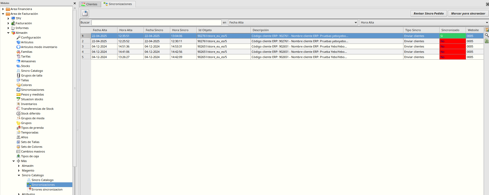
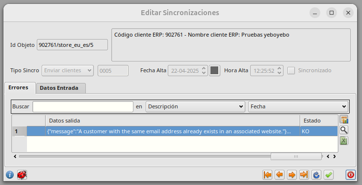

# Sincronización de clientes/contactos mayoristas

El objetivo de este proyecto es crear un botón desde el formulario de clientes para crear los clientes o sus contactos asociados de forma automática en la tienda privada.

### Creación automática de clientes y contactaos en la tienda online
Los pasos son:
* Vamos a *Facturación - Principal - Clientes* y seleccionamos el cliente a crear.
* Sin el lugar del cliente queremos sincronizar un contacto vamos a *Facturación - Principal - Clientes - Pestaña Agenda* y seleccionamos el contacto a crear. (El contacto debe de tener informado el email)
* Pulsamos el botón *Crear cliente en tienda online*.
    * Si el cliente/contacto ya está creado (tiene informado el campo *Id. Magento*), el botón esta deshabilitado.

* Aparece un mensaje en el que se nos pregunta en qué Store view queremos crear el cliente, las opciones serán:
    * USD / Inglés
    * USD / Español
    * EUR / Inglés
    * EUR / Español
* Seleccionamos un website y pulsamos *Continuar*
    * Se apunta un registro del cliente en la cola de sincronizaciones en el website seleccionado, copiando los siguientes datos de la tabla de clientes:
        * *email*
        * *Nombre y apellidos*: (se tomarán automáticamente del nombre del cliente separando por el primer espacio)
        * *CIF / VAT*
        * *Teléfono*
        * *Direcciones*
        * *Contraseña*: Por defecto será siempre 'Guanabana-25', luego podemos entrar en Magento y cambiarla de forma manual, o pedir al cliente que lo haga.
    * El programa ejecuta automaticamente los registros de las sincronizaciónes cada minuto.
    * Cuando se ha creado el cliente en la tienda online, se guarda el Id del cliente creado en el nuevo campo *Id. Magento*.

* Podemos consultar la cola de sincronizaciones para ver las sincronizaciones pendientes, las que se han sincronizado correctamente o las que no han podido sincronizarse. Para ello accedemos al 'Area de Facturación -> Almacén -> Más -> Sincro Catálogo -> Sincronizaciones'

Veremos una tabla ordenada por fecha de alta en la cola, en la que podremos ver, entre otros datos, sus fechas y horas de alta y sincronización, el objeto a sincronizar, el tipo de sincro (en este caso 'Enviar Clientes') y si ha sido o no sincronizado.

* Un registro que está pendiente de sincronizar cuando tiene los valores de fecha y hora de sincronización vacíos y la columna 'Sincronizado' a 'No'
* Si un registro se ha sincronizado correctamente aparecerán informadas la fecha y hora de sincronización y el valor de 'Sincronizado' a Si.
* Si un registro se ha intentado sincronizar pero ha habido algún problema tendrá infomados los datos de fecha y hora de sincronización pero la columna 'Sincronizado' aparecerá como 'No'. Al editar ese registro podemos ver en la tabla de Errores un registro con el error obtenido en el campo 'Datos Salida'.

En este caso ha fallado la sincro de este cliente porque ya existía uno con el mismo email.

### Sincronización de pedidos de magento

A la hora de sincronizar un pedido de magento con eneboo, si existe en eneboo un cliente para el email con el que se creó el pedido de magento se asignará al pedido el cliente que corresponda. Si el email corresponde a un contacto también se buscará el cliente correspondiente a ese contacto.