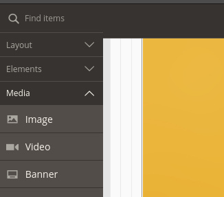
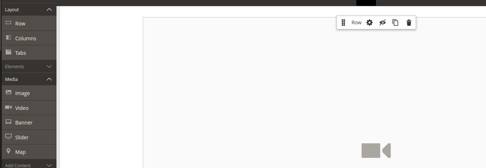
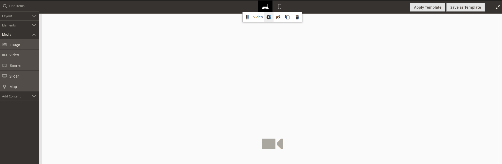
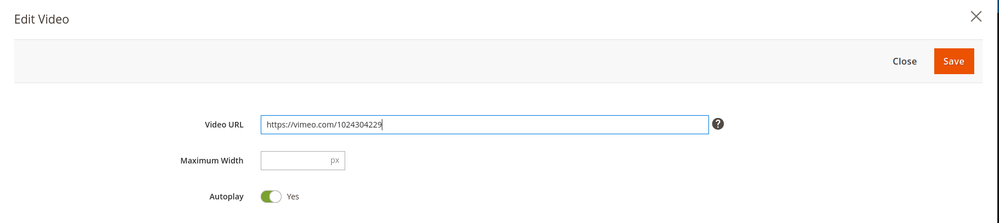

# Videos en bloques CMS

> **NOTA**: Consultar primero el tutorial [**Subir y configurar vídeo desde Vimeo**](../subir-video-vimeo/subir-vimeo.md)

## Insertar un video en un bloque CMS

* Accediendo al admin de Magento, editaremos el bloque/página CMS donde queramos insertar el video. Para esta guía trabajaremos con el bloque **PUBLICA-ES-Imagen Home**.

* Dentro del editor nos iremos al desplegable **Media** y arrastraremos la opción **Video** al contenido.

    

* **IMPORTANTE:** El bloque video siempre debe ir **dentro de un elemento contenedor** del desplegable **layout** (row, colums, ...), ya que no se puede incluir directamente en un bloque vacio.

    

* Veremos el bloque de video que hemos insertado vacío, lo editaremos poniendo el ratón sobre este y haciendo clic en la rueda de herramientas.

    

* Copiaremos el enlace del video y lo pegaremos en el campo **Video URL**. *(Para que se reproduzca el video cuando carga la página activaremos la opción **Autoplay**)*

    

* Si guardamos y recargamos la web ya deberíamos ver el video en la web.
    
    
