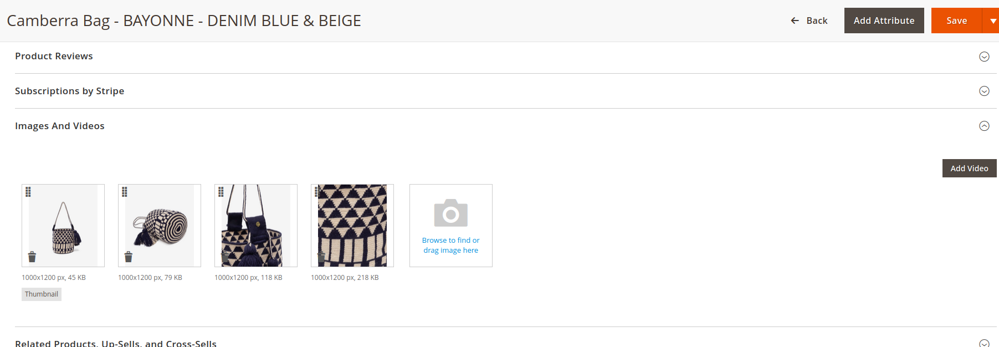
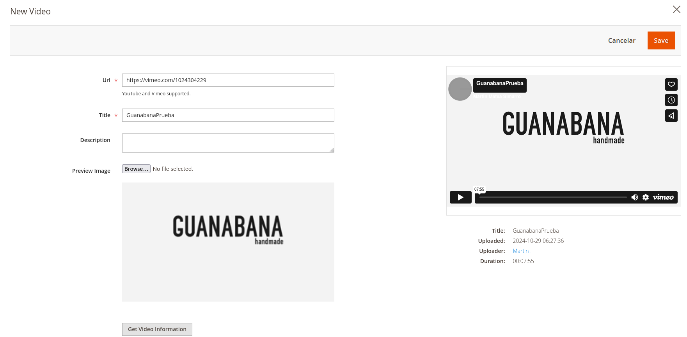
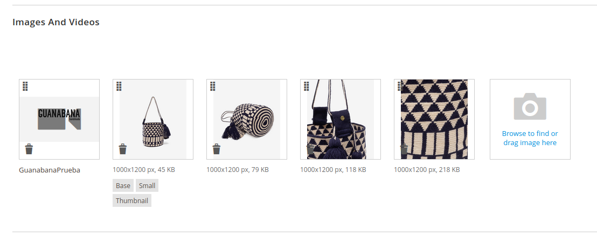

# Videos en productos

> **NOTA**: Consultar primero el tutorial [**Subir y configurar vídeo desde Vimeo**](../subir-video-vimeo/subir-vimeo.md)

## Insertar un video en un producto

* Accediendo al admin de Magento, entraremos en el producto el cuál le añadiremos un vídeo en su galería.

* Bajaremos hasta el desplegable **Images And Videos** y ahí haremos clic en  el botón de la derecha **Add Video**.

    

* Se nos abrira la ventana para configurarlo, debemos agregar la **url** del vídeo y un título.
    
    

* Una vez añadido, podemos arrastarlo y ponerlo en la posición que queramos mostrarlo en la web.

    

* Guardamos la configuración del producto y si recargamos la web ya deberíamos de ver el video configurado.

    