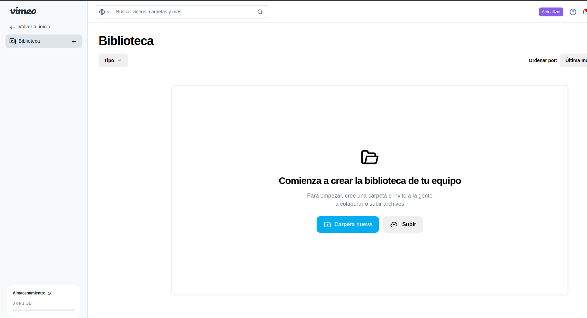
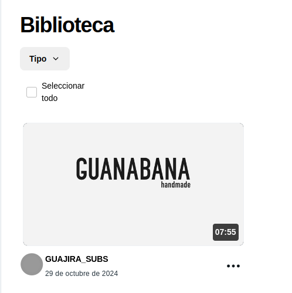
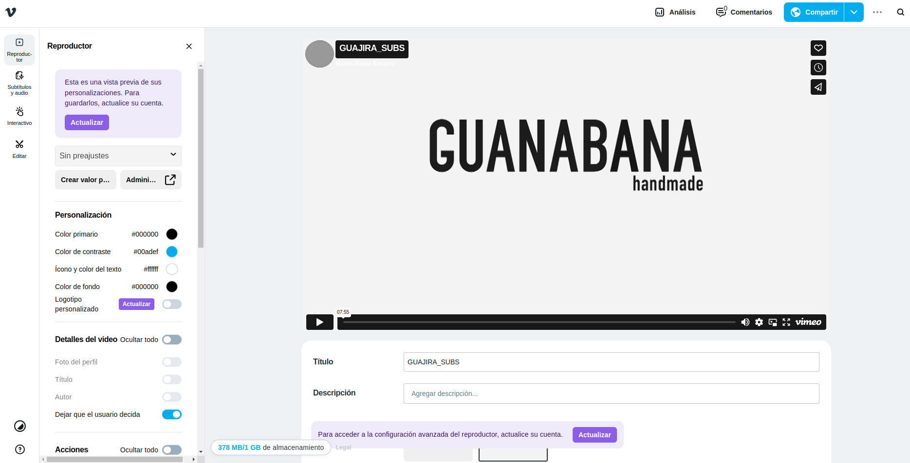
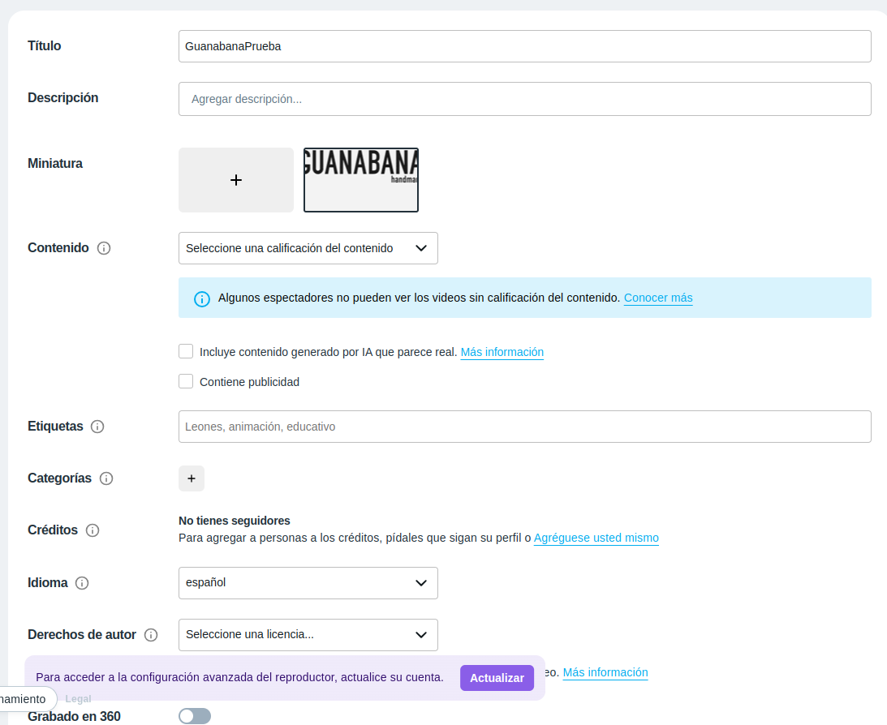
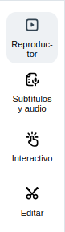
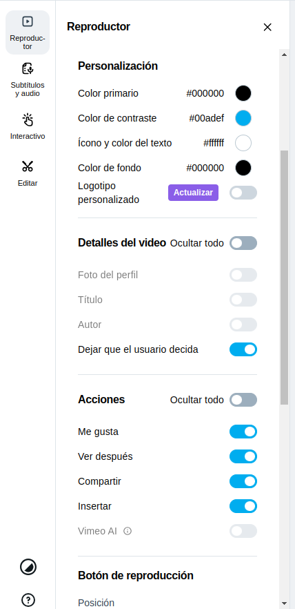

# Subir y configurar vídeo desde Vimeo

Iniciaremos sesión en nuestra cuenta en [**Vimeo**](https://vimeo.com/)

## Subir video
* Accederemos a la [biblioteca](https://vimeo.com/library) de Vimeo y subiremos nuestro video.
    
    

* Debemos asegurarnos que ponemos el video como **público** para poder reproducir el video en la web.
    
    

## Configurar Video
* Haciendo clic en el video que hemos subido podremos realizar algunas configuraciones.

    

* Como vemos en la imagen anterior podemos:
    > **NOTA**: Algunas de las opciones de edición de video como la personalización del editor, solo se podrán editar con una **cuenta con  suscripción** de pago de Vimeo
    
    * Bajo el video. Podemos editar la información relacionada con los titulos y descripciones, etiquetas, miniaturas, idioma, etc...
    
        

    * En la columna izaquierda podremos editar/recortar el video, insertar capitulos(marcas) en el video, etc...

        
    
    * En la opción reproductor podremos ocultar o mostrar los botones del reproductor o editar los colores que posteriormente se verán en la web.
        
        

* Con el video subido y configurado ya podemos incluirlo en nuestra web.
    * [**Tutorial vídeo en bloques CMS**](../editor-bloques-cms/video-cms.md)
    * [**Tutorial vídeo en productos**](../productos/video-productos.md)