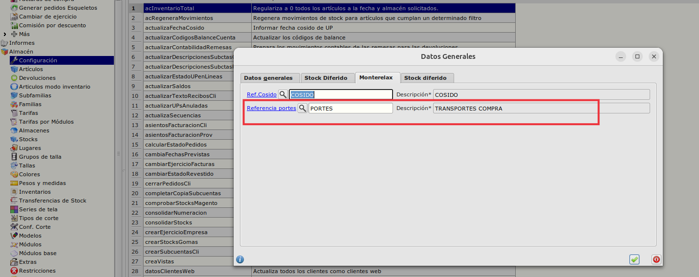
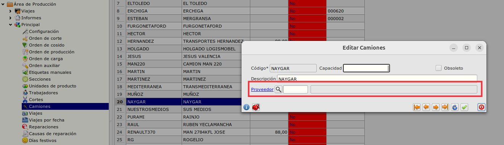
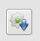
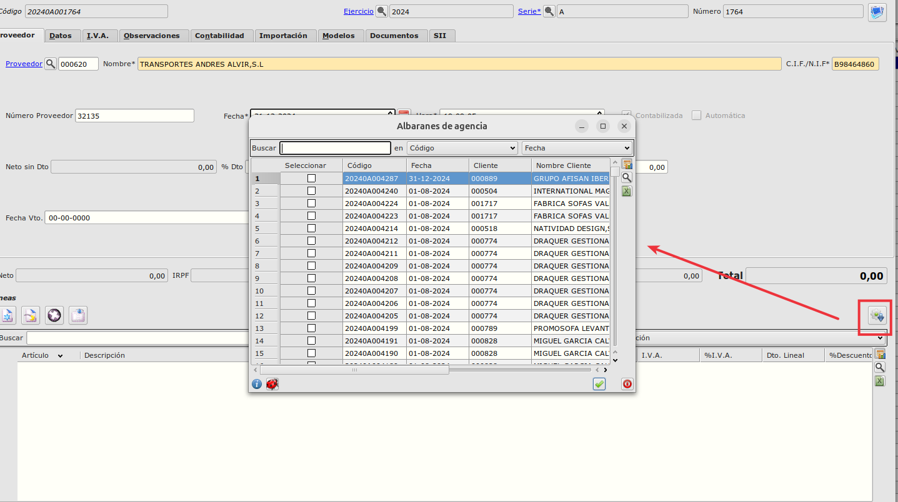
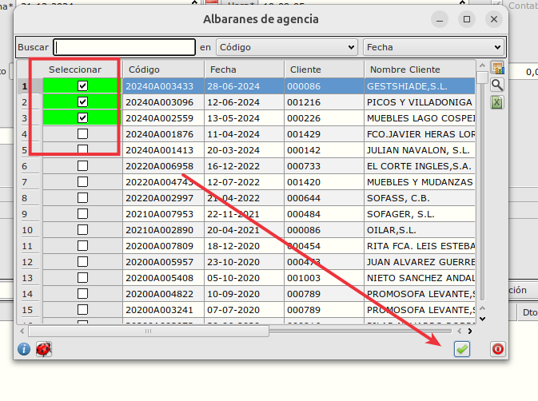
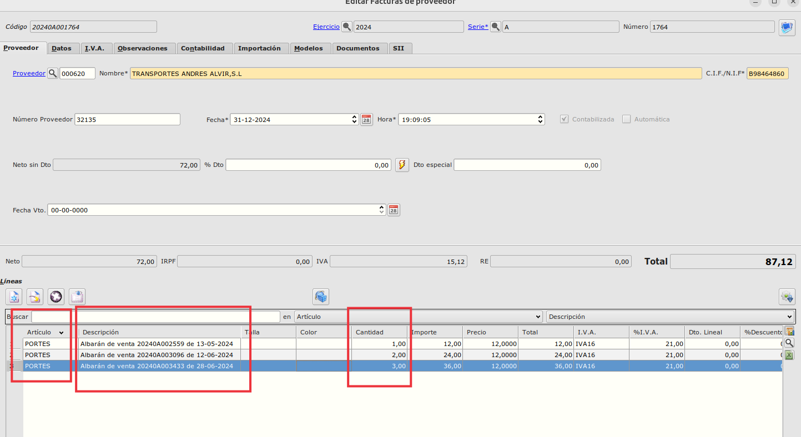
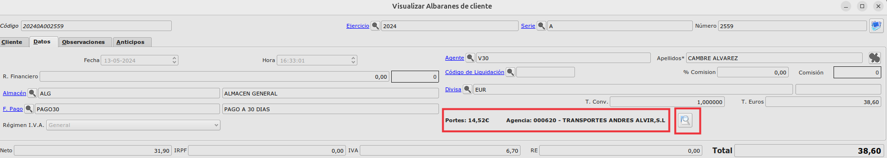
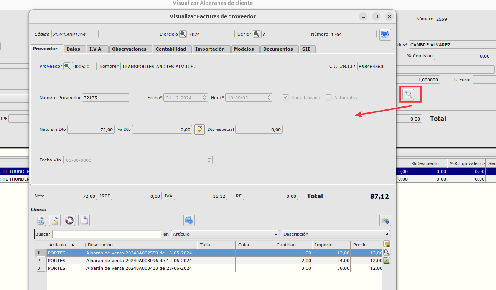

# Autofactura de servicios de agencias de transporte

## Configuraciones previas

### Configuración Referencia de Portes

Desde el  **Área de Facturación -> Almacén -> Configuración**, en la pestaña **Monterelax**, configuraremos la referencia que se utilizará en las líneas de factura de compras para facturar los portes.

### Configuración de agencia transporte en camiones

En el **Área de Producción -> Principal -> Camiones**, editaremos los registros e informaremos la agencia de transporte (proveedor). 

## Generación de factura de transporte.

- Desde el **Área de Facturación -> Facturación -> Facturas de compra**, crearemos un nuevo registro e informaremos los datos de la cabecera.

- Pulsaremos el botón , el cual nos mostrará un listado con los albaranes asociados al camión del proveedor que hemos informado en la cabecera de la factura, permitiendo seleccionar uno o varios.

 

 - Seleccionaremos los albaranes que queramos facturar el transporte y pulsaremos el botón de aceptar.

- Esto creará tantas líneas como albaranes hayamos creado de la siguiente forma:
    - Referencia --> Referencia de portes configurada en el módulo de almacén.
    - Descripción: Albarán de venta (código de albarán) de (fecha del albarán)
    - Cantidad: Bultos del albarán
    - Precio unitario: El asociado al artículo y al proveedor  

- Cada albarán seleccionado se quedará marcado para que no se pueda seleccionar de nuevo.

## Visualización de factura de transporte desde albaranes 

- Una vez realizado el proceso, si vamos a **Área de Facturación -> Facturación -> Albaranes de venta** y editamos uno de los albaranes añadidos a la factura de compra, podemos ver en la pestaña de datos los portes de ese albarán y la agencia (proveedor) a la que se ha hecho la factura.

- Si pulsamos sobre la lupa, podremos navegar a la factura de transporte

