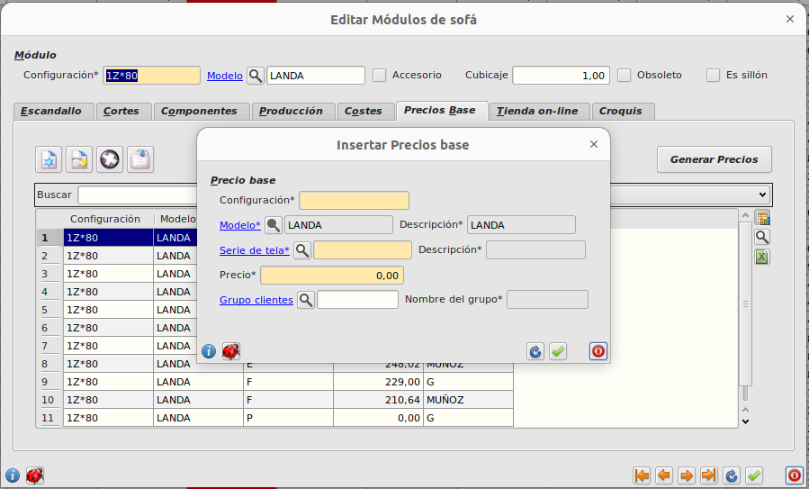

# Añadir una opción de configuración por modelo y tela

Para añadir una opción para elegir en la compra, debemos hacerlo desde el ERP. Debemos ir al formulario principal de **Area de Facturación/Almacén/Módulos**. Seleccionar el modelo, la configuración y en el formulário, clicar la pestaña *precios base*.

En la tabla añadimos o modificamos el precio base, indicando la serie de tela, el grupo de clientes y el precio deseado(*se mostrarán las configuraciones con un precio mayor de 0*).

[Volver](./addproducto.md)