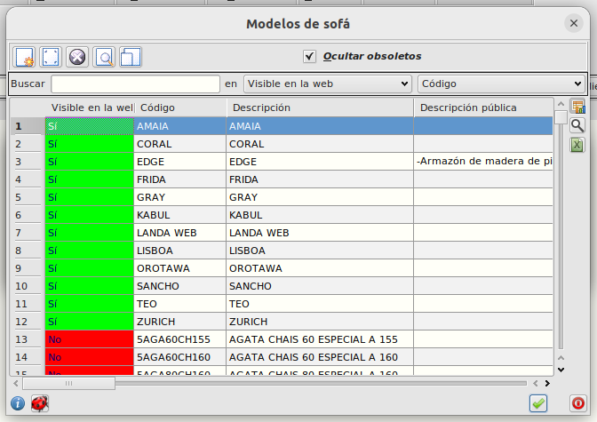

# Incluir un modelo en el catálogo

Para incluir un modelo en el catálogo debemos hacerlo desde el ERP. Debemos ir al formulario principal de **Area de Facturación/Almacén/Modelos**. Seleccionar el modelo que queremos incluir y marcar el campo _'En portada'_.

Después, debemos incluir el modelo en la ficha de aquellos clientes que queramos que lo vean. Debemos ir al formulario de cliente en **Area de Facturación/Principal/Clientes**.

Seleccionamos la pestaña _Modelos tienda online_ y añadimos el modelo a mostrar.

[Volver al Índice](./index.md)
