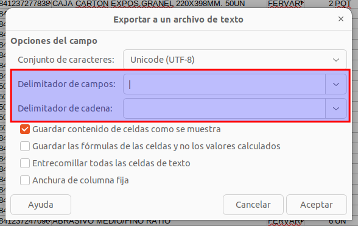
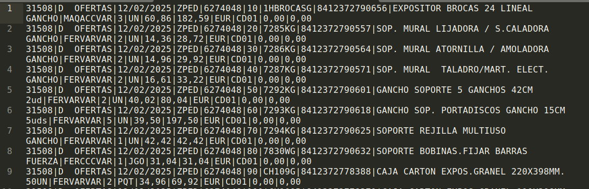

# Importar artículos de cadena 88

## Formato esperado

Vamos a cargar un fichero *.csv* con las filas de los artículos. El sistema espera recibir los datos necesarios en la siguiente posición(*columna*) de cada fila:

- Material(*referencia*): 7,
- Código EAN/UPC: 8,
- Denominación: 9,
- Precio neto: 13,
- Pvp: 17,
- Tarifa ms1: 17,
- Tarifa ms2: 18,

## Formatear archivo excel

### Usando LibreOffice

Si estamos usando un archivo de tipo excel debemos realizar unos pasos previos antes de poder cargarlo en el ERP.

Debemos eliminar todas las filas que no se correspondan con artículos, por ejemplo, una primera fila con la cabecera. Seleccionamos las filas a eliminar, hacemos clic derecho sobre la selección y clicamos la opción **eliminar filas**.

Una vez que solo tenemos los datos de artículos guardamos el archivo en formato *.csv*, seleccionando el **delimitador de campos** como una *|* y el **delimitador de cadena** vacío. 

si abrimos el fichero creado con un procesador de textos podemos comprobar que el contenido es similar en su estructura a este: 

## Carga de archivo

Para carga el archivo vamos al formulario de artículos desde el menú **Area de Facturación/Almacen/Artículos** y clicamos en el botón de la barra superior, situado en la parte derecha **Importar artículos de cadena 88** con el icono de *CSV*.

Se mostrará una barra con el progreso de la carga, cuando esta finalice veremos un mensaje de éxito y se recargarán los registros de la tabla de artículos.

[Volver al Índice](../index.md)