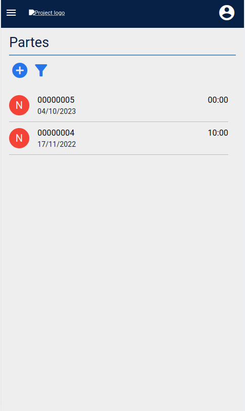
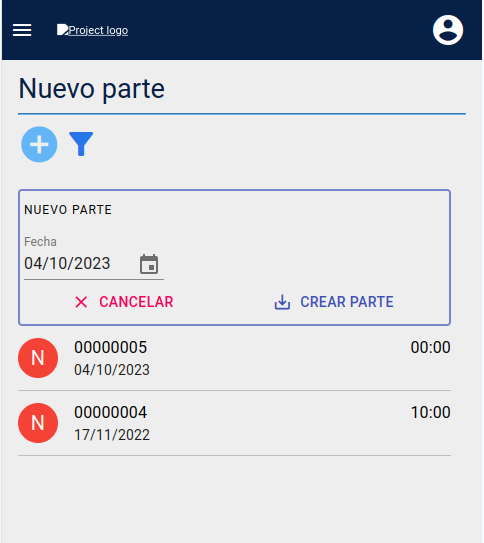
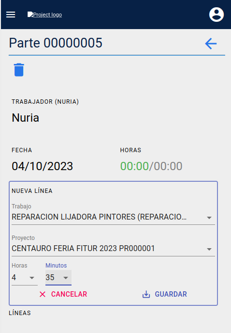
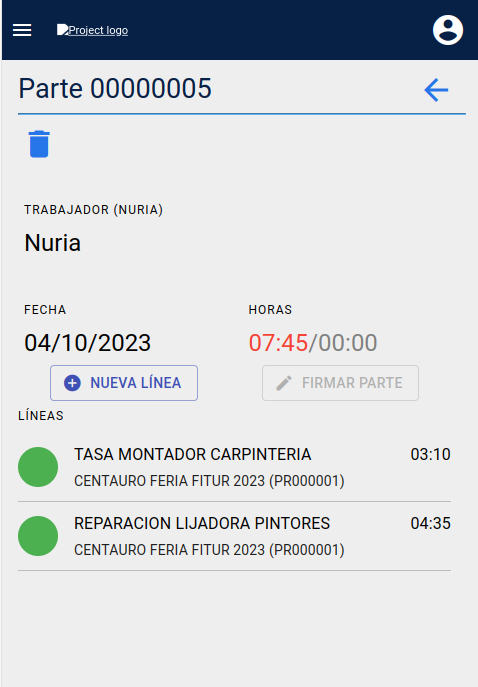
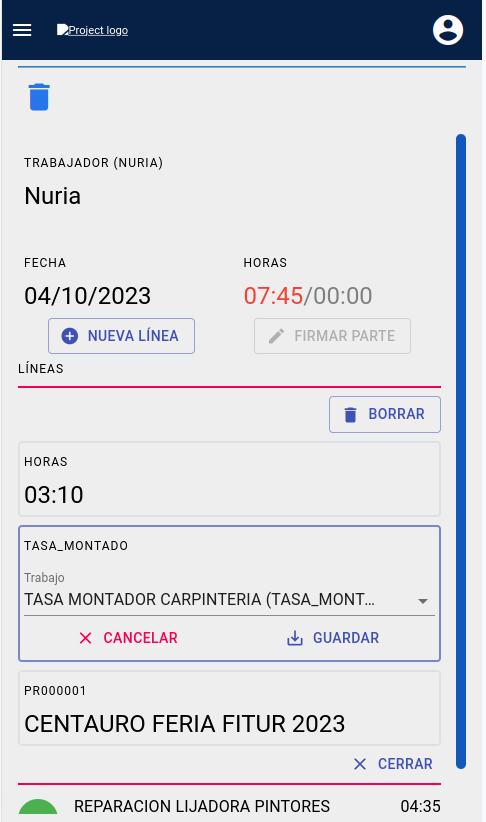
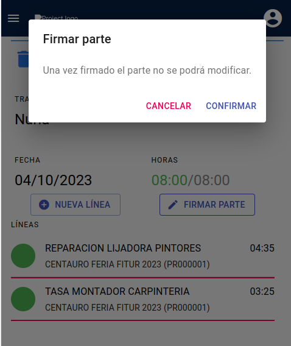

# App Trabajadores

## Configuraciones previas en el ERP

* Para establecer la cantidad de **horas objetivo** que el trabajador debe introducir en un parte diario, debemos ir al formulario **Area de Facturación/Facturación/Configuración** y rellenar los campos *Horas partes* y *Horas partes viernes* en formato *hora:minutos:segundos*.

* Los trabajos que el trabajador puede seleccionar a la hora de crear una línea de trabajo de un parte, pertenecen a la superfamilia de artículos *MANO DE OBRA*.
  * Si no existe dicha familia, podemos crearla en el formulario **Area de Facturación/Almacén/Superfamilias** con el nombre *MANODEOBRA* y el tipo *MANO DE OBRA*. 
 
* En el formulario **Area de Facturación/Almacén/Familias** debemos añadir la superfamilia *MANODEOBRA* a las familias de artículos que nos interesen, así como el **Oficio** al que pertenezca la familia de artículos.

* En el formulario **Area de Facturación/Almacén/Artículos** debemos añadir la familia correspondiente al mismo, que determinará así el oficio relacionado con el artículo y la superfamilia a la que pertenece.

* En el formulario **Area de Colaboración/Proyectos/Usuarios** debemos seleccionar el oficio del mismo de tal modo que el usuario solo podrá ver los artículos que pertenezcan a su mismo oficio y aquellos artículos cuya familia tenga el oficio *Todos*. Si el oficio del usuario es *'Todos'*, este podrá ver todos los artículos cuya superfamilia sea *MANODEOBRA*.

*  El trabajador solo podrá seleccionar proyectos que estén en **estado abierto**. Para cambiar el estado de un proyecto podemos hacerlo en el formulario **Area de Colaboración/Proyectos/Proyectos**.

## Sincronización con aplicación en servidor remoto.
El despliegue de la aplicación se localizará en un servidor remoto. Podremos sincronizar los datos de partes y proyectos, así como reabrir partes cerrados con el servidor principal desde el ERP del mismo.

### Sincronizar partes, proyectos y reabrir partes

* Desde el formulario **Area de Facturación/Facturación/Partes de tarbajo** podremos sincronizar con el servidor remoto. Actualizaremos los datos de la tabla de proyectos de la aplicación remota, así como traer los datos de los partes con estado *firmado* en la aplicación. Para ello debemos clicar en el botón **Sincronizar con la base de datos de partes de trabajo** que encontramos en la parte derecha de la barra superior. Si la operación ha sido exitosa veremos un mensaje de confirmación *Se han sincronizado los partes desde la aplicación web* y estos partes pasarán a estado **Cerrado**.

* Para reabrir un parte **cerrado**, seleccionamos el parte y clicamos el botón **Reabrir** que encontramos en la parte derecha de la barra superior.  Si la operación ha sido exitosa veremos un mensaje de confirmación *Este parte se ha reabierto tanto en el ERP como en la aplicación web* y estos partes pasarán a estado **Borrador**.

### Modificar trabajadores, artículos, familias, horas objetivo, etc.

Todos los datos que no sean proyectos no serán sincronizados hacía la base de datos del servidor remoto. De modo que si los modificamos en el ERP principal, también debemos hacerlo en el ERP del servidor remoto.

## Listado de partes

* Veremos un listado de los últimos 15 partes registrados.

* Cada elemento línea consta de la siguiente información:
  * Avatar (círculo de color verde/firmado y rojo/pendiente de firmar)
  * Título izquierdo: Código del parte
  * Subtítulo izquierdo: Fecha del parte
  * Título derecha: Horas y minutos en formato hh:mm

## Crear un nuevo parte

* Pulsamos el botón **+** del listado de partes
  * Se abre el formulario de alta de parte con la fecha actual como valor de fecha por defecto.
* Modificamos la fecha si es necesario y pulsamos **Crear parte**
  * Si ya hay un parte para el trabajador conectado y la fecha, obtenemos el error _Ya existe un parte (num. parte) para el trabajador 'nombre trabajador' en la fecha 'fecha parte'_.
  * Si no hay un parte ya creado, se crea un parte y aparece en el listado de partes.

## Asignar horas a un parte
* Seleccionamos el parte de la lista
  * El parte se visualiza en la parte derecha de la pantalla. Podemos ver:
    * Nombre del trabajador
    * Fecha
    * Horas totales registradas/ Horas objetivo

* Pulsamos el botón **+ Nueva línea**
  * Se muestra el formulario de alta de ĺínea de parte
* Indicamos los siguientes valores:
  * Referencia de manor de obra. Se muestran todos los artículos de la familia de mano de obra y del oficio del trabajador.
  * Proyecto. Se muestran todos los proyectos en estado Abierto
  * Horas. Valor entero 0/8 
  * Minutos: Valor entero  0/55 en intervalos de 5 minutos
* Pulsamos **Guardar**.
  * La línea se guarda y aparece en el listado de líneas. Se recalcula el tiempo total ingresado en el parte.

## Listado de líneas
Cada elemento línea consta de la siguiente información:
* Avatar (círculo verde)
* Título izquierdo: Descripción de la referencia
* Subtítulo izquierdo: Nombre y código del proyecto
* Título derecha: Horas y minutos en formato hh:mm

## Editar una línea
* Selecccionamos la línea a editar y pulsamos sobre ella
  * Se despliega el formulario de edición de línea
* Editamos y guardamos los datos correspondientes
* Pulsamos **Cerrar** para colapsar la línea

## Borrar una línea
* Pulsamos **Borrar**
  * Se abre un dialogo de confirmación.

## Borrar un parte
* Pulsamos botón de icono _papelera_ en la cabecera
  * Se abre un dialogo de confirmación.

## Firmar un parte
* Cuando el total de tiempo ingresado en el parte se corresponda con el tiempo objetivo, el color del campo *horas ingresadas* cambiará a verde y el botón **Firmar parte** estará habilitado.
  * Se abre un dialogo de confirmación.

* Una vez firmado por el trabajador se indicará el estado del parte(**Firmado**) al lado del código del mismo y ya no se podrá modificar por parte del trabajador. Y después de sincronizar la aplicación remota desde el ERP del servidor principal, el estado pasará a ser **Cerrado**. 
