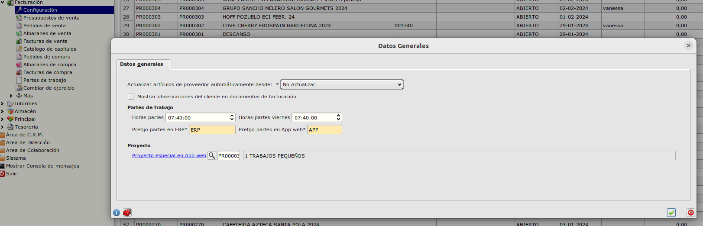

# Configuración Proyecto especial web

Se podrá configurar un proyecto especial para el cual el usuario deberá indicar un texto explicativo de los trabajos realizados

Si vamos al formulario de *Configuración* que podemos encontrar en **Área de Facturación -> Facturación -> Configuración** podemos informar el proyecto deseado. 

Una vez informado el Proyecto especial web, desde la app web se va habilitar el campo observaciones de la lineas de partes en caso que el proyecto de la linea es el proyecto especial.