# Proyectos CC

## Creación de un proyecto
Desde el **Área de colaboración -> Proyectos -> Proyectos** podemos crear un proyecto.

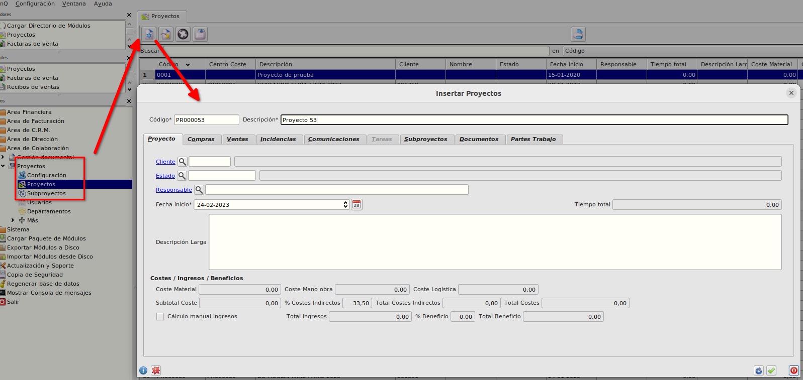

Al pulsar nuevo registro informaremos en la primera pestaña **Proyecto** obligatoriamente la *Descripción* y cambiaremos la *Fecha Inicio* si es necesario, por defecto se crea con la fecha actual.

En la parte de abajo del formulario, podemos ver el apartado dónde se irán totalizando los costes e ingresos del proyecto:

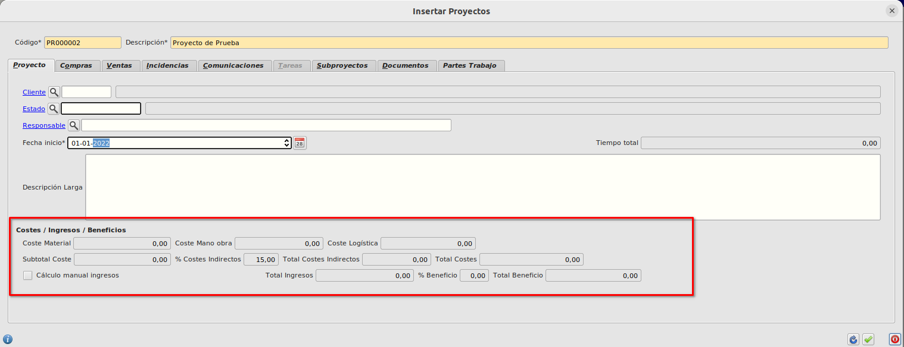

Los costes calculados automáticamente se dividen en 3, *Coste Material*, *Coste Mano de Obra* y *Coste Logística*.

Estos costes se calculan a partir de albaranes de proveedor no facturados y de facturas de proveedor como la suma del neto de albaranes y del neto de facturas donde se ha informado el proyecto en su cabecera más la suma del neto de las líneas de albaranes y del neto de las líneas de facturas donde se ha informado el proyecto.

- Coste Material --> En este campo se calcula como la suma de los importes 
sin iva de las líneas donde la referencia está asociada a una familia cuya superfamilia es tipo *MATERIALES*.
- Coste Mano de obra --> En este campo se calcula como la suma de los importes sin iva de las líneas donde la referencia está asociada a una familia cuya superfamilia es tipo *MANO DE OBRA*.
- Coste Logística--> En este campo se calcula como la suma de los importes sin iva de las líneas donde la referencia está asociada a una familia cuya superfamilia es tipo *LOGÍSTICA*.
- Subtotal Coste --> Coste Material + Coste Mano Obra + Coste Logística
- % Costes indirectos --> Este campo se informa automaticamente con el % parametrizado en **Área de colaboración -> Proyectos -> Configuración**
- Total Costes Indirectos --> Resultado de aplicar el *% Costes Indirectos* al *Subtotal de costes*.
- Total Costes --> Subtotal Coste + Total Costes Indirectos.
- Cálculo Manual Ingresos --> Este check marcado no calcula el *Total Ingresos* automáticamente y permite informarlo manulamente, con el check desmarcado los ingresos se calculan automáticamente.
- Total Ingresos --> Este campo se calcula automáticamente como la suma del neto de albaranes de cliente no facturados y del neto de facturas de cliente donde se ha informado el proyecto en su cabecera más la suma del neto de las líneas de albaranes de cliente no facturados y del neto de las líneas de facturas de cliente donde se ha informado el proyecto.
- % Beneficio --> Calculado como:
```
 Total Ingresos - Total Costes
 ________________________________  X 100
       Total Costes
```
- Total Beneficio --> Total Ingresos - Total Costes

### Pestaña Compras
- En la pestaña de compras podemos los documentos que están asociados al proyecto

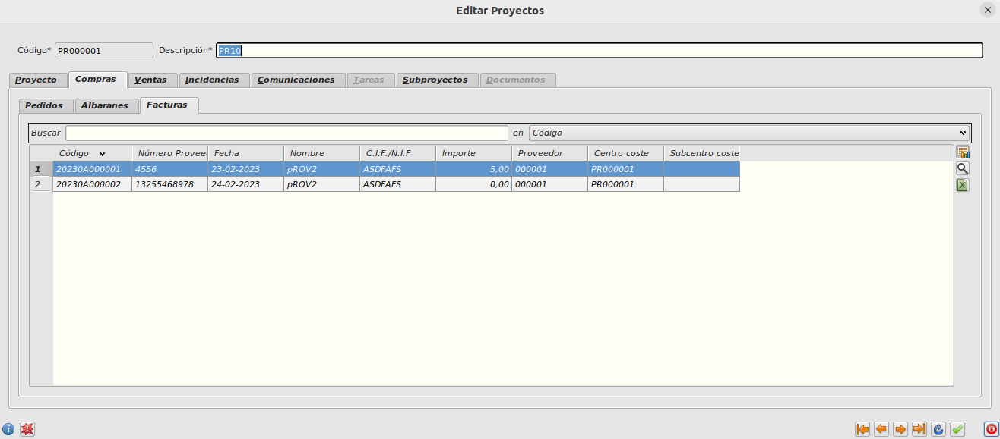

### Pestaña Ventas
- En la pestaña de ventas podemos los documentos que están asociados al proyecto

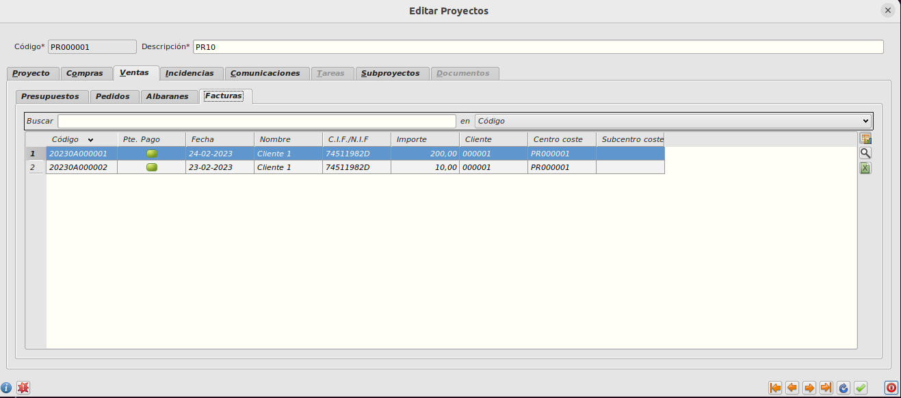

## Asignación de albarán o factura de proveedor a un proyecto.

Podemos asignar un proyecto a un albarán o factura de proveedor de dos formas, bien informando el proyecto en la cabecera del documento o bien informando en la/s líneas que queramos el proyecto.

Si informamos en la cabecera del documento no podremos informar en ninguna línea y el coste que se asignará del documento será el neto.

En la pestaña de **Centro de Coste** del albarán o factura informaremos en el campo *Centro coste* el proyecto en el cual queremos imputar el coste.

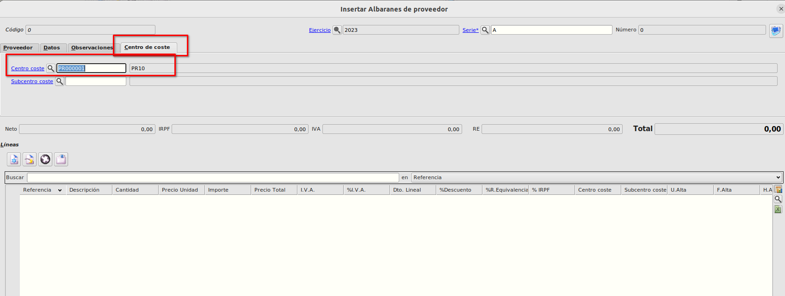


Si por el contrario no informamos el proyecto en la cabecera del proyecto y lo informamos en las líneas (lo que nos permite asignar varios proyectos a un documento), no podremos informar el proyecto en la cabecera del documento y el coste será la suma de los importes de la línea sin iva.

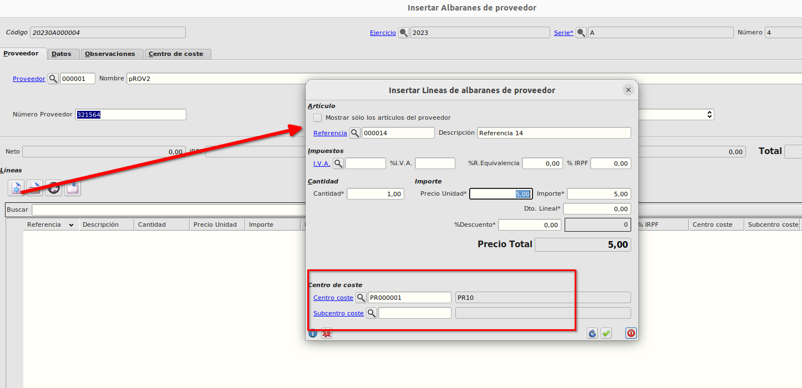

## Asignación de albarán o factura de cliente a un proyecto.

Al igual que en la imputación de costes, podemos asignar un proyecto a un albarán o factura de cliente de dos formas, bien informando el proyecto en la cabecera del documento o bien informando en la/s líneas que queramos el proyecto.

Si informamos en la cabecera del documento no podremos informar en ninguna línea y el ingreso que se asignará del documento será el neto.

En la pestaña de **Centro de Coste** del albarán o factura informaremos en el campo *Centro coste* el proyecto en el cual queremos imputar el ingreso.


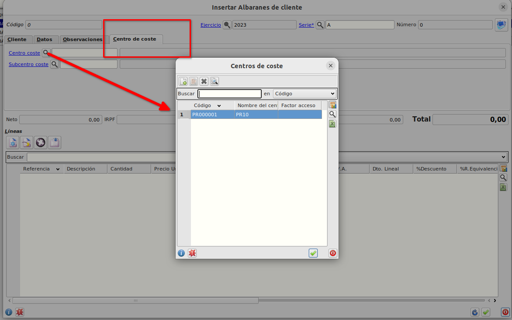

Si por el contrario no informamos el proyecto en la cabecera del proyecto y lo informamos en las líneas (lo que nos permite asignar varios proyectos a un documento), no podremos informar el proyecto en la cabecera del documento y el ingreso será la suma de los importes de la línea sin iva.


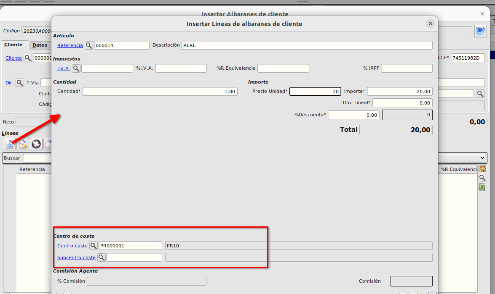

## Modificación de proyecto de una factura bloqueada

En ocasiones ocurre que queremos asignar o cambiar un proyecto a una factura de cliente o proveedor que está bloqueada.
Tanto para cliente como para proveedor podemos cambiar el proyecto bien de la cabecera o de la línea.

### Asignar/cambiar proyecto en la cabecera
Desde el maestro de facturas (de clientes o proveedores), seleccioaremos la factura y pulsaremos en *Modificar factura*

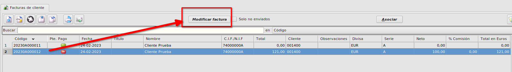

En el diálogo que nos aparece seleccionaremos *Informar Proyecto*

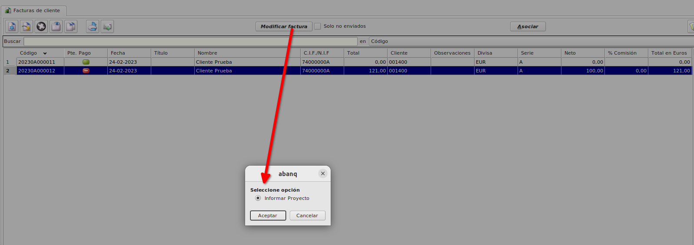

Se abrirá un formulario para informar el proyecto, si ya tuviera un proyecto asociado el documento se abriría con el proyecto cargado.

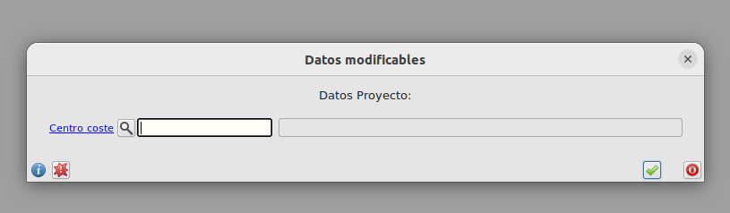

### Asignar/cambiar proyecto en una línea
Dentro del formulario de factura (de clientes o proveedores), seleccioaremos la línea y pulsaremos en *Modificar línea*

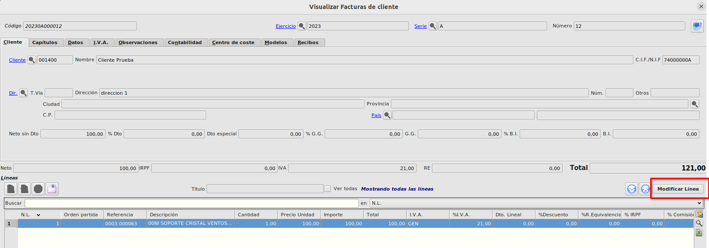

En el diálogo que nos aparece seleccionaremos *Modificar proyecto línea*

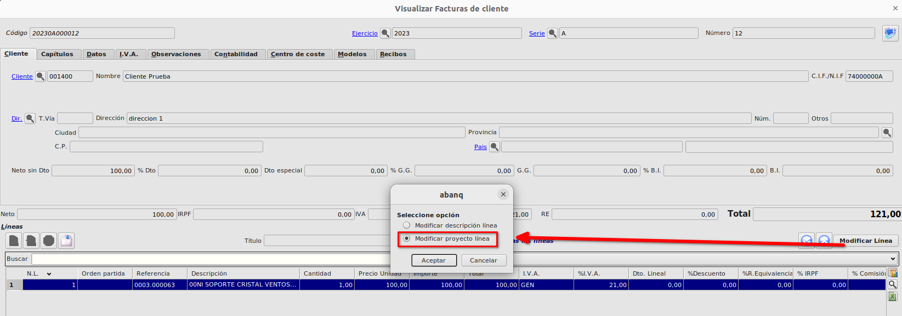

Se abrirá un formulario para informar el proyecto, si ya tuviera un proyecto asociado el documento se abriría con el proyecto cargado.


### Más

  * [Volver al Índice](./index.md)
