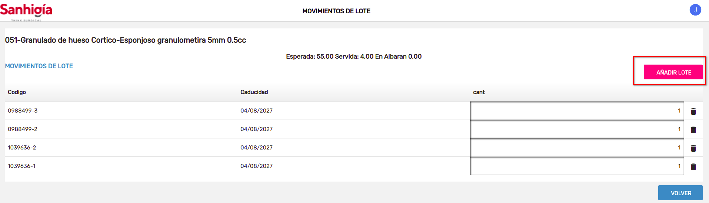

# Asignar lote

## Asignar lote desde lineas de pedido de compra

Desde el botón **Asignar lote** abrimos el diálogo para seleccionar un lote existente o crear uno nuevo.

- Para crear un lote nuevo tenemos que informar el código de lote y la fecha de caducidad. El programa ignora la fecha de caducidad en el filtro de buscar.

- Si no existe el código de lote, se creará y tambien se creará el movimiento del lote. 
- Si existe un lote con el mismo código no se va a crear el lote. Solo se va a crear un nuevo movimiento del lote. Se puede observar que en este caso , aunque hemos informado la fecha de caducidad no se cambiará en el lote existente. Si queremos cambiarla tenemos que hacerlo desde Eneboo ir a **Area de Facturación/Almacén/Lotes**

[Volver al Índice](../../../index.md)