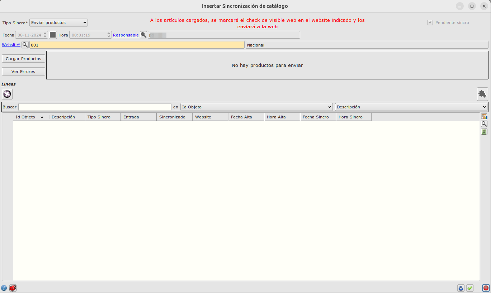
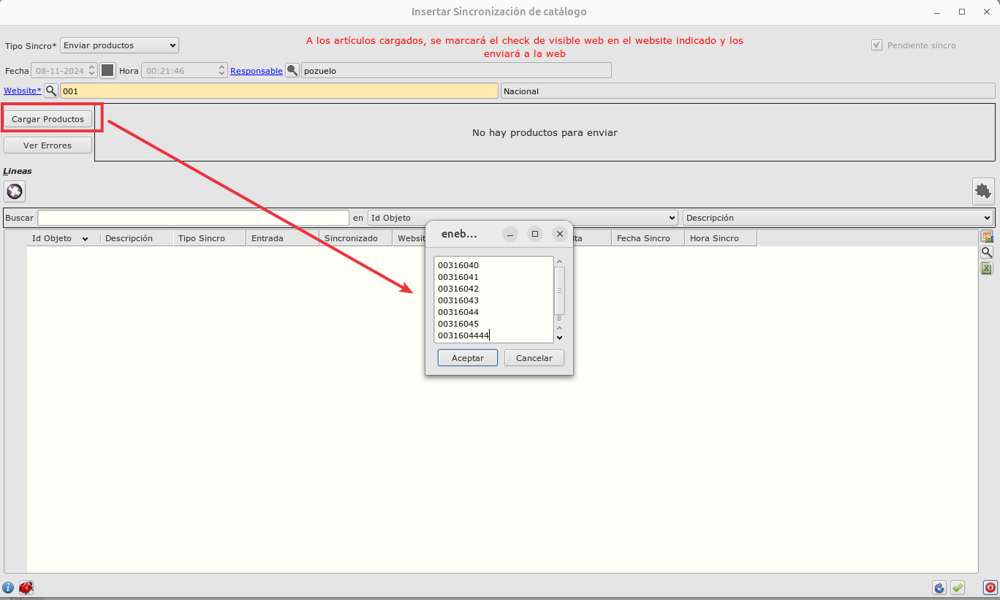

# Pantalla de sincronización con tienda online

## Crear registros de sincronización

Podemos crear manualmente registros de sincronización con la tienda online especificando las referencias a sincronizar. Para ello seguiremos los siguientes pasos:

+ Abrimos Facturación -> Almacén -> Sincro Catálogo

+ Creamos un nuevo registro

+ Escogemos el tipo de sincronización modificando el valor de _Tipo Sincro_. Las posibles sincros disponibles son:
    + _Enviar productos_ - Marcará los productos como visibles en web y los enviará
    + _Deshabilitar poductos_ - Desmaracará los productos como visibles en web y los inhabilitara en la tienda online
    + _Enviar productos padre_ - Marcará los productos padre como visibles en web y los enviará
    + _Borrar productos padre_ - Marcará los productos padre como no visibles en web y los inhabilitara en la tienda online
    + _Enviar stocks_ - Enviará los stocks que haya en ese moomento a la tienda online
    + _Enviar tarifas_ - Enviará las tarifas que haya en ese moomento a la tienda online

Para sincronizar  stocks y tarifas es necesario que el artículo esté sincronizado previamente.

+ Escogemos el website modificando el valor de _Website_. Si sólo tenemos un website por defecto aparecerá seleccionado.

+ Usamos el botón _Cargar productos_ para indicar los productos a cargar.
    + Se abre un formulario para pegar una lista de referencias separadas por saltos de línea.

+ Indicamos la lista de referencias y pulsamos _Aceptar_.
    + Si la carga es correcta, se muestra una etiqueta en el formulario con el texto: _Hay X producto/s cargado/s y listo/s para enviar_

+ Si alguna de las referencias indicadas no es correcto o no existe aparecerá el texto _Hay X producto/s erróneo/s_

+ Podemos ver las referencias erróneas pulsando el botón _Ver Errores_

+ Una vez cargadas las referencias a sincronizar, pulsamos el botón _Enviar_. y se generan los correspondientes registros de sincronización de las referencias cargadas.

+ Podemos eliminar algún registro si se ha creado por error con el botón _Eliminar registro_

+ Debemos aceptar el formulario de sincronización para que el sistema cron de Eneboo procese las sincronizaciones. 

    + Si cancelamos no se enviarán a la tienda online.

Podemos consultar el estado de la sincronización en la tabla _Líneas_ de cada registro de Sincronización.

## Publicar fotos:
Para poner automaticamente las fotos, estas tienen que estar subidas al servidor de la web en la carpeta media/import. El nombre de las fotos debe comenzar por el sku_* de forma que REFAAA_1.jpg y REFAAA_2.jpg seran fotografias de la referencia REFAA.

Las fotografias solo se actualizan automaticamente si previamente no se le han asignado fotografias. Lo hacemos asi por si se realiza algun cambio  manualmente en la galeria de productos, que no se pierda el cambio en cualquier sincronización del ERP, ya que manualmente se puede seleccionar la foto principal o el orden en el que quieren que se muestren.