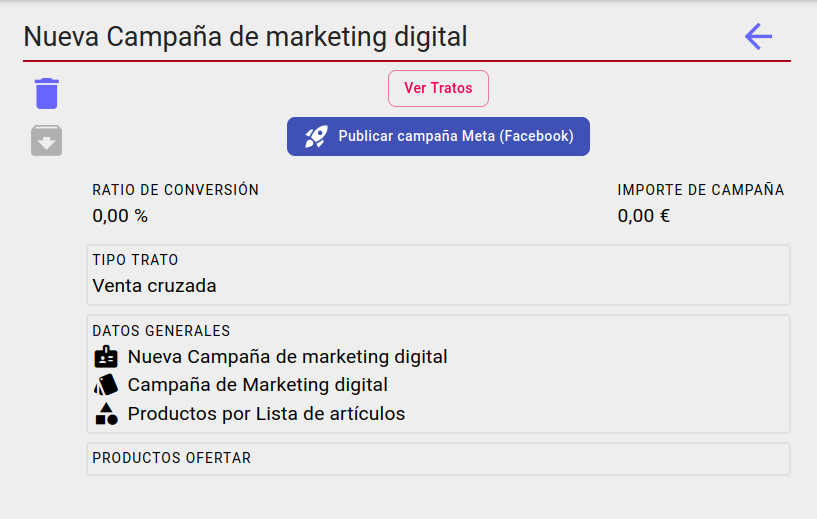

# Campañas
Primero vamos a la pantalla de campañas desde el menú principal.

## Listado de campañas

Veremos un listado de las campañas no archivadas. Si deseamos ver también las archivadas podemos marcar la opción en el filtro.

No se mostrarán las campañas de tipo marketing digital/leads pacientes.

## Creación de la campaña

En la pantalla de campañias pulsamos sobre el icono "+" en la parte izquierda de la lista de campañas

De esta manera accederemos al asistente de creación de campañas

### Datos generales

Lo primero que debemos hacer es darle un nombre representativo de la campaña y elegir el tipo de campaña, así como decidir si vamos a generar la campaña por subfamilias o artículos concretos.

Entre los tipos de campaña podremos elegir entre *repetición*, *captación*, *medición*, *venta cruzada* y *marketing digital*.

Al terminar, pulsaremos siguiente.

### Parámetros de campañas de repetición

En caso de que hayamos elegido una campaña de repetición, accederemos a la configuración de parámetros de repetición.

En este caso, tendremos que configurar los días desde la última compra. Este parámetro se utilizará para buscar los clientes que han comprado estos productos/subfamilias últimamente.

[Aquí](./listas_productos.md) está explicado cómo configurar los filtros de búsqueda asociados a la compra de productos.

### Parámetros de campañas de captación

En caso de elegir la campaña de captación, accederemos a la configuración de parámetros de captación.

Aquí deberemos configurar el tipo de captación (Leads o Venta Directa). Así como el umbral de recomendación (parámetro calculado por una Inteligencia Artificial que indica el nivel de recomendación, a más alto, más recomendado).

[Aquí](./listas_productos.md) está explicado cómo configurar los filtros de búsqueda asociados a la compra de productos.

### Parámetros de campañas de medición

En caso de elegir la campaña de medición, accederemos a la configuración de parámetros de medición. Aquí deberemos configurar el rango de medición del impacto de la campaña.

[Aquí](./listas_productos.md) está explicado cómo configurar los filtros de búsqueda asociados a la compra de productos.

### Parámetros de campañas de venta cruzada

En caso de elegir la campaña de venta cruzada, accederemos a la configuración de parámetros de venta cruzada.

En este caso, tendremos que configurar los días desde la última compra. Este parámetro se utilizará para buscar los clientes que han comprado los productos últimamente.

[Aquí](./listas_productos.md) está explicado cómo configurar los filtros de búsqueda asociados a la compra de productos.

Establecer productos a ofertar en la campaña, indicando la cantidad y el precio al que deben ser ofertados.

### Parámetros de campañas de marketing digital

En caso de elegir la campaña de marketing digital, accederemos a la configuración de parámetros de marketing digital.

**OPCIONAL:** Establecer productos a ofertar en la campaña, indicando la cantidad y el precio al que deben ser ofertados.

### Subfamilia

Si hemos elegido productos por subfamilia, ahora deberíamos indicar la subfamilia que queremos recomendar.

Simplemente buscaremos por nombre la subfamilia y clicaremos sobre la deseada.

### Productos

En caso de elegir campaña por lista de productos, indicaremos los productos en el siguiente formulario.

Simplemente buscaremos el producto por nombre o referencia, clicaremos sobre los productos deseados y pasarán a listarse debajo del buscador.

### Rango de medición del impacto

El último formulario que tendremos que rellenar es el del rango de medición del impacto, es decir, las fechas entre las que querremos hacer seguimiento del impacto de la campaña.

### Resumen

Por último, se mostrará un resumen de la configuración de la campaña y, posteriormente el botón de confirmación de "Crear campaña".

Al pulsarlo deberíamos ver un mensaje de color verde en la parte inferior que indique "Campaña creada correctamente" y posteriormente debería aparecer en la lista de campañas

Al pulsar sobre ella, podremos acceder al detalle de la campaña y podremos modificarla si fuese necesario

## Datos para tratos

Podemos setear unos valores para que cuando al lanzar una campaña que genera autómaticamente [tratos](../tratoscampanias/index.md), podamos crear los mismos con un valor y un agente determinado, este último campo dependerá de si el *tipo de trato* está [configurado](../tipostrato/index.md) a tal efecto.  

## Lanzamiento de campaña

Para lanzar la campaña, primero deberemos calcular los clientes a los que va a ir dirigida, para ello, pulsamos en el botón "Calcular clientes". En caso de que haya clientes que se correspondan con los parámetros indicados, se activará el botón de "Lanzar campaña para X clientes", indicando el número correspondiente.

En caso de no tener el número adecuado de clientes, podemos modificar los parámetros y repetir la operación.

Al pulsar en lanzar campaña, se creará una lista en ActiveCampaign con los emails de los clientes implicados.

Esta lista no estará activa hasta que se cree una campaña asociada a la misma.

## Publicar campaña en Meta(Facebook)

Para publicar la campaña en el gestor de anuncios de Meta asociado tenemos que hacer clic en el botón *'Publicar campaña en Meta(Facebook)'*. El botón estará deshabilitado si no se ha establecido un **tipo de trato** para la campaña.

Si la publicación es exitosa el estado de la campaña parasará a *'En seguimiento'* y el botón cambiará a *'Sincronizar campaña Meta(Facebook)'*. Cuando un cliente potencial(*lead*) se une a una campaña de Facebook se generará automaticamente un trato asociado a ese contacto y al agente informado por defecto en la campaña y si no lo tiene, al agente conectado.

Para prevenir posibles fallos en la creación automática de tratos tenemos el botón *sincronizar* que utlizaremos para generar los tratos de los contactos asociados en la campaña de Facebook que no lo estuvierán ya.

## Medición de campaña

Por último, tras lanzar la campaña (o con campañas de solo medición), podremos hacer una medición de la misma. Para esto, se sustituirán los botones de interacción por un gráfico de barras indicando las ventas de productos/subfamilias implicados en la campaña.

Junto con el gráfico, aparecen dos campos de fecha para indicar el rango de comparación sobre el periodo de impacto.

[Volver al Índice](../../../index.md)
