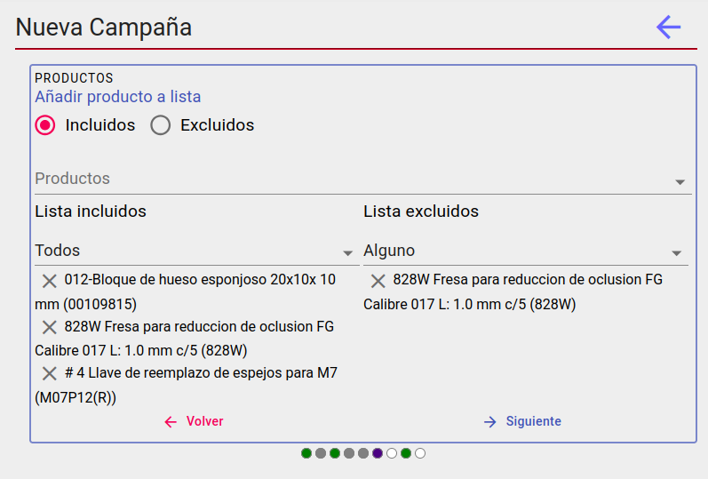

# Productos para búsqueda de clientes
El objetivo es establecer los productos que vamos a usar en la de búsqueda de clientes objetivo de la campaña. 

Tendremos dos listas para configurar la búsqueda(*incluidos y excluidos*). Al seleccionar un producto en el buscador se añadirá a la lista que tengamos marcada en la parte de arriba. Para eliminar un elemento de la lista clicaremos en el icono del aspa. 

También debemos seleccionar el tipo de inclusión de los productos en la búsqueda, para la lista incluidos buscaremos clientes que hayan comprado *todos* o *alguno* de los productos seleccionados y para la lista negra buscaremos clientes no hayan comprado *alguno* o *ninguno* de los productos incluidos en está lista.

En la búsqueda se combinarán ambas posibilidades. Podemos dejar una lista vacía, pero se deberá al menos usar una de las dos.

[Volver a campañas](./index.md)
