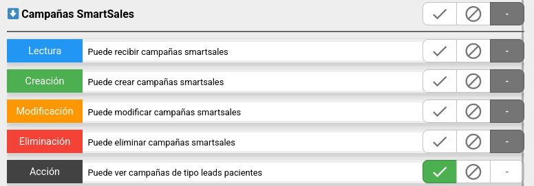
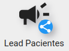
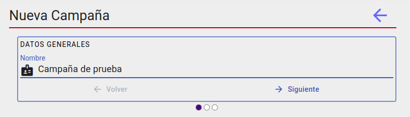
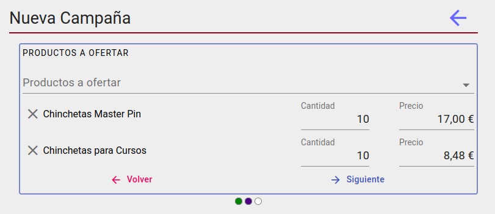
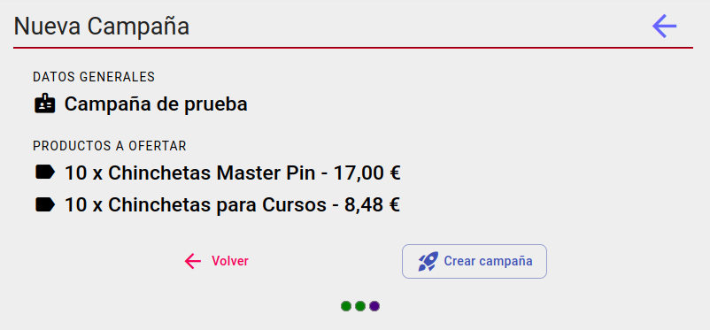
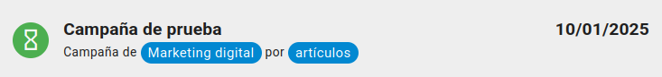
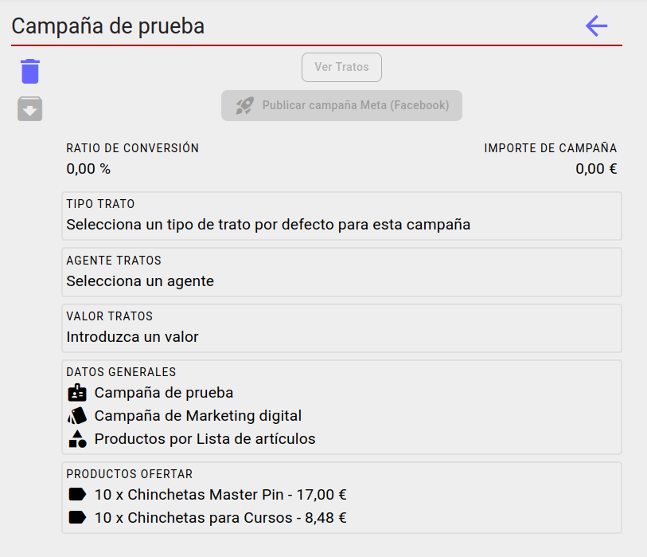
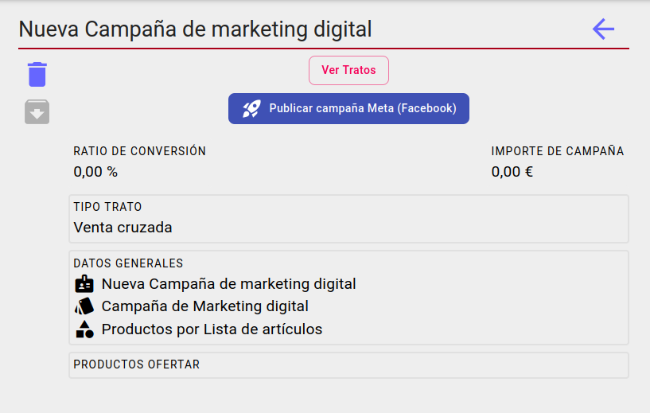

# Campañas de Leads pacientes

## Permisos

Para poder ver la opción la en el menu principal el grupo de nuestro usuario debe tener los permisos de acceso concedidos.

## Listado de campañas

Primero vamos a la pantalla de campañas desde el menú principal.

Veremos un listado solo de las campañas de tipo marketing digital/leads pacientes no archivadas. Si deseamos ver también las archivadas podemos marcar la opción en el filtro.

## Creación de la campaña

En la pantalla de campañias pulsamos sobre el icono "+" en la parte izquierda de la lista de campañas

De esta manera accederemos al asistente de creación de campañas

### Datos generales

Lo primero que debemos hacer es darle un nombre representativo de la campaña. Desde esta pantalla las campañas serán automáticamente del tipo *marketing digital*.

### Parámetros de campaña

Debemos establecer productos a ofertar en la campaña, indicando la cantidad y el precio al que deben ser ofertados.

### Resumen

Por último, se mostrará un resumen de la configuración de la campaña y, posteriormente el botón de confirmación de "Crear campaña".

Al pulsarlo deberíamos ver un mensaje de color verde en la parte inferior que indique "Campaña creada correctamente" y posteriormente debería aparecer en la lista de campañas

Al pulsar sobre ella, podremos acceder al detalle de la campaña y podremos modificarla si fuese necesario

## Datos para tratos

Podemos setear unos valores para que cuando al lanzar una campaña que genera autómaticamente [tratos](../tratoscampanias/index.md), podamos crear los mismos con un valor y un agente determinado, este último campo dependerá de si el *tipo de trato* está [configurado](../tipostrato/index.md) a tal efecto.  

## Publicar campaña en Meta(Facebook)

Para publicar la campaña en el gestor de anuncios de Meta asociado tenemos que hacer clic en el botón *'Publicar campaña en Meta(Facebook)'*. El botón estará deshabilitado si no se ha establecido un **tipo de trato** para la campaña.

Si la publicación es exitosa el estado de la campaña parasará a *'En seguimiento'* y el botón cambiará a *'Sincronizar campaña Meta(Facebook)'*. Cuando un cliente potencial(*lead*) se une a una campaña de Facebook se generará automaticamente un trato asociado a ese contacto.

Para prevenir posibles fallos en la creación automática de tratos tenemos el botón *sincronizar* que utlizaremos para generar los tratos de los contactos asociados en la campaña de Facebook que no lo estuvierán ya.

[Volver al Índice](../../../index.md)
