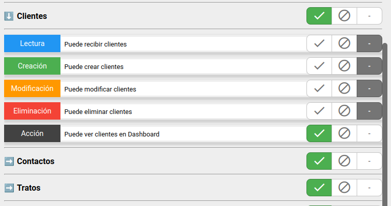
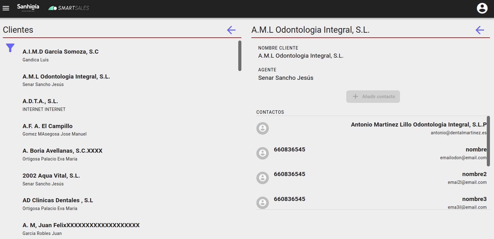

# Clientes

## Gestion de clientes

Para ver la pantalla de clientes, hay que habilitar para el grupo el permiso de "Puede ver clientes en dashboard"

Desde la pantalla de clientes podemos informacion del agente al que pertenece y gestionar sus contactos y sus tratos, tareas y presupuestos pendientes.

El boton añadir contacto, creara un nuevo contacto ya asociado al cliente.

[Volver al Índice](../../../index.md)
