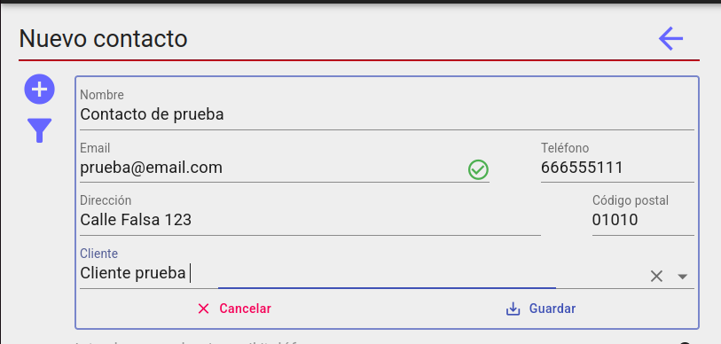

# Contactos

## Acceso

El acceso a la pantalla de contactos está determinado por el acceso a campañas, de modo que solo los usuarios con permiso de acceso a las mismas lo tendrán para esta pantalla.

## Gestion de contactos

Desde la pantalla de contactos podemos editar la informacion de un conatacto así como dar de alta y eliminarlo.

## Alta de contacto

Clicamos en el botón (+) para desplegar el formulario de alta. Como mínimo debemos ingresar un nombre y una dirección correo electrónico válida.

Comforme tecleamos el correo se comprobará que tiene un formato adecuado y que no existe ya en la base de datos de contactos. Si este ya existiera podremos ir a ver la ficha del mismo clicando en el mensaje de aviso.

## Listado de contactos

Aquí veremos el listado de contactos que podemos filtrar usando el buscador rápido situado en la parte superior que buscará conincidencias para nombre, email o teléfono con el texto introducido.

Si clicamos en el botón lateral, podremos filtrar el listado por código postal y agente.

## Ficha de contacto

Desde aquí podremos editar y eliminar el contacto. También se nos muestra acciones e información adicional sobre el contacto:

  * Eventos en los que a participado
  * Acciones para contactar(Llamada, enviar email, mandar whastapp)
  * Tratos pendientes
  * Tareas no completadas
  * Notas asociadas

[Volver al Índice](../../../index.md)