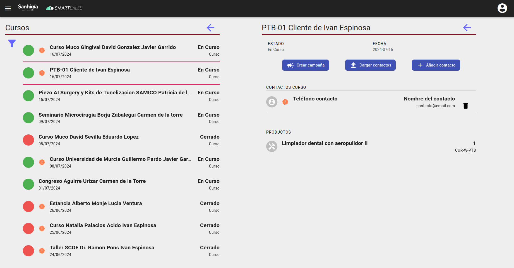

# Cursos

## Creación de la campaña

Se puede acceder a los eventos de tipo curso desde el menu principal en la seccion de smartsales.

Dentro los usuarios de Marketing y los superusuarios podran ver toda informacion y realizar las acciones, el resto de usuarios solo vera los contactos asociados a su agente.

## Crear campaña

 Crea una campaña de tipo captacion de leads con los datos del curso(Nombre, productos) y un score minimo de 0. Tambien se crea un trato por cada contacto asociado al curso para lo que debemos seleccionar el tipo de trato que queremos usar en la creación de los mismos.

Una vez creada la campaña, no importara si se añaden o elimian contactos del evento, los tratos no se veran afectados.

## Añadir contacto

Posibilidad de asociar un contacto al evento y actualiza los datos del contacto, tambien se puede crear un contacto nuevo desde la pantalla de añadir.

## Cargar contactos

Se puede cargar una lista de contactos seleccionando un fichero .xls. El fichero deberá tener la siguiente estructura:

| Nombre curso | Nombre agente | Ciudad | Email | Teléfono | C.P. |

## Contactos no revisados

Al cargar contactos puede suceder que cargemos información de un contacto con un email ya existente, si alguno de los campos introducidos(ciudad, teléfono, cp) no tuviera un valor previo se actualizaría.

Indicamos que un contacto no ha sido revisado después de la creación o de una actualización con el icono:

Para desmarcarlo clicamos en el contacto indicado y en la ficha del mismo marcamos la caja "*Contacto revisado*".

## Curso no revisado

Si el curso tiene algún contacto no revisado lo indicaremos con el mismo icono que usamos para el contacto no revisado.

[Volver al Índice](../../../index.md)