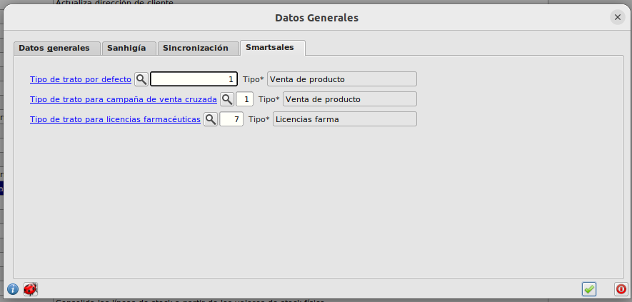
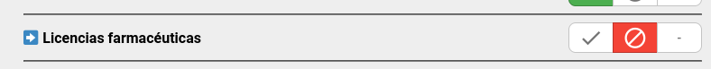
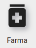
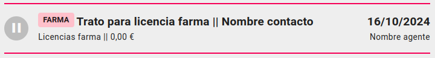

# Tratos de licencia farmacéutica

## Configuración inicial

* Desde el ERP, en el formulario **Area de Facturación/Facturación/Configuración** debemos seleccionar un tipo de trato para que sea informado como el '*Tipo de trato para licencias farmacéuticas*'.

* Desde la app debemos negar el acceso a todos aquellos grupos que no queremos que operen con este tipo de tratos . Esto es muy **IMPORTANTE** ya que dada la funcionalidad de este tipo de tratos los usuarios que operen con estos necesitan poder seleccionar clientes relacionados con cualquier agente.

## Carga automática

Para realizar una carga de tratos de licencia framacéutica automaticamente desde el ERP podemos hacerlo desde el formulario de **Sistema/Mantenimiento/Proceso** *cargaInicialTratosLicenciaFarma* y clicamos el botón superior *lanzar proceso*. Si no aparece el proceso clica el botón *Recargar funciones*.

En el formulario de carga clicamos el botón *Pegar desde hoja de cálculo*.
Se comprobará el número de columnas, el formato de email y que el código de agente se corresponsde con uno existente.

## Tratos licencias framacéuticas

Accedemos a la pantalla desde el menú principal en la sección *Smartsales* clicando el icono:

El funcionamiento general es el mismo que el de cualquier otro [trato](../tratos/index.md), salvo que a la hora de ganar un trato generamos una licencia asociada al mismo.

En los listados de tratos que no son el propio de licencias framacéuticas, estos aparecerań marcados con un indicador.

### Crear trato

Debemos seleccionar el tipo de trato configurado asociado a las licencias farmacéuticas, este tipo de trato debe tener obligatorimaente un cliente asociado y opcionalmente un contacto asocado a este.

### Agente observador

Al crear un trato, el agente asociado al mismo será el agente que lo está creando. Pero si el cliente está asociado a otro agente este será agente observador del trato y podrá verlo en sus listados, aunque no podrá cambiar el estado del mismo.

### Cambiar estado trato

Al ganar un trato se nos pedira la fecha de fin del trámite de la licencia y la fecha de caducidad de la misma. Se creará la licencia y se ganará el trato. Se considera la fecha de inicio del trámite la misma que la del trato.

Para cambiar de estado un trato ganado y por tanto con una licencia asociada debemos primero clicar de nuevo en 'Ganado' para pasar a un estado pendiente. Esto no solo cambiará el estado del trato si no que también eliminará la licencia asociada.

[Volver al Índice](../../../index.md)