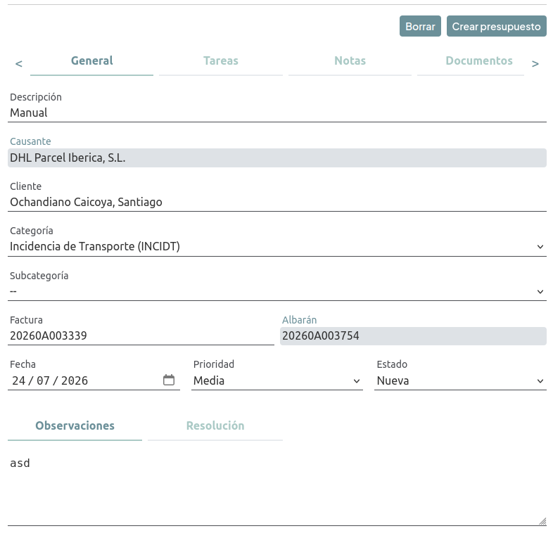
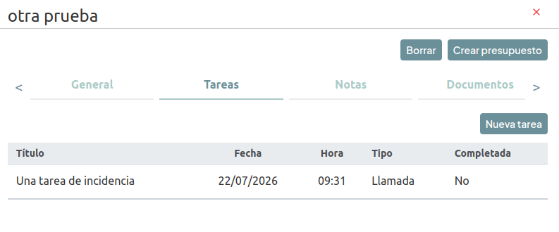
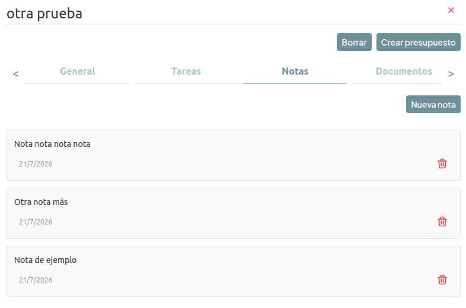
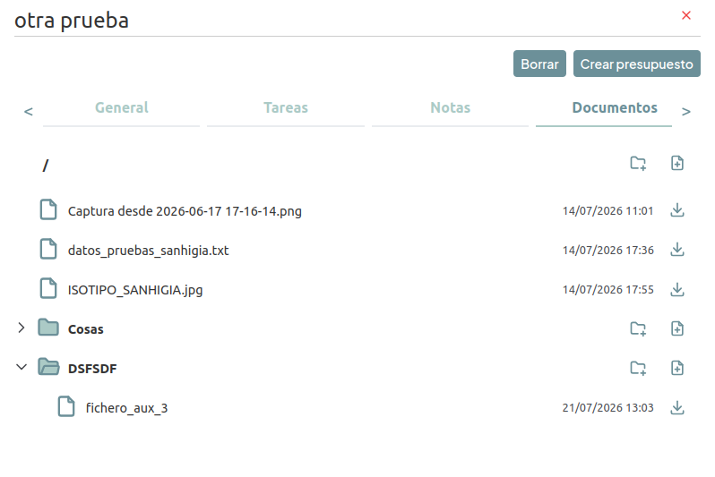

# Ficha de incidencia

Sobre los tabs de la ficha hay dos botones: **Borrar** y, si la incidencia todavía no tiene un presupuesto asociado, **Crear presupuesto**.

## Pestaña General

Campos editables:

- **Descripción**.
- **Cliente**: al cambiarlo se vacía la factura si había alguna.
- **Categoría**: cambiarla puede cambiar el tipo de incidencia (Producto/Transporte), igual que en la creación.
- **Subcategoría**: depende de la categoría.
- **Factura**.
- **Fecha**.
- **Prioridad**: Baja, Media o Alta.
- **Estado**: Pendiente, Nueva, Pendiente de datos, Asignada, Rechazada o Cerrada.
- **Artículo**: solo visible si la incidencia es de tipo Producto.
- **Observaciones** y **Resolución**: dos cuadros de texto en la parte inferior de la pestaña.

Campos de solo lectura (informativos, no se pueden modificar desde la ficha):

- **Causante**: nombre del proveedor o transportista responsable de la incidencia.
- **Albarán**: código del albarán asociado a la factura de la incidencia.
- **En garantía**: casilla que indica si la incidencia se generó dentro del periodo de garantía del artículo. Solo aparece en incidencias de tipo Producto.

Al modificar cualquier campo aparecen los botones **Guardar** y **Cancelar**.

### Presupuesto asociado

Si la incidencia ya tiene un presupuesto, se muestra su código junto al botón **Ir a presupuesto**, que navega directamente a su ficha.

Si aún no lo tiene, el botón **Crear presupuesto** abre una confirmación; al aceptarla se genera un presupuesto para el cliente de la incidencia y navegamos automáticamente a su ficha.

### Borrar incidencia

El botón **Borrar** pide confirmación y, al aceptarla, elimina la incidencia y la quita del listado.

## Pestaña Tareas

Lista las tareas asociadas a la incidencia con su título, fecha, hora, tipo y si está completada. Al pulsar sobre una tarea navegamos a su ficha.

El botón **Nueva tarea** navega a la pantalla de creación de tareas.

## Pestaña Notas

Muestra las notas de la incidencia ordenadas de la más reciente a la más antigua, con su texto y fecha.

- **Nueva nota**: abre un cuadro de texto; al escribir algo se activa el botón **Añadir nota**.
- Cada nota tiene un icono de papelera para borrarla, con confirmación previa.

No se pueden editar notas ya creadas, solo añadir o borrar.

## Pestaña Documentos

Permite adjuntar y descargar documentos (fotos, vídeos, pdfs u otro tipo de fichero) organizados en carpetas:

- Se pueden crear carpetas y subir documentos tanto en la raíz como dentro de cualquier carpeta, arrastrándolos o seleccionándolos desde el selector de archivos (se pueden elegir varios a la vez).
- El **tamaño máximo por fichero es de 20 MB**. Los ficheros que lo superen no se suben; si ninguno de los ficheros seleccionados se llega a subir por este motivo, se muestra un aviso.
- No hay restricción sobre el tipo de fichero.
- Cada documento se descarga con el icono correspondiente; no hay previsualización de fotos, vídeos ni pdfs dentro de la aplicación.

[Volver a Incidencias](./index.md) · [Volver al Índice](../../../index.md)
