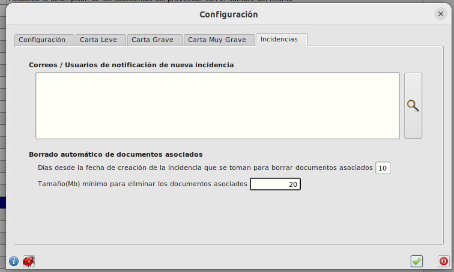
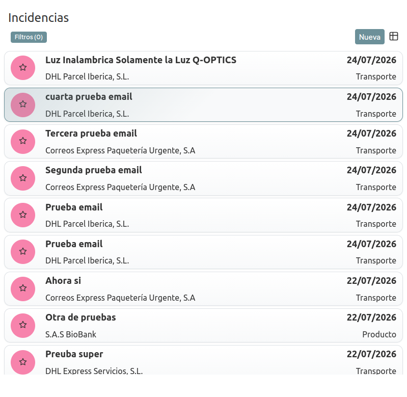
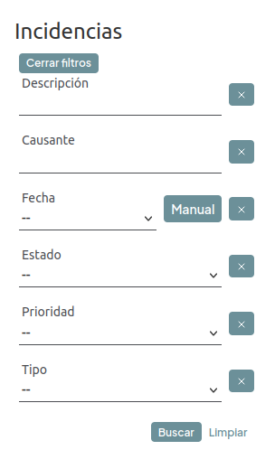
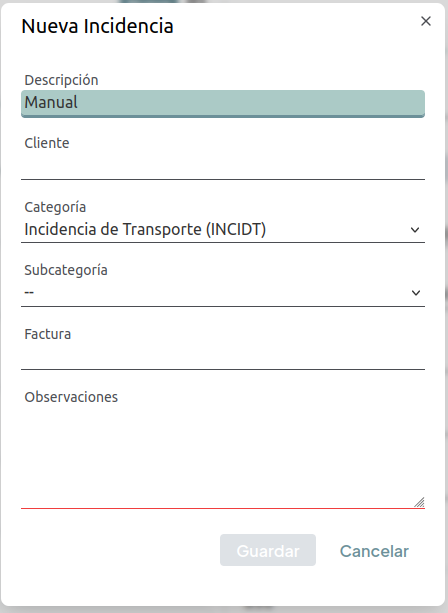

# Incidencias

Gestión de incidencias de **producto** y de **transporte** desde la aplicación web. Cada incidencia queda asociada a un cliente, una factura y, según el tipo, a un artículo (producto) o a un transportista.

Accedemos desde el menú principal **SmartSales → Incidencias**.

<!--  -->

## Configuración en el ERP

Antes de usar la pantalla hay que completar dos configuraciones en el ERP.

### Notificación por email

En el formulario **Área de CRM / Principal / Configuración**, pestaña **Notificaciones incidencia**, se indican los correos electrónicos (separados por `;`) que recibirán un aviso cada vez que se cree una nueva incidencia.

<!--  -->

### Proveedor por agencia de transporte

En las incidencias de tipo Transporte, el transportista causante se obtiene del proveedor asociado a la agencia de transporte del albarán de la factura indicada. Esta asociación se configura en el formulario **Área de Facturación / Principal / Más / Transporte / Agencias de transporte**, indicando el proveedor correspondiente a cada agencia.

<!--  -->

En las incidencias de tipo Producto, el proveedor causante es el proveedor por defecto del artículo elegido; no requiere configuración adicional.

## Tipos de incidencia

Una incidencia es siempre de uno de estos dos tipos, determinado automáticamente por la **categoría** elegida al crearla:

- **Producto**: la categoría tiene como tipo causante _Proveedor_. Lleva asociado un artículo y, opcionalmente, el campo _En garantía_ que se calcula en el momento de la creación de la incidencia. Será **Sí** cuando la fecha de la incidencia es menor a la fecha de la factura + número de meses de garantía del artículo.
- **Transporte**: la categoría tiene como tipo causante _Transportista_.

## Listado de incidencias

El listado se puede ver en dos formatos, alternables con el botón de cambio de modo situado sobre la lista:

- **Tarjetas** (vista por defecto): cada tarjeta muestra la descripción, la fecha, el causante (proveedor o transportista) y una etiqueta indicando si es _Transporte_ o _Producto_. El avatar de la izquierda indica el estado mediante un icono y un color distintivo:

  | Estado             | Icono       |
  | ------------------ | ----------- |
  | Nueva              | Estrella    |
  | Pendiente          | Reloj       |
  | Pendiente de datos | Información |
  | Asignada           | Usuario     |
  | Rechazada          | Cerrar      |
  | Cerrada            | Check       |

- **Tabla**: columnas _Descripción_ _Causante_ y _Fecha_, ordenable por columna.

Por defecto **no se muestran las incidencias en estado Cerrada**; para verlas hay que seleccionarlo explícitamente en el filtro de estado.

### Filtros

- **Descripción**: filtro por texto de descripción.
- **Fecha**: filtro por rango de fechas.
- **Causante**: busca por el nombre del proveedor o transportista.
- **Estado**: cualquiera de los seis estados. Si se deja vacío, se aplica el filtro por defecto (no cerradas).
- **Prioridad**: Alta, Media o Baja.
- **Tipo**: Producto o Transporte.

## Crear incidencia

Pulsamos el botón **Nueva** sobre el listado. Se abre un formulario con los siguientes campos, en este orden:

1. **Descripción** _(obligatorio)_.
2. **Cliente** _(obligatorio)_: buscador de clientes. Al cambiarlo se vacía la factura si había alguna seleccionada.
3. **Categoría** _(obligatorio)_: solo se ofrecen categorías cuyo tipo causante sea Proveedor o Transportista. Al elegirla, la incidencia queda marcada automáticamente como de tipo **Producto** o **Transporte**; si deja de ser de tipo Producto se vacía el artículo si lo hubiera.
4. **Subcategoría**: depende de la categoría elegida; se vacía cada vez que se cambia la categoría.
5. **Factura** _(obligatorio)_: requiere haber seleccionado antes un cliente; busca solo entre las facturas de ese cliente.
6. **Artículo** _(obligatorio solo si la incidencia es de tipo Producto)_: no aparece en incidencias de transporte.
7. **Observaciones** _(obligatorio)_.

El proveedor o transportista causante **no se indica manualmente**: se calcula a partir de la factura/artículo elegidos y se muestra después en la ficha de la incidencia, en el campo _Causante_.

Al guardar, la incidencia se crea con prioridad _Media_, estado _Nueva_ y la fecha del día.

## Ficha de incidencia

Al pulsar sobre una incidencia del listado accedemos a su [ficha](./ficha.md), donde se puede editar, adjuntar documentos, añadir notas, gestionar tareas asociadas, generar un presupuesto o borrarla.

## Informe de incidencias

Desde el menú **Informes → Incidencias** se puede generar y descargar un informe de incidencias en hoja de cálculo. Ver [Informe de incidencias](./informe.md).

[Volver al Índice](../../../index.md)
