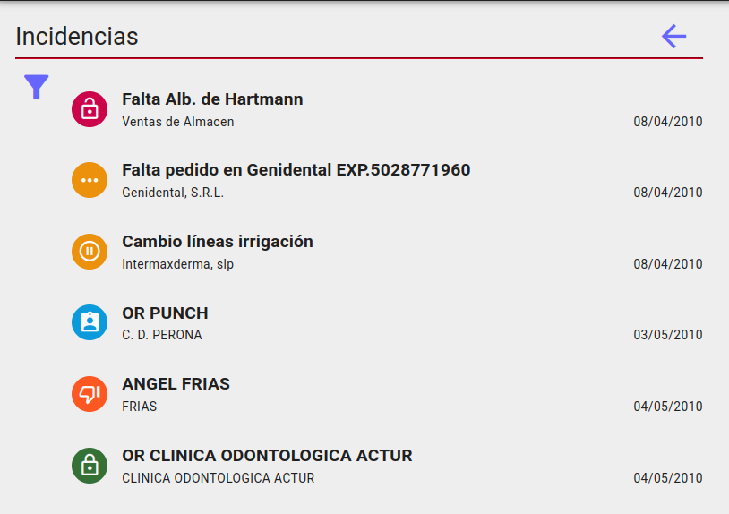
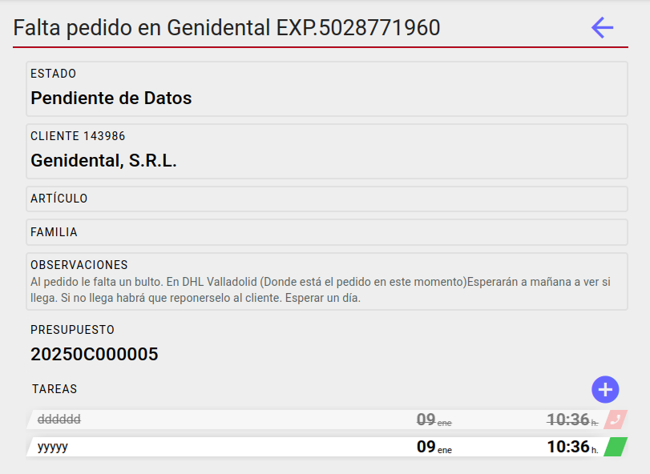

# INCIDENCIAS

## Configuración inicial

Abrimos el formulario **Area de Facturación/Facturación/Configuración** y en la pestaña **Datos generales**, informamos el campo *Serie de incidencias* y pulsamos el botón de confirmación.

### Permisos incidencias

Todos los usuarios tiene acceso a la pantalla. Aquellos grupos de usuarios que tengan el siguiente permiso concedido podrán ver y editar las incidencias de todos y si no lo tienen solo podrán ver y editar las suyas.

## Pantalla incidencias

### Listado

Veremos el listado de incidencias ordenado de más antigua a más reciente. El item de incidencia constará de un avatar indicando el estado(*Nueva, Pendiente de Datos, Pendiente, Asignada, Rechazada y Cerrada*), la descripción, el nombre del cliente y la fecha.

### Filtro

Podremos filtrar el listado por el estado de las incidencias. 

## Ficha incidencia

En la ficha de incidencia todos los campos(*estado, cliente, artículo, familia, observaciones, crear presupuesto y tareas*) son editables.

### Crear presupuesto

Al clicar el botón se creará automáticamente un presupuesto asociado a la incidencia y al cliente de la misma. Puede ser que el cliente tenga más de una dirección, entonces se nos pedirá que seleccionemos cuál queremos utilizar para la creación del presupuesto. Si la dirección(*seleccionada manual o automáticamente*) es de Canarias tendremos que elegir el '*Origen de salida*' a utilizar en el presupuesto.

Al crear el presupuesto, navegaremos automáticamente a la ficha del mismo.

Si una incidencia tiene asociado un presupuesto podremos ir a la ficha del mismo clicando sobre el código del mismo.

### Tareas

Veremos un listado de las tareas asociadas a la incidencia, así como el tipo y el estado de las mismas. También podemos añadir nuevas tareas clicando en el botón.

Podemos ir a la ficha de la tarea clicando sobre ella.

