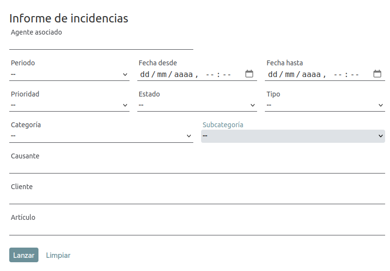

# Informe de incidencias

Genera y descarga un fichero de hoja de cálculo con las incidencias que cumplan los filtros indicados. Se accede desde el menú **Informes → Incidencias**.

Es una pantalla de filtros: no muestra los datos en pantalla, solo genera el fichero al lanzar el informe.

## Filtros

- **Agente asociado**.
- **Periodo**: atajo rápido de fechas (hoy, esta semana, etc.).
- **Fecha desde** / **Fecha hasta**: al editarlas manualmente se desactiva el atajo de periodo.
- **Prioridad**: Alta, Media o Baja.
- **Estado**: cualquiera de los seis estados de incidencia.
- **Tipo**: Producto o Transporte.
- **Categoría** y **Subcategoría**.
- **Causante** (proveedor).
- **Cliente**.
- **Artículo**.

Ninguno de los filtros es obligatorio.

## Lanzar el informe

Al pulsar **Lanzar** se genera el fichero (el botón muestra "Generando..." mientras se procesa) y se descarga automáticamente. El nombre del fichero incluye el agente y las fechas indicadas, si se han filtrado, por ejemplo: `informe_incidencias_agente-juan-perez_2026-07-01_2026-07-27.xlsx`.

El botón **Limpiar** restablece todos los filtros.

[Volver a Incidencias](./index.md) · [Volver al Índice](../../../index.md)
