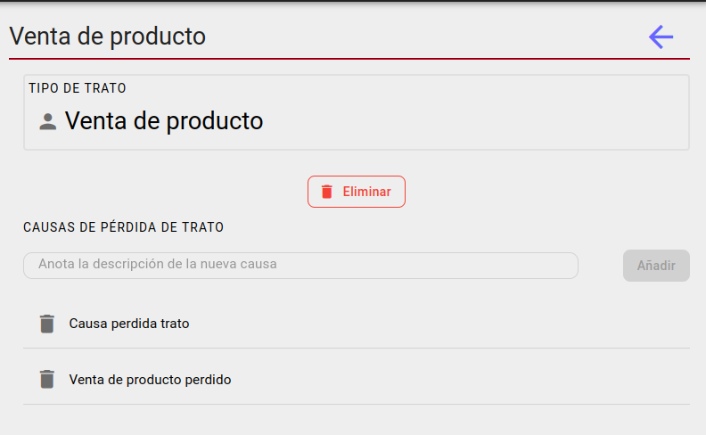
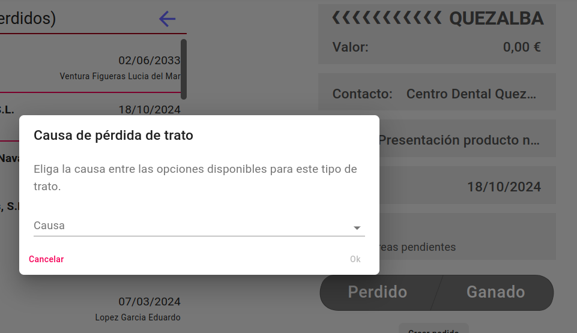
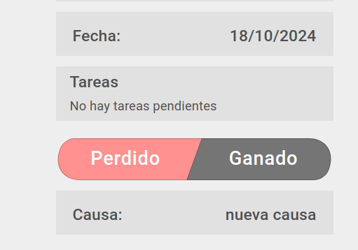

# Perdida de trato

## Gestionar causas de perdida de trato

Se pueden gestionar las casusas de perdida de trato desde la pantalla de [tipos de trato](../tipostrato/index.md).

## Indicar causa perdida

Cuando se marque un trato como Perdido aparecera una pantalla preguntando por la causa, es obligatorio seleccionar una causa de perdida.

Una vez seleccionada una causa, se mostrara en la pantalla del trato y podra ser editada.

[Volver al Índice](../../../index.md)