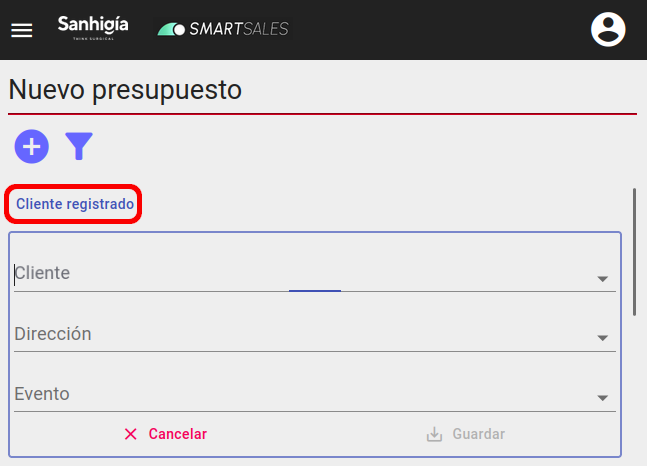
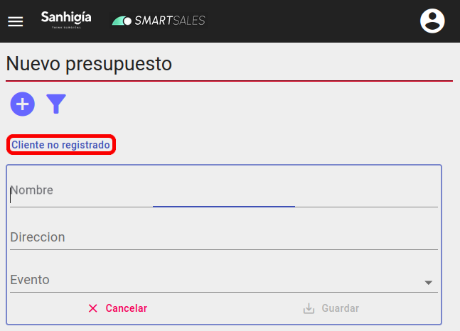

# Crear presupuesto para un cliente no registrado

- Al igual que para crear un presupuesto para un cliente registrado, tendremos que pulsar primero el botón de "_Nuevo presupuesto_" con el símbolo + en la esquina superior izquierda. Entonces se abrirá el formulario para crear presupuesto.

  Encima del formulario aparecerá un botón "_Cliente registrado_", si lo pulsamos el formulario cambiará al modo no registrado.

Modo cliente registrado

Modo cliente no registrado

- Con el modo "_cliente no registrado_" activado introducimos los datos del presupuesto (nombre del cliente, direccion, evento). Los campos obligatorios son el nombre del cliente y el evento. En caso de no introducir ninguna dirección, el presupuesto se creará con un "-" asignado a su dirección.

- Para seleccionar un evento se sigue la misma lógica que con un presupuesto para un cliente registrado. Si no existe ningún evento asociado, hay que escoger la opción de "_venta regular_".

[Volver al Índice](../../../index.md)
