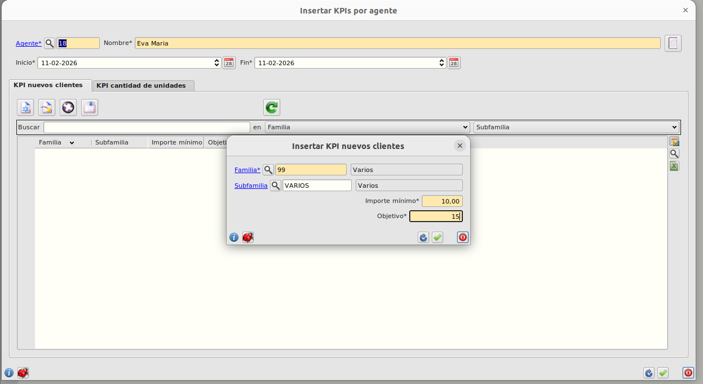
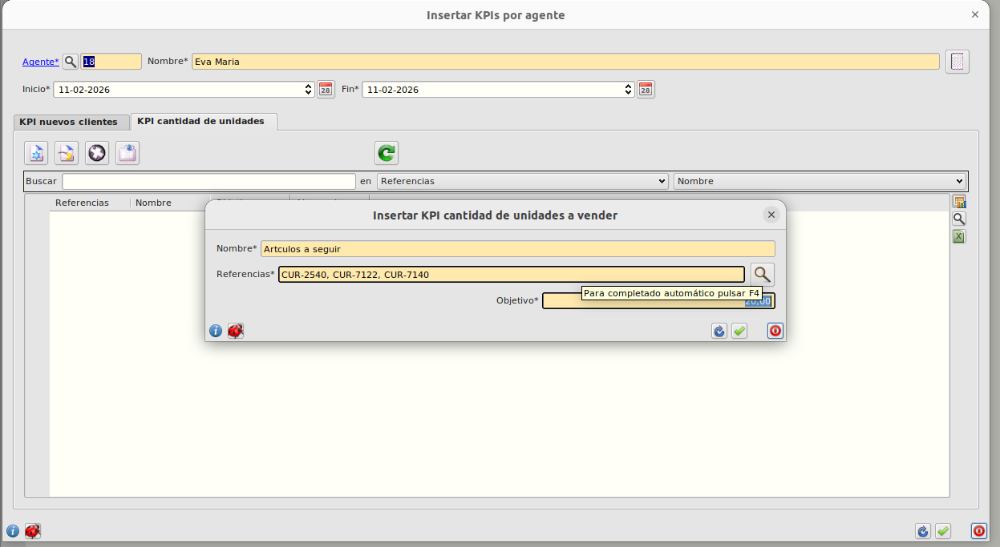

# KPIs por agente

### KPI Nuevos clientes

Esta tabla muestra el rendimiento en la facturación a nuevos clientes según determinado grupo de artículos por familia y opcionalmente subfamilia. Las principales columnas son:

- **Familia**: por la que agrupar los articulos facturados a monitorear.
- **Subfamilia**: asociada a la familia por la que agrupar los articulos facturados.
- **Importe Mínimo**: de gasto del cliente para considerarle en el cálculo.
- **Cantidad objetivo**: de nuevos clientes.
- **Cantidad alcanzada**: de nuevos clientes.

Todos las columnas con editables menos la columna _cantidad alcanzada_ que se cálcula autmáticamente clicando el botón general del formulario _Calcular datos_ o en el botón _recargar datos_ dentro de la sección.

### KPI cantidad de unidades

Esta tabla muestra el rendimiento en la facturación sobre artículos concretos. Las principales columnas son:

- **Nombre**: del grupo.
- **Referencias**: lista de artículos a monitorear.
- **Cantidad objetivo**: de artículos facturados.
- **Cantidad alcanzada**: de artículos facturados.

Todos las columnas con editables menos la columna _cantidad alcanzada_ que se cálcula autmáticamente clicando el botón general del formulario _Calcular datos_ o en el botón _recargar datos_ dentro de la sección.

Para actualizar el cálculo podmeos hacerlo indivdualmente por tabla clicando el botón de 'recargar datos' o globalmente con el botón 'calcualr datos' en la parte superiro derecha del formulario.

[Volver al Índice](../../../index.md)
