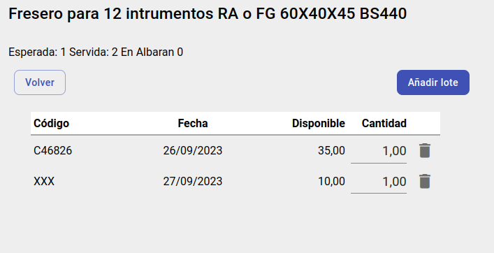

# Ver movimientos de lote

Si un artículo es compuesto y tiene lotes, tenemos varias formas de ver los lotes que hemos añadido al pedido para enviar:

* Desde el Avatar circular la línea
* Desde el boton Movimientos por lotes dentro del desplegable

## Pantalla de Movimientos de lote

Desde esta pantalla se pueden gestionar los lotes que hemos añadido al pedido, tanto eliminar un lote como añadir uno nuevo o crear un lote.

## Crear nuevo lote

Desde esta pantalla podemos añadir un lote ya existente pero si no se selecciona ninguno y se indica el codigo de lote y la fecha de caducidad se creara un nuevo lote, el cual tiene cantidad disponible 0 por lo que sera necesario realizar un inventario al vuelo para poder añadirlo al pedido.

* [Inventario al vuelo](./inventarioVuelo.md)

[Volver](../index.md)