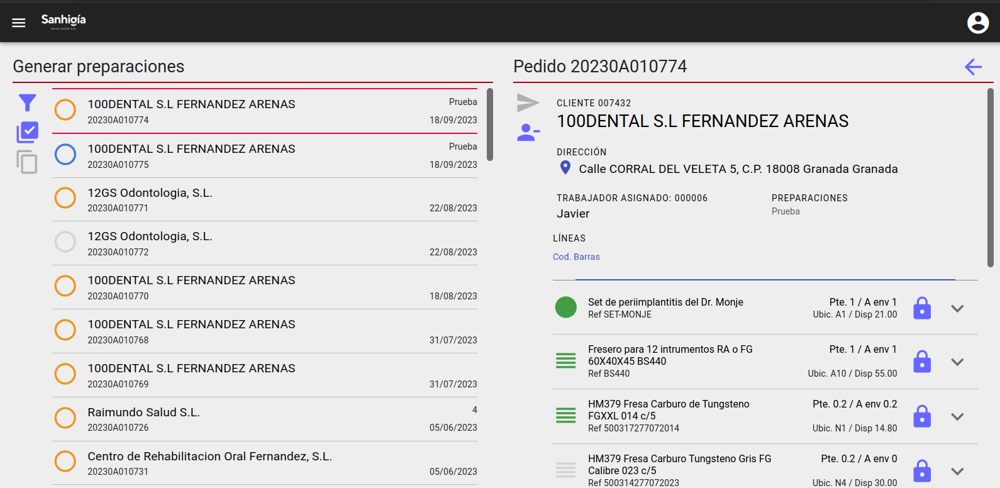
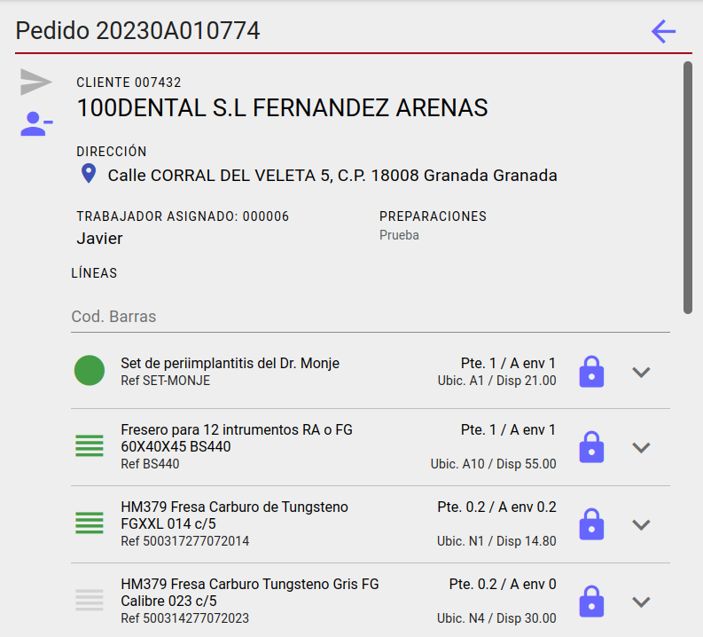

# PANTALLA GENERAR PREPARACIÓNES

A la izquierda si estamos en pantalla grande y la pantalla inicial si estamos en movil tenemos una lista con pedidos de venta donde los colores del avatar representan:

* **Gris**: Pedido no asignado a ningun trabajado o con 'Pagos pendientes'.
* **Amarillo**: Pedido pendiente de preparar.
* **Azul**: Pedido ya preparado y listo para enviar.
* **Verde**: Pedido ya preparado y enviado.

## Acciones

* [Filtrar Pedidos](./Acciones/filtro.md)
* [Generar Preparación](./Acciones/generarPreparacion.md)

# PANTALLA PEDIDO

Pantalla con información de un pedido y sus línas

## Lectos de códigos de barras

* [Lector barcodes](./Acciones/lectorBarcode.md)

## Acciones

* [Cerrar línea](./Acciones/cerrarLinea.md)
* [Ver movimíentos de lote](./Acciones/verLotes.md)

[Volver](./index.md)