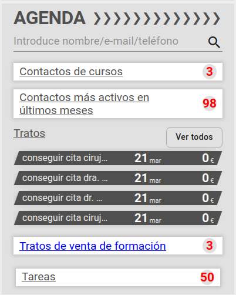
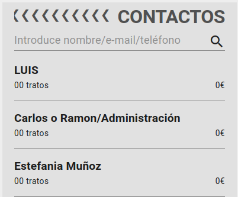
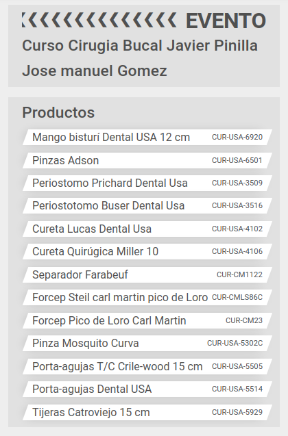
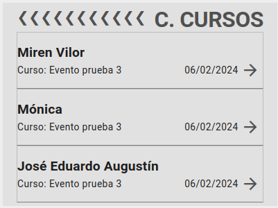

# Agenda

## Buscador

Podemos buscar un contacto tecleando parcial o completamenta el nombre, email o teléfono. También podemos clicar la lupa que mostrará el listado de contactos sin ningún filtro.

#### Listado de contactos

Contiene el listado de [contactos](./contacto.md) indicando el nombre del mismo en la parte superior y en la de abajo veremos un contador de tratos abiertos del contacto y la suma del valor de los mismos. Al clicar sobre un contacto accederemos los datos del mismo.

#### Evento de contacto

Si el contacto ha asistido a algún evento se indicará en una lista, al clicar sobre alguno de ellos accederemos a la ficha del mimso. En ella veremos el nombre del evento en la parte superior y un listado de los productos que se promocionaron en el evento, indicando nombre y refencia del producto.

## Contactos de cursos

#### ¿Qué es un contacto de curso?

 Son aquellos contactos que están asociados a nuestro usuario por código postal o contactos que no tienen asignado ningún código postal y que han tenido una interacción o asistencia a un curso o evento en los últimos _N_ días, siendo _N_ un valor parametrizable en el ERP.  [Parametrizar días](./periodobusqueda.md).

La caja *contactos de cursos* será visible siempre que tengamos al menos un contacto de este tipo.

#### Listado de contactos de cursos

Si clicamos en la caja veremos la pantalla de *Contactos cursos* que contiene el listado de contactos recientes indicando el nombre del evento y la fecha de la última interacción que podemos ver en detalle si clicamos en la flecha. Al clicar sobre un contacto accederemos los datos del mismo.

## Contactos más activos en últimos meses

#### ¿Qué es un contacto activo?

 Son aquellos contactos que están asociados a nuestro usuario por código postal o contactos que no tienen asignado ningún código postal y que han tenido una interacción o asistencia con un curso/evento o una campaña en los últimos _N_ días, siendo _N_ un valor parametrizable en el ERP.  [Parametrizar días](./periodobusqueda.md).

La caja *contactos más activos en últimos meses* será visible siempre que tengamos al menos un contacto de este tipo.

## Tratos

Aquí veremos un listado de los últimos como máximo 6 tratos abiertos del agente logeado. Si clicamos alguno de ellos navegaremos a la ficha del trato.

Si clicamos en ver todos, navegaremos a la pantalla de tratos.

## Tratos de licencia farmacéutica

Esta caja solo será visible si existe uno o más tratos de tipo licencia farmacétuca que han sido generados para un cliente asociado al agente logeado pero gestionado por un agente del departamente defarmacia.

Si clicamos en la caja navegaremos a la ficha de la tratos de licencia farmacéutica.

## Tratos de venta de formación

Esta caja solo será visible si existe uno o más tratos asociados al agente logeado o su superior que han sido generados por el departamento de marketing para este agente.

Si clicamos en la caja navegaremos a la ficha de la tratos de marketing.

## Tareas

Aquí el agente podrá el número de tareas pendientes que tiene asociadas, si clicamos en la caja se abrirá un desplegable mostrando las tareas. 

Si clicamos alguna de ellas navegaremos a la ficha de la [tarea](./tareas.md).

Si clicamos en ver todas, navegaremos a la pantalla de tareas.

[Volver al Índice](./index.md)